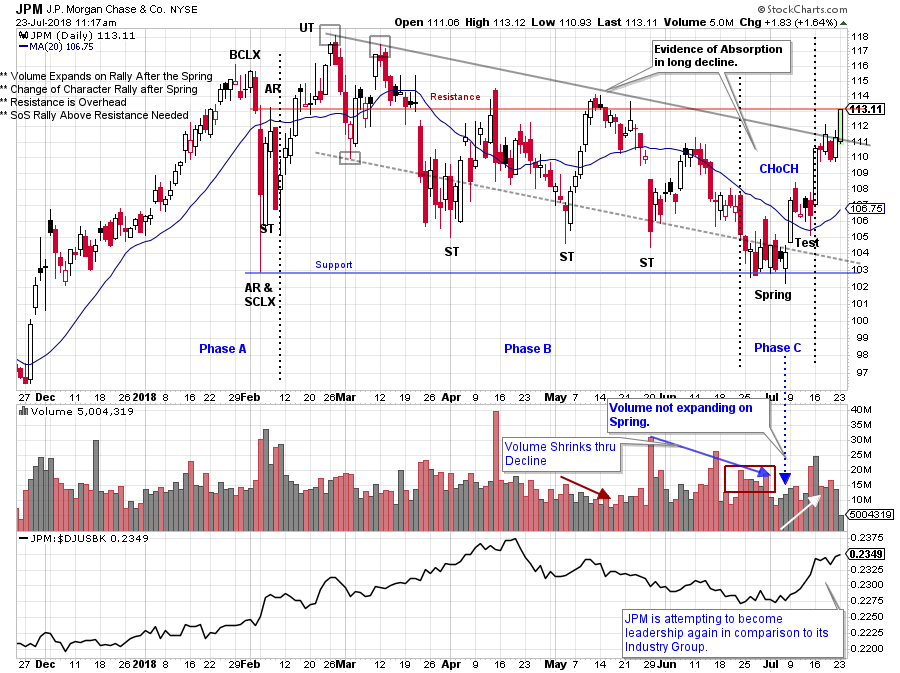
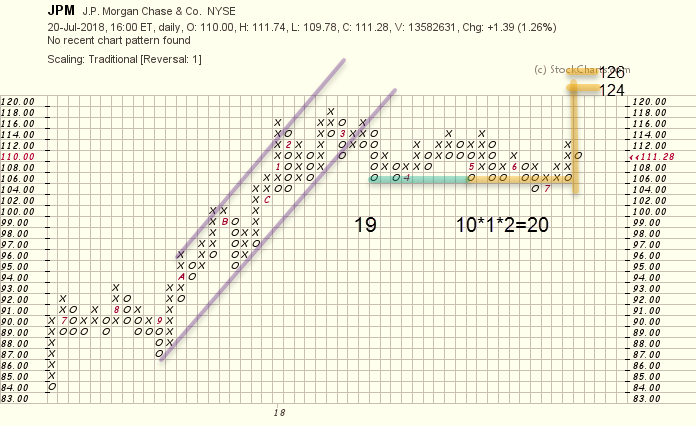

# Is Your Money Safe in Banks?

URL: https://articles.stockcharts.com/article/articles-wyckoff-2018-07-is-your-money-safe-in-banks/
Date: July 23, 2018 at 02:31 PM
Author: Bruce Fraser

July is a busy month. Preparations are taking place for the upcoming ChartCon. And Roman Bogomazov and I are launching our new StockCharts TV program ‘Power Charting’. Power Charting will be broadcast weekly on Friday at 3pm EDT with repeats thereafter. Our emphasis will be on Wyckoff Method basics using live case studies. We hope you can join us.

Despite the craziness let’s take a few minutes for some Wyckoff Analysis. Here we will evaluate an important bank stock. Recent activity in the banks hint of their desire to become active and leadership again. Time will tell if this is a durable new trend. Let’s look at J.P. Morgan Chase (JPM), a bell-weather bank stock, for some clues about the future of banks.

---

(click on chart for active version)

Note that JPM was a relative strength leader (to its peer group) into mid-April. Also, a downtrend channel formed (drawn in grey). The entire structure has the hint of Reaccumulation. Attempts were made to break below the channel oversold line, but each time JPM settled and then bounced. Volume expanded on the declines which is evidence of the presence of Supply. Finally, JPM declined to Support. The question we ask is whether this Supply was being Absorbed? Notable clues on the chart included the early May rally on diminishing volume which indicated muted Demand. The drop that followed also had sparse volume until the low day (ST) in late May. That wide ranging day with a volume spike was a low. We can conclude that good Demand was present to absorb the Supply and stop the decline. After a brief rally into June, JPM then dropped with some volume, into a Spring (at Support). Volume expanded as Support was Tested but JPM could not follow through and begin a new downtrend. The actual Spring had modest volume, closed near the high for the day, and reversed up the next day (on expanding volume). A Spring on modest volume can be bought immediately as the rally that follows can often be surprisingly strong (more on this at ChartCon). A Change of Character has emerged with this rally as Supply has been Absorbed and Demand becomes evident. The rally days are strong and the Backups are shallow (evidence of a Phase C & D uptrend). Two important levels of Resistance are directly above. A Sign of Strength price jump is needed to propel JPM above resistance in the near future.

Using a 1 box method Point and Figure chart we identify a swing trading count objective of 124-126. A larger segment of 19 columns (38 points) will be considered once new high prices are achieved.

Join us at ChartCon where we will discuss more on trade entry strategy including a discussion of Springs. And see you on Power Charting on StockCharts TV.

All the Best,

Bruce @rdwyckoff

Announcement:

Roman Bogomazov and I will be guests on MarketWatchers LIVE on Wednesday, July 25th from 12-1:30pm EDT. We will be discussing all things Wyckoff related and our new StockCharts TV program 'Power Charting'. If you cannot make our live Wyckoff discussion, a recording will be available. See you then. (click here for more information)
