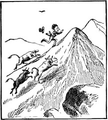
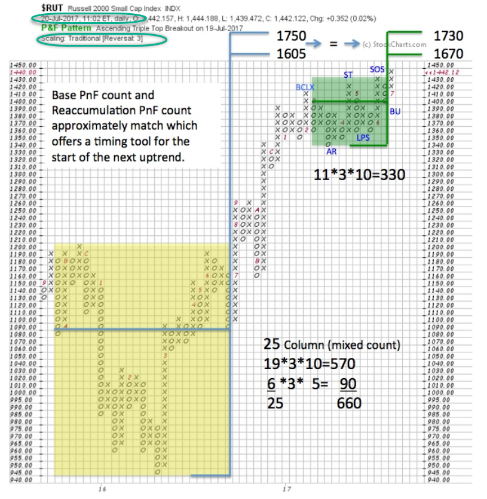
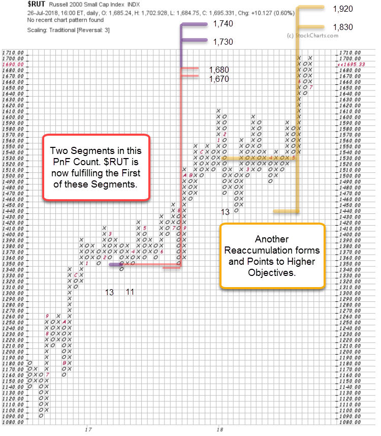

# Russell Revisited

URL: https://articles.stockcharts.com/article/articles-wyckoff-2018-07-russell-revisited/
Date: July 27, 2018 at 03:43 PM
Author: Bruce Fraser

One year ago, we analyzed the Russell 2000 Small Cap Index ($RUT) in a Wyckoff Power Charting blog post. An evaluation of the vertical bar chart and the Point and Figure objectives pointed to higher prices (click here to read the ‘Hustling Russell’). Please review this prior post before proceeding. Now the $RUT is fulfilling those PnF objectives, let’s revisit the counts and see what could happen from here.

Roman Bogomazov and I were guests on MarketWatchers LIVE this past Thursday (thanks to Erin and Tom for having us on to introduce our new program ‘Power Charting’ click here to watch). We made the case that the Russell 2000 and the NASDAQ Composite are extended and overbought in their trend channels. Therefore, the laggard index, the Dow Jones Industrial Average ($DJI) needs to rotate to leadership. The $RUT fulfilling two important PnF objectives is one reason this rotation is important to the longevity of this bull move.

---

(first published July 22, 2017)

This PnF chart was published one year ago and pointed to higher prices for the Russell 2000. The two counts confirmed each other. Recently the $RUT has fulfilled these confirming PnF counts. This does not automatically result in the end of the uptrend. Let’s have a look at the current state of affairs for $RUT and consider some options for what could happen from here.

The large base count is not shown here (see top chart above). The Reaccumulation count of 2017 actually became larger (two additional columns were added after the blog was posted) and thus the count has been adjusted slightly. An additional Sign of Strength (SoS) and Last Point of Support (LPS) formed in 2017 and are counted in this chart. Two Segments are (11 and 13 columns are identified) counted. The smaller count has been fulfilled and the larger objective is just above the current price level of 1,695 (1,708.56 high). The $RUT has made no net progress since mid-June (end of the quarter) and this suggests the index is losing momentum.

Notice that $RUT has formed another Reaccumulation (in 2018) since that year ago post. It has generated higher objectives which is encouraging for higher prices in the future. The two PnF objectives in play now, are likely to be respected. Thus, a pause is expected soon (or it has already begun). Ideally this pause will generate PnF counts to match recent Reaccumulation counts of 1,830 to 1,920.

Rotation of strength to the blue chip $DJI would be welcome here as the $RUT rests and prepares for another swing higher. Now we will closely observe the $DJI for a Sign of Strength (SoS) needed to clear the Resistance directly above current levels. And for the ability to show relative strength compared to other indexes. This is what I believe is needed to keep the bull running.

All the Best,

Bruce @rdwyckoff

Illustration: ‘Savage Stock Going Up’ by Palmer Cox (1840-1924)

Announcements:

Power Charting on StockCharts TV. Friday 3pm ET with replays (click here for more)

Best of Wyckoff (BOW) Online Conference. BOW 2018: Judging the Market by its Own Action. September 1, 2018 – watch live or on-demand. This is the Wyckoff event of the year. CLICK HERE to learn more about this Epic Conference.
