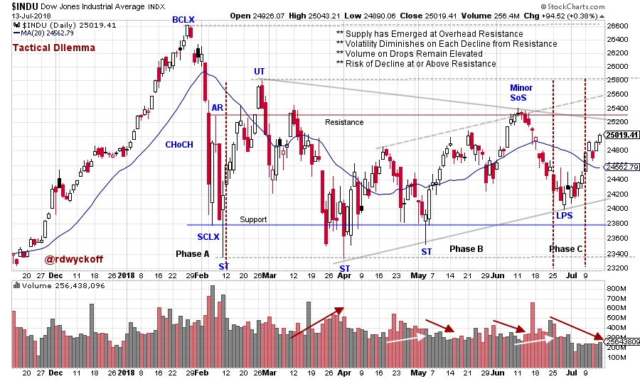
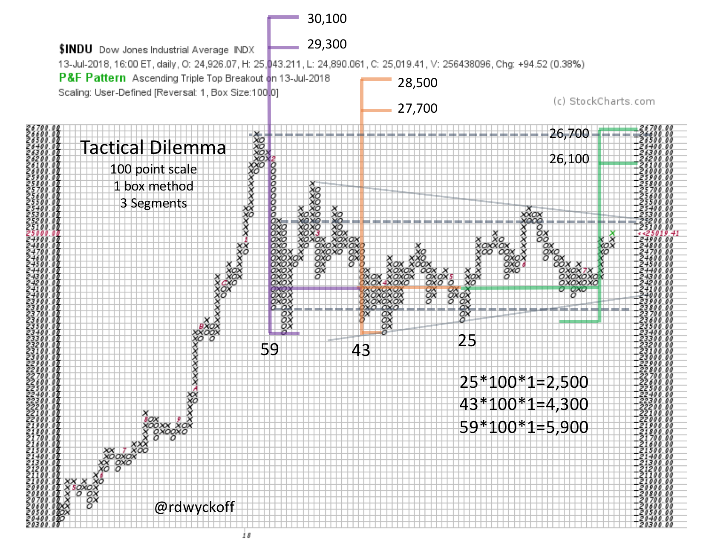

# Tactical Dilemma

URL: https://articles.stockcharts.com/article/articles-wyckoff-2018-07-tactical-dilemma-/
Date: July 15, 2018 at 08:25 PM
Author: Bruce Fraser

While some major indexes have pushed to new high ground recently, the Dow Jones Industrial Average ($INDU) has remained a notable laggard. This creates a tactical dilemma for Wyckoffians. Is the weaker Dow Jones Industrial Average offering a ‘tell’ by lagging the broad market? Or is the industrial (thirty) stock index being left behind by more dynamic indexes that are launching into fresh new uptrends?

Wyckoff is an actionable method that emphasizes what to do, and when to do it. Wyckoffians try to not get caught up in the popular market thinking about why markets and stocks rise and fall. Rather Wyckoffians follow the footprints of the large, informed market participants (the Composite Operator). Let’s turn our attention to the $INDU and attempt to discern the motives of the C.O. for this bell-weather index.

---

(click on chart for active version)

The C.O. is judging the level of available Supply overhanging the market (or a campaign stock). Two measures of Supply in a price range are volatility and volume. Each major decline since January is successively less volatile and has diminishing volume. Note the contracting trendlines (evidence of Absorption). A negative is that volume during price drops is generally higher than during the rally phases (evidence that supply is still present). The C.O. will not support a rally out of the trading range area until the overhanging Supply is soaked up. The $INDU is firmly in the middle of the range and has three important Resistance levels above to overcome. The interpretation here is one of Reaccumulation. Distribution has a signature of ever increasing volatility and that is not evident here, yet. More on that below.

Wyckoffians are concerned with tactics. Here a Minor Sign of Strength (Minor SoS) puts us on the alert for a Last Point of Support (LPS) to follow. This LPS is an actionable event for buying the index or stocks. And there is an excellent likelihood that Phase C is unfolding. A Wyckoffians job is to act accordingly and place intelligent stops (more on this during my ChartCon presentation). Next, we look for a good rally to confirm the LPS, and so far, this is the case. Expanding volume and good demand bars that drive the index through overhead Resistance are now needed to confirm.

Here a one-box reversal Point and Figure is constructed to generate trading counts. Segment 1 (green) generates a count objective to the area of the January high. This is a logical target and drives $INDU through important Resistance. Tranche one of our theoretical trade is placed in the area of the LPS. Future tranches are possible above overhead Resistance. We seek confirmation of higher prices with Jumps on expanding volume and Backups on diminishing price spread and volume. Segments 2 & 3 indicate more price potential beyond the January all-time high price for $INDU.

Trouble for the above scenario would likely occur around the Resistance level. If the C.O. doesn’t see good demand driving prices through the areas where Supply would appear, they could become sellers. A minor Upthrust that fails is a favorite in the C.O. playbook. Failure back into the trading range on widening spread and high volume would be a major warning. In this situation, good entry tactics allow Wyckoffians to exit their trades even or with small gains.

All the Best,

Bruce @rdwyckoff

Homework: Compare these indexes to the $INDU: $NDX, $COMPQ, $RUT and $SPX
