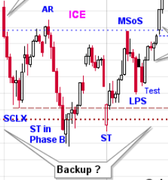
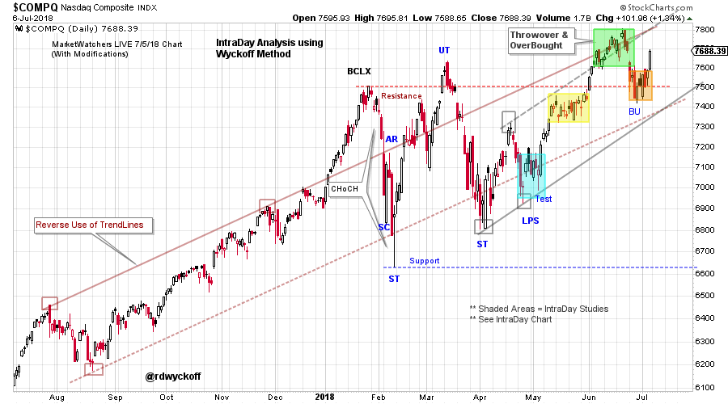
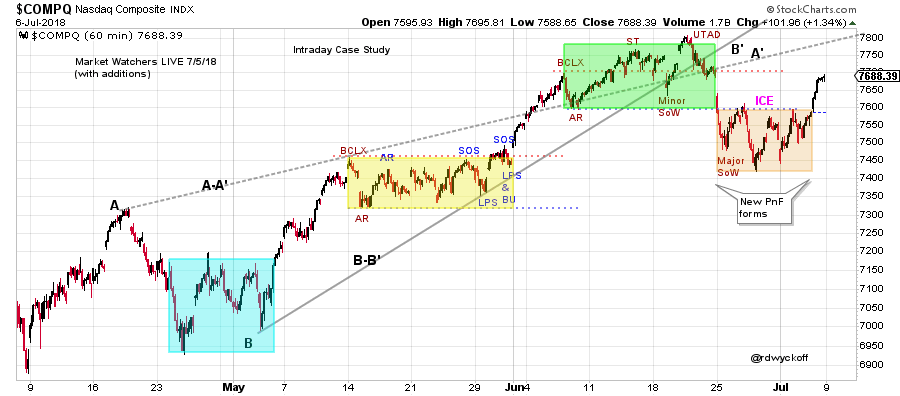
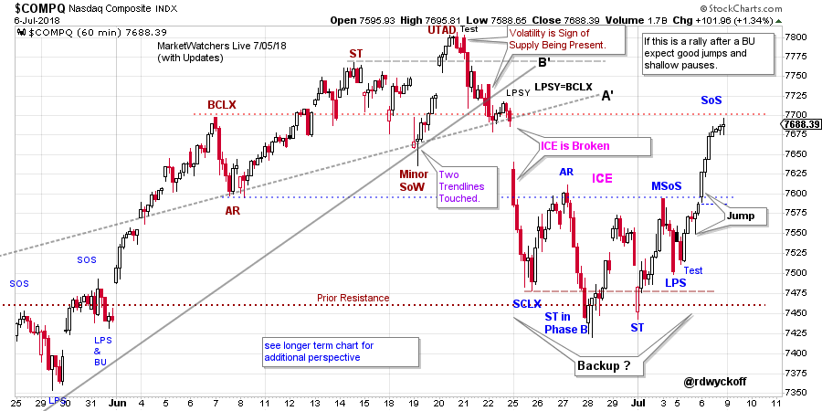
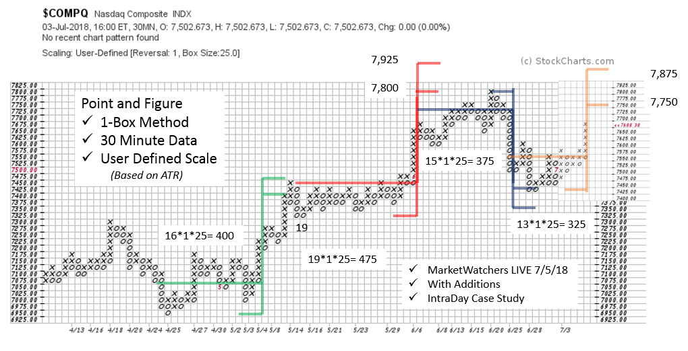

# Wyckoff Intraday Workshop

URL: https://articles.stockcharts.com/article/articles-wyckoff-2018-07-wyckoff-intraday-workshop/
Date: July 08, 2018 at 03:00 PM
Author: Bruce Fraser

During my most recent guest appearance on MarketWatchers LIVE (7/5/18) I introduced a case study of intraday trading with the Wyckoff Method. Intraday trading is not every traders cup of tea, but even if you are not a short term trader there are benefits to studying the intraday charts. Integration of intraday Vertical Bar and Point and Figure chart methods are equally effective in this condensed timeframe as they are in longer (daily and weekly) periods.

---

(click on chart for active version)

Context is important to intraday trading. A study of the larger timeframe (daily here) provides perspective. We see the NASDAQ Composite Index ($COMPQ) has been respecting a long term trend channel with throwovers into a Buying Climax (BCLX) and an UpThrust (UT). In June $COMPQ again jumped the Resistance level and appears to be having a successful Backup (BU). This is encouraging for the bulls. A retreat below Resistance would be a useful warning of weakness and send the $COMPQ back into the very wide trading range. Inability to decline down to the two trendlines during the recent BU is further evidence of bullishness for $COMPQ.

We will look more closely at the four shaded areas on the chart in our intraday case study.

(click on chart for active version)

The shaded areas showcase four Wyckoff Structures on a 60-minute vertical chart. Since the broadcast a new intraday Reaccumulation forms and appears to be complete. This Reaccumulation forms after the Distribution PnF down-count is fulfilled (see the PnF chart below). Conditions change quickly in the intraday timeframe. The essence of Wyckoff analysis is to patiently wait for the completion of pauses and the emergence of the next trending phase. Each of the shaded areas has classic Wyckoff elements within the intraday timeframe.

(click on chart for active version)

Zooming into the most recent activity we can see that intraday Reaccumulation completes and results in a good jump toward overhead Resistance. This eight-day structure is classic Wyckoff and the pivot (LPS with Test) upward and the Jump is very tradable. This is new data since the broadcast.

Each of the intraday counts on this chart produce valuable objectives. At the completion of the June Distribution count, $COMPQ becomes range bound and generates a bullish PnF count objective. This PnF count completed into the end of last week when a markup began. This latest price objective counts to the June high. Indications of higher prices would include strong rallies and shallow reactions that retrace very little of the prior advance.

Intraday trading is an endless stream of Wyckoffian setups. I like to study these intraday setups (though I am not a short term trader) because it enhances my feel for how the market is trading. Also, it gives me additional opportunities to practice, practice, practice. Explore these intraday Wyckoff structures and see if they enhance your market perspective and trading skills. Please take time to review these charts while listening to the 7/5/18 MWL broadcast (click here for a link. My segment starts at 15:16 minutes.).

All the Best,

Bruce @rdwyckoff

Homework: Make the intraday charts active and zoom in using shorter time frames. Study the Wyckoff structures up close.
