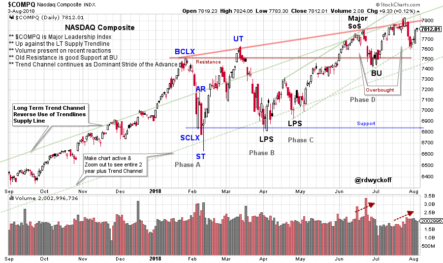
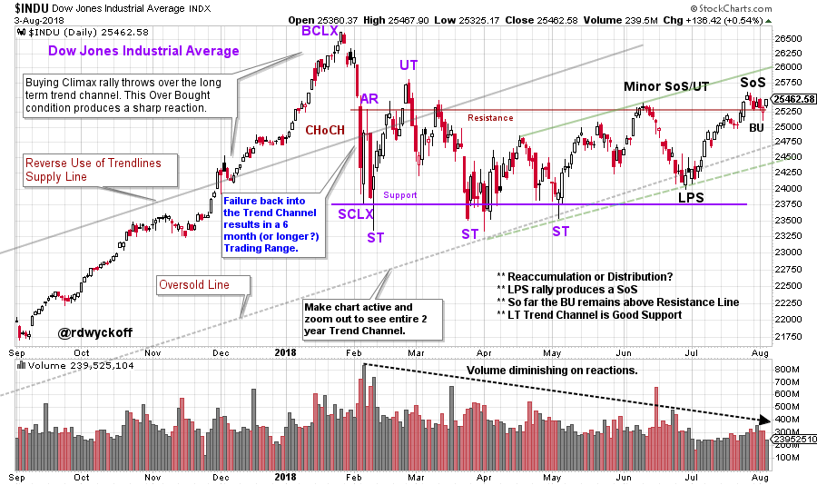

# Homework Assignment

URL: https://articles.stockcharts.com/article/articles-wyckoff-2018-08-homework-assignment/
Date: August 05, 2018 at 05:19 PM
Author: Bruce Fraser

ChartCon 2018 is fast approaching and preparations are being made. Let’s take a few minutes during this busy week to study some charts. For contrast we will compare the NASDAQ Composite, which is one of the leadership indexes, to the Dow Jones Industrials, which is a laggard.

A big thank you to fellow Wyckoffian, Roman Bogomazov, for his collaboration in the preparation of these charts for original publication in the Wyckoff Market Discussion sessions (click here for more information).

---

(click on chart for active version)

The NASDAQ Composite ($COMPQ) rallied in late June (end of the quarter) into three forms of Resistance. Also, there was an Upthrust of the Buying Climax (BCLX) which is labeled a Major Sign of Strength. In July the Major SoS was tested and the index is at that level now. Consider the scenarios that are possible here, both bullish and bearish. What is the price and volume action that would signal each?

(click on chart for active version)

Recently the Dow Jones Industrials ($INDU) has come to life after forming a Last Point of Support (LPS). The $INDU is attempting to hold just above Resistance, after a constructive rally, and is labeled a Back Up (BU). In both of the above examples, study the multi-year trend channel that has set the stride of the bull trend. Consider three scenarios for the $INDU at this juncture.

See you at ChartCon 2018,

Bruce @rdwyckoff

Announcements:

Best of Wyckoff Online Conference BOW 2018: Judging the Market by its Own Action. September 1, 2018 – watch live or on-demand. This is the Wyckoff event of the year. CLICK HERE to learn more about this Epic Conference and to register now.
