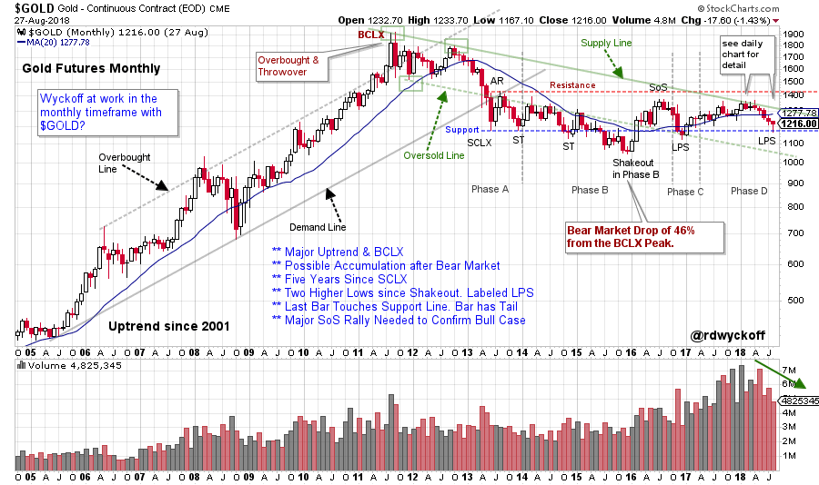
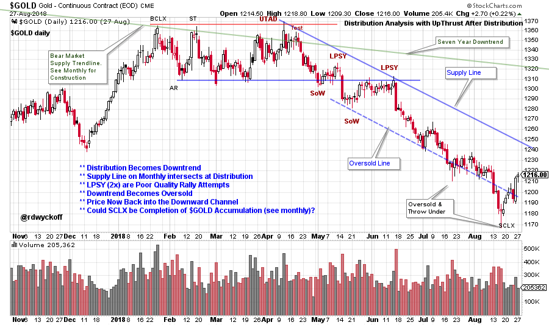
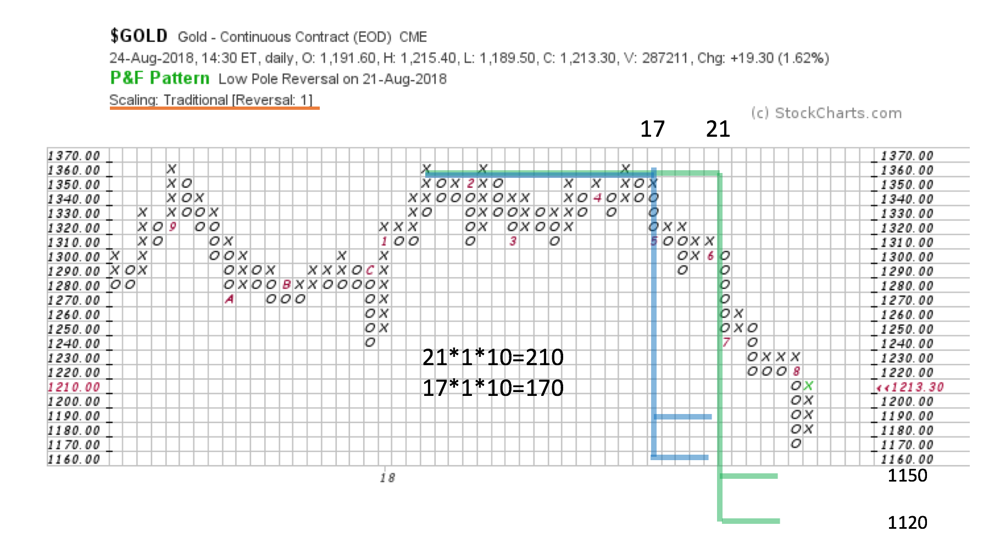

# Prospecting for a Low in Gold

URL: https://articles.stockcharts.com/article/articles-wyckoff-2018-08-prospecting-for-a-low-in-gold/
Date: August 28, 2018 at 01:50 PM
Author: Bruce Fraser

Gold began an uptrend in 2001 which persisted for more than 10 years. At the conclusion of that trend, gold had a classic Buying Climax (BCLX) which led to a Change of Character. For the last 5 years gold has made no upward progress. Is gold getting ready to resume the prior uptrend, or is it a sideways trend about to become a new downtrend?

Wyckoff is a scalable methodology and thus works in many timeframes. If we want to understand the likely direction of the big trend, we evaluate bigger chunks of data. Wyckoff is always about what to do and when to do it. With gold we are starting our analysis with monthly vertical bar charts to capture the essence of the 10 year uptrend and the following 5 year trading range. Only if gold demonstrates either the completion of Accumulation or Distribution would we consider initiating a trading position.

---

(click on chart for active version)

Note how this monthly vertical chart follows Wyckoffian principals. In 2011 a throwover concludes the uptrend for gold and a major decline follows, a final low arrives more than 4 years after the peak. This was a major bear trend (46% decline to the Shakeout low). Gold has been making higher lows since the end of 2015. A rally began at the end of 2016 and we label that low a Last Point of Support (LPS). The rally from the LPS low is capped by touching the Supply Line and this turns the trend down again (see the daily chart below for more detail on this Distribution area). The most recent five months have all been down bars. The last bar for gold (August 2018) has returned to the Support line as defined by the low of the Selling Climax (SCLX) made in 2013. This puts gold at a critical and interesting juncture. Let’s zoom into the daily timeframe and refine the analysis.

(click on chart for active version)

In early 2018 Distribution forms as $GOLD rallies into the monthly Supply Trendline (see monthly chart). Zooming into the daily timeframe illustrates a level of detail that isn’t seen on the monthly chart. This demonstrates the value and edge in understanding the large view and having that inform the smaller view. Trendlines are so valuable. Often the stride of the decline or advance is defined early in the trendline construction. Such is the case here. From the UpThrust After Distribution (UTAD) to the Last Point of Supply (LPSY) a Supply Line is drawn and a stride established. The Trend Channel is formed with an Oversold Line which is a parallel line extended from the lowest low in between these two points (here using the Sign of Weakness low). A classic Distribution completes over five months. Two SoW drops below Support followed by very weak rally attempts, signal that quality demand is non-existent and gold is vulnerable to a drop. This drop is likely to produce a downtrend. The Supply Line expresses the rate of the expected drop. In August, $GOLD threw under the downtrend channel and became Oversold­­. A rally back into the channel began almost right away.

Study the August bar on the monthly chart. It touched a major monthly Support line and held. A tail is forming on that last bar. A Change of Character rally on the daily chart could produce a rally to the Supply Trendline and possibly to the Resistance Line.

Two Point and Figure Counts (PnF) of the Distribution area (profiled above) extend counts into the Oversold area of the channel previously studied. The smaller Distribution Count has been fulfilled. The larger count was missed by only two boxes, and still could be touched later.

To summarize: Gold futures have declined to the Support formed in 2013. Distribution on the daily chart produced a four month downtrend channel. $GOLD became oversold with a climactic surge under this daily trend channel (which also touched the monthly support line). The Point and Figure count was fulfilled at these lows. These three forms of Support could hold $GOLD here and produce a rally attempt. If this low is a Last Point of Support, a good rally toward Resistance should be the result. A break below the monthly Support (and the prior LPS) would be a clue the downtrend is still in force (a tactical place for stops).

All the Best,

Bruce @rdwyckoff

Upcoming Wyckoff Events:

Best of Wyckoff Online Conference BOW 2018: Judging the Market by its Own Action. September 1, 2018 – watch live or on-demand. This is the Wyckoff event of the year. CLICK HERE to learn more about this Epic Conference and to register now.

Partial List of Speakers and Topics: David Weis:Finding Springs Gary Fullett:Looking for trades at the right edge of the chart Roman Bogomazov:Deliberate Practice to Master Wyckoff Analysis, Part II Todd Butterfield: Wyckoff's Law of Effort vs. Result in the Cryptocurrency Markets Bruce Fraser and Roman Bogomazov: Review of Current Markets from a Wyckoff Method Perspective

Wyckoff Market Discussions, Free Session (Wednesday September 5th):Roman Bogomazov and I will be offering acomplementary webinar on September 5th: please click here to register now! In the Wyckoff Market Discussions we evaluate the present position and probable future direction of major indices, sectors, industry groups and stocks. Our main intention for the WMD is to impart unique Wyckoff-themed education and analysis. Join us on 9/5from 3pm to 5pm (PDT) for this free session. Register and attend to receive special offers for future WMD sessions. To register for the event click here. For more informationclick here.
