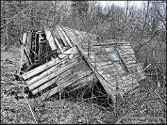
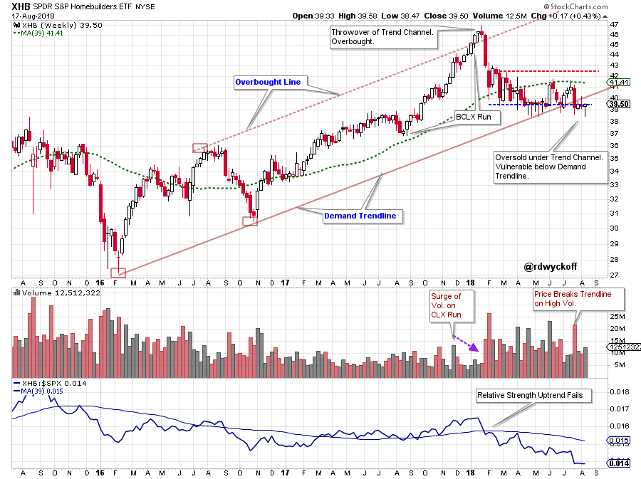
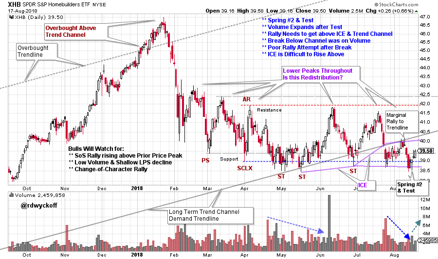

# Residential Deconstruction

URL: https://articles.stockcharts.com/article/articles-wyckoff-2018-08-residential-deconstruction/
Date: August 18, 2018 at 08:00 AM
Author: Bruce Fraser

Charts are sometimes a mish-mash of contrary messages. As a general rule Wyckoffians will attempt to avoid these situations. But they can be valuable case studies. Residential Construction has been a Relative Strength (RS) laggard during all of this year after a surging climactic run in 2017. See the classic Trend Channel that framed the uptrend for the SPDR Homebuilders ETF in the weekly chart below. After a throwover of the channel (producing an Overbought condition) a Change-of-Character dropped the price of XHB into the channel. Thereafter persistent weakness took XHB to the Demand Line where it became Oversold. After a couple of marginal attempts to rally, XHB is now below the Demand Trendline. Note the constant weakness of the RS during 2018.

---

(click on chart for active version)

A very high volume down week pierced the channel and so far, has not been able to mount a meaningful rally. This is a very vulnerable looking spot. Let’s zoom into the daily view to gain some clarity.

(click on chart for active version)

This chart has been marked up as potential, unfinished, Accumulation. But it could be Redistribution. After the initial drop into February, each of the subsequent rally attempts has been to a lower high. The July / August rally has been the weakest and on declining volume. This modest rally was turned back after touching the Demand Line from underneath. Also, the July drop had a surge of down volume (most of it near the Support area). Was there evidence of good Demand in this spike of volume? The August decline into the Support area was on lower volume and produced a Spring action (it is labeled a Spring #2, could it be a Spring #3?). Click here to read about Springs.

Your mission (if you choose to accept it) is to build scenarios for what could happen next (bullish and bearish). Look for hints in the chart above. This case study is strictly for education and fun.

Enjoy,

Bruce @rdwyckoff

Announcements:

TSAA-SF Annual Conference. Saturday, August 25th, from 8am to 5pm.

For those of you who will be near San Francisco on August 25th, this is a wonderful event. Click here to see the list of All-Star Speakers who will be presenting. For Wyckoffians; Roman Bogomazov will present: ‘Hank Pruden: 21stCentury Technician’. I have accepted an invitation to be a participant on the end-of-day panel discussion. If you can attend please find me during one of the breaks and say hi. The conference is at Golden Gate University (GGU) 536 Mission St., San Francisco, CA and is a very short walk from the Montgomery Street ‘BART’ Station. See you there.

Best of Wyckoff Online Conference BOW 2018: Judging the Market by its Own Action. September 1, 2018 – watch live or on-demand. This is the Wyckoff event of the year. CLICK HERE to learn more about this Epic Conference and to register now.

Wyckoff Trading Course Roman Bogomazov will be conducting a complimentary webinar on August 27th @ 3:00pm PDT. This is an introduction to his online series: Wyckoff Trading Course Attend the first WTC Fall 2018 webinar - click here to reserve your seat!
