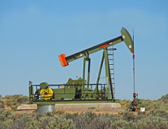
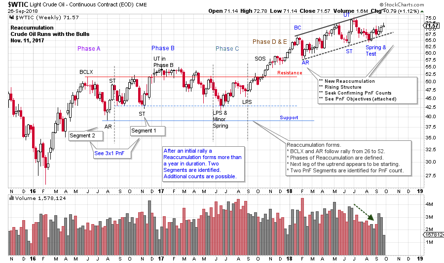
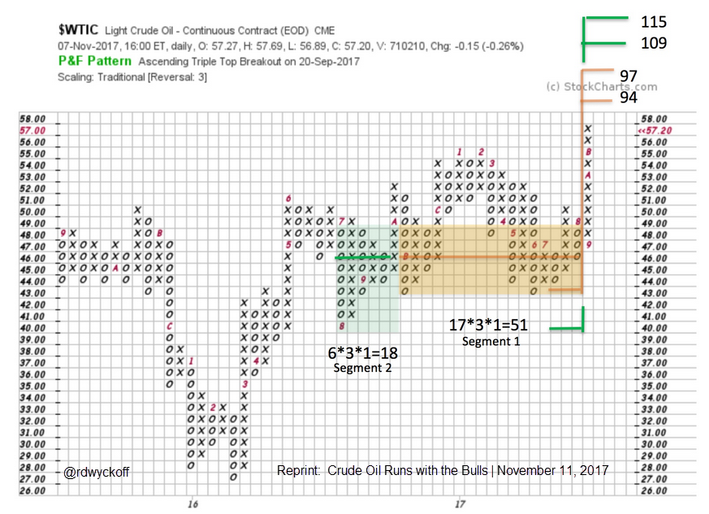
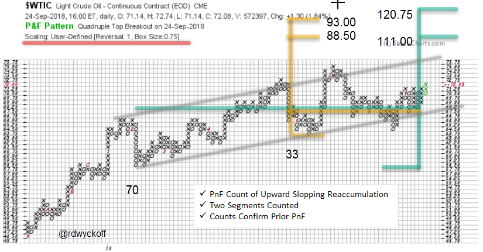

# Campaigning Crude Oil

URL: https://articles.stockcharts.com/article/articles-wyckoff-2018-09-campaigning-crude-oil/
Date: September 27, 2018 at 12:13 PM
Author: Bruce Fraser

It is time to update the blog post, 'Crude Oil Runs with the Bulls', of November 11, 2017 (click here). Our Crude Oil ($WTIC) odyssey began in December of 2015 with a study of the Distributional Top touching $112. A Distribution Point and Figure (PnF) count produced an almost unbelievable price objective of $34 / $28. That December $WTIC fell to about $35. On the chart below note the early February 2016 low as the climactic action continued to skid lower. On the way down $WTIC formed a Redistribution PnF count that confirmed the objective of the Distributional top PnF Count at $30 / $28 (the final low was about $26). Click hereand here to study this epic crude oil decline.

---

(click on chart for an active version)

Note the final crude oil low in February 2016 at $26.05. The reversal up was quick and steady. A long and protracted Cause or Reaccumulation formed after that initial rally. We counted that large structure after a Sign of Strength (SoS) jump above the Resistance area. Here we will reprint that PnF chart, with counts for your study.

Those PnF count objectives were breathtaking at the time. But consider how well the earlier Distribution counts worked. Crude oil has big swings and tends to trend and trend. Two Segments are highlighted here. Neither objective has yet been achieved. The lower is $94 / $97 and the upper is $109 / $115.

We turn our attention to the trading in 2018. On the vertical chart above study the trend channel that forms. It is a modestly rising channel. It has the characteristics of Reaccumulation on a rising scale. The Wyckoff labeling is based on this interpretation. Volume has recently been drying up during declines and expanding as crude rises. Let’s count the PnF.

We choose a User-Defined scale of 0.75 for the box size and one-box reversal method. Campaign traders would focus intently on the large trends (prior PnF chart). Here there is more of a Swing Trading orientation. Swing traders have the goal of capturing the imminent intermediate trend move. We see two Segments. The first counts to $88.50 / $93.00. The larger to $111.00 / $120.75. Major potential has been generated in 2018. The prior peak at $75 is just above current prices. The top of the trend channel is also important. We will watch for crude oils ability to quickly lift to this overhead Resistance.

Reflect on how horizontal PnF analysis has illuminated the path of crude oil in recent years. We will continue to track this very important commodity in the months ahead. Tune in to this weeks ‘Power Charting’ episode for further discussion on the present position and probable future direction of the crude oil market on StockCharts TV. Friday 3pm ET with replays (click here for more).

All the Best,

Bruce @rdwyckoff

Announcements:

Point and Figure Workshop:

Please join fellow Wyckoffian Roman Bogomazov and me starting October 4th for a new three-webinar series: Projecting Point-and-Figure Price Targets Across Multiple Time Frames. While Roman and I have previously taught a foundational Wyckoff Point-and-Figure (P&F) course, the upcoming October series is based on entirely new material. We will provide detailed, step-by-step instruction on how we apply P&F analysis in different time frames as charts unfold, including some advanced refinements, such as learning to recognize the directional bias of a trading range using P&F alone, and enhancing the quality of your P&F analysis by incorporating trading volume. Please click HERE to learn more and to sign up!

Power Charting on StockCharts TV

Past episodes of ‘Power Charting’ are now available ‘On-Demand’ on the StockCharts TV youtube channel (click here for a link).
