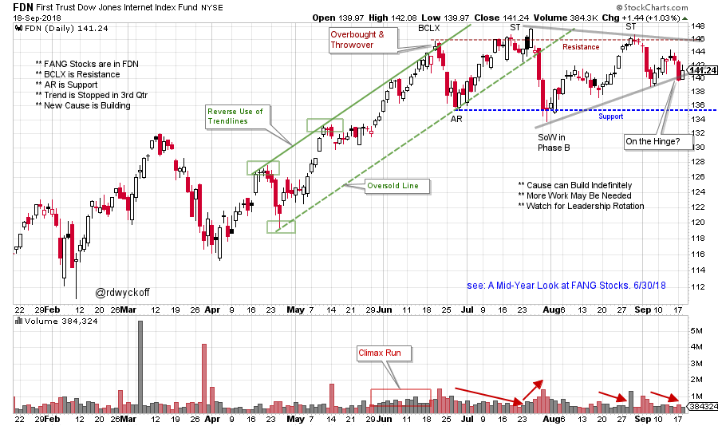

# deFANG'd?

URL: https://articles.stockcharts.com/article/articles-wyckoff-2018-09-defangd/
Date: September 19, 2018 at 08:00 AM
Author: Bruce Fraser

In June we studied the First Trust Dow Jones Internet Index Fund (FDN). This ETF is our proxy index for the FANG stocks. At that time FDN had accelerated into an overbought condition by throwing over its trend channel. Almost immediately weakness set in and FDN tumbled to the lower trendline. The rush of FDN into the June Buying Climax (BCLX) had the appearance of institutions crowding their buying into quarter-end, late in the uptrend. The decline that followed was significant and was labeled an Automatic Reaction (AR). As Wyckoffians when we observe such market action, a ‘Change of Character’ (CHoCH) in trading is expected. In this case the CHoCH was from a trending phase to a trading range. Take some time now and review ‘A Mid-Year Look at FANG Stocks’ (click here for a link).

---

The Wyckoff drill is to extend a Resistance line at the BCLX peak and a Support line at the AR. It is expected that price will become range-bound around these extremes while building a Cause for the next move. Let’s see what happened as the 3rdquarter unfolded.

(click on chart for active version)

After the Buying Climax (BCLX), selling sets in. Resistance at this peak has been respected during the entire 3rdquarter. A Cause is being formed for the next move, and does not appear to be complete. We can see that declines are very volatile and swift while rallies are plodding. Volume expands on drops and dries up on the price rises. Since the Sign of Weakness (SOW), FDN has been making higher lows. The drop from the Secondary Test (ST) is wide and weak, which demonstrates Supply emerging. If FDN falls to Support during this decline, the appearance of Distribution will be evident. A small rising trendline is now being threatened by price weakness.

A trading range (Cause building) phase in the 3rdquarter has formed as expected. What would we need to see to set up a fresh new uptrend or a downtrend? The FANG stocks have been very important leadership. Two converging Trendlines have constricted FDN into a Hinge. Resolution of this Hinge, in either direction, could initiate a new move. Can the FANG stocks continue to lead the way higher, or will strength come from other stocks, groups and sectors of the market?

All the Best,

Bruce @rdwyckoff

Announcements:

Join Roman Bogomazov and me for our new Wyckoff program 'Power Charting' on StockCharts TV. Friday 3pm ET with replays (click here for more)
