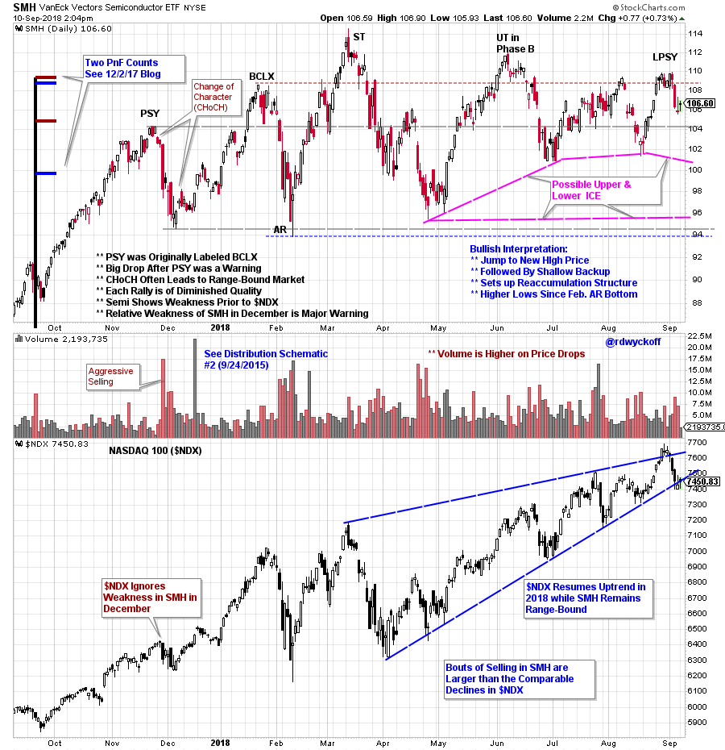
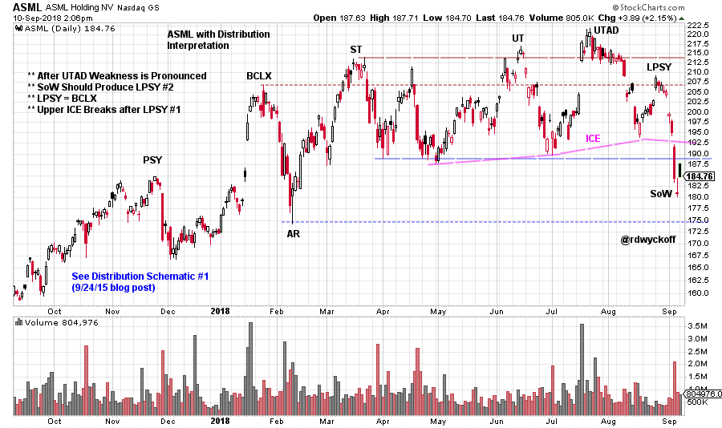
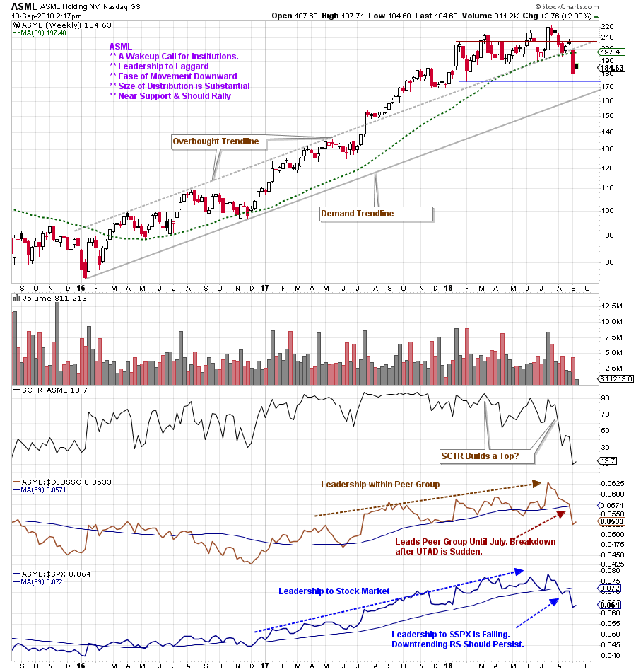
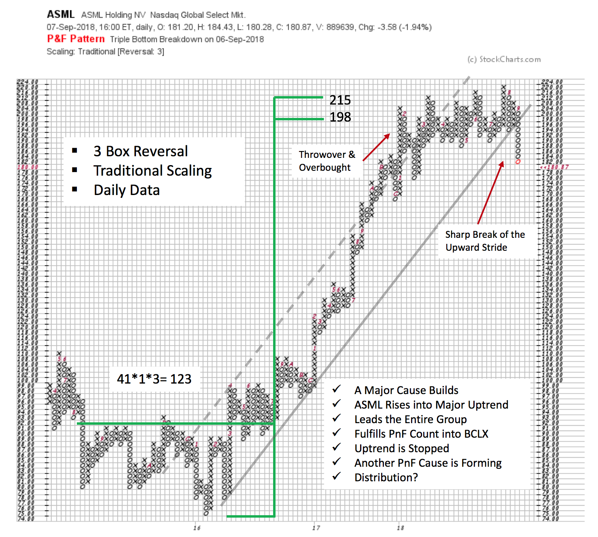

# Semi-Tough

URL: https://articles.stockcharts.com/article/articles-wyckoff-2018-09-semi-tough/
Date: September 10, 2018 at 03:52 PM
Author: Bruce Fraser

Back in December of 2017 we asked ‘Do Semiconductors Still Compute?’. An epic rally that began in 2016 had Climactic qualities as SMH accelerated into year-end 2017. Two different PnF counts were fulfilled on that rally surge. After a sharp break on high volume it appeared the rally had run its course. That blog post made the case for a range-bound condition for the semiconductor index for the foreseeable future. Let’s bring this Wyckoff analysis up to date.

Begin by reading ‘Do Semiconductors Still Compute?’ (click here for a link) with particular focus on the two SMH PnF counts. Note how they confirm each other. Also, note the Buying Climax (BCLX) into the PnF price objectives. What was labeled a December 2017 BCLX has now been updated to Preliminary Supply (PSY) and the next peak became the BCLX. This change can be seen in the SMH chart below.

---

Semiconductors have set the psychological tone for this bull market with their stellar outperformance and persistent trending. When these stocks are rising strongly it tends to encourage the entire stock market to go upward. Notice that SMH showed early weakness in December ahead of the NASDAQ 100 ($NDX). This Change of Character (CHoCH) was evidence of the Composite Operator (CO) beginning important selling of the Semiconductor stocks. And this weakness precedes the selling in the $NDX that arrives in January. Did SMH provide a warning of upcoming trouble for the entire stock market?

(click on chart for active version)

Compare the trading tone of $NDX in 2018 to the SMH. The weakness in SMH is distinct. If the $NDX becomes weak here what is the likely response from the semiconductor stocks? ASML Holding NV (ASML) is a key leadership stock in the semiconductor space.

(click on chart for active version)

ASML has been slightly stronger than the SMH Index with higher peaks during the Range-Bound 2018 period. The BCLX in January is clearly evident, thrusting more than 30 points. The Resistance formed by the BCLX peak contains each attempt to rise above it, until the July Upthrust, which is notable with a large climactic gap on very high volume. Systematic CO selling is engulfing ASML after the UTAD and pushes the price into the upper Resistance line for three weeks. Significant Distribution here gives way to a sharp price break with gaps. The LPSY stops at the original Resistance line formed at the BCLX peak. Price is now moving down with ease which leads Wyckoffians to expect that Distribution is complete.

(click on chart for active version)

Semiconductors have been stock market leadership since 2016. ASML has been a leader among the leadership. Studying the two Relative Strength indicators above, we can see that ASML turned down against its peer group ($DJUSSC) and the stock market ($SPX). Institutions began aggressive selling of ASML in the early stages of the 3rd quarter upon the completion of the Upthrust After Distribution (UTAD). The severity of the decline suggests that institutions are aggressively selling late in the Distribution structure, and are in a hurry to exit their positions.

The Composite Operator (CO) is the first to sell. Their selling campaigns begin around the PSY and BCLX and continue until they are done. This is the area of Distribution. Other large sellers will arrive late in the Distribution structure or as the Markdown phase is underway.

In 2015-16 ASML built a major Cause in the form of a PnF count that led to the major uptrend that followed. A Climax formed into the PnF count objective with a throwover of the uptrend channel. Distribution appears nearly complete, and is a large structure.

SMH is at the tipping point. It is within striking distance of the March high prices. A return to leadership by rallying to these levels would be welcome and give a boost to the entire market. As Wyckoffians often say; It is on the Hinge!

All the Best,

Bruce @rdwyckoff

Announcements:

Special Offer: 3 for $30 (September 12, 19 and 26 sessions); 3pm to 4:30pm PT (all sessions recorded)

Wyckoff Market Discussion, our weekly webinar series focuses on the study of markets to develop ever higher levels of Wyckoff Trading Mastery. In the Wyckoff Market Discussions, we evaluate the present position and probable future direction of major indices, sectors, industry groups and stocks. Our main intention for WMD is to impart unique Wyckoff-themed education and analysis. WMD is regularly priced at $99/month.

Join us and see what our Wyckoff community is all about. To learn more, click here.
