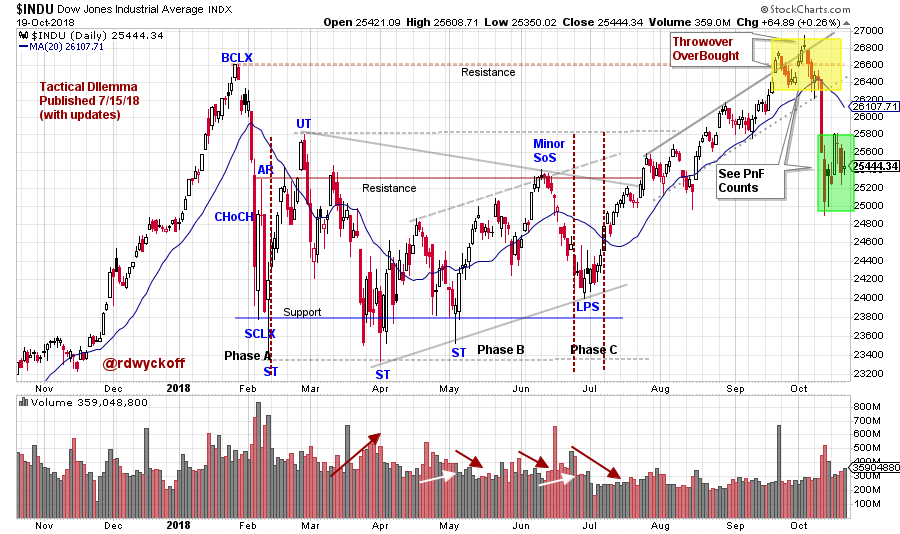
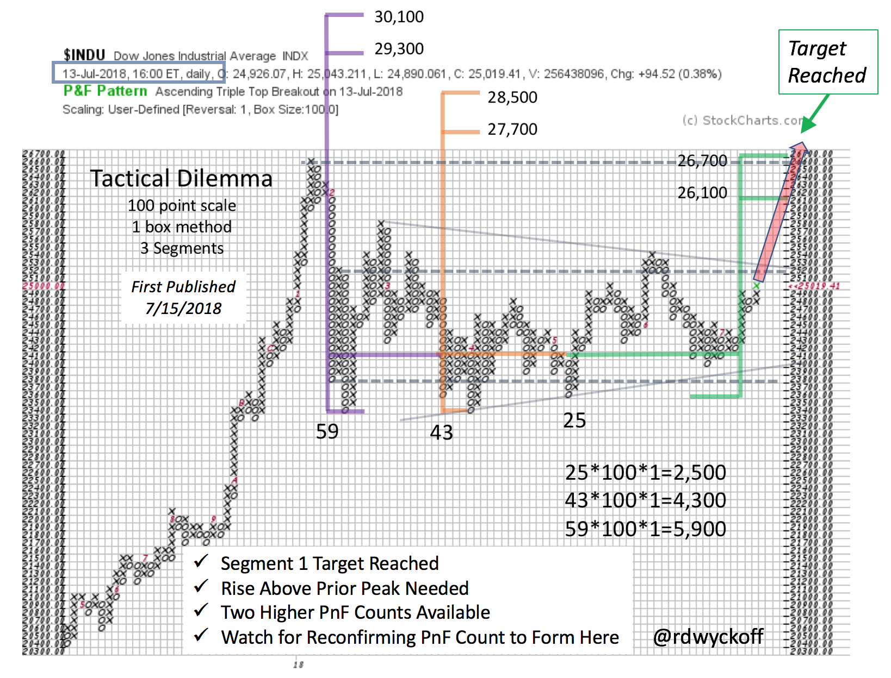
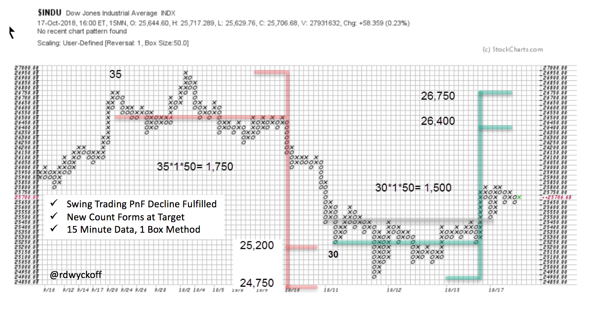
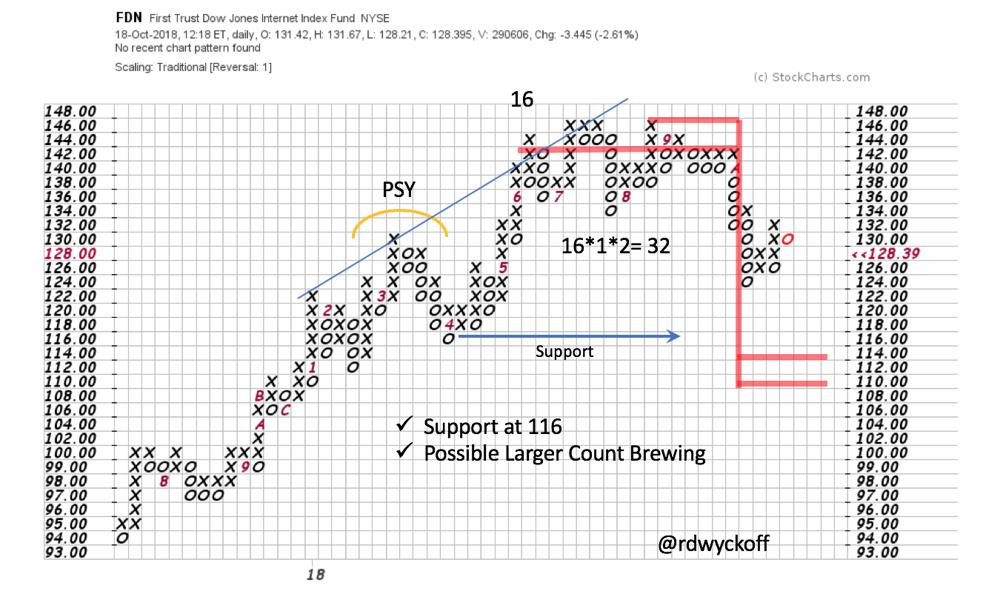

# Headwinds

URL: https://articles.stockcharts.com/article/articles-wyckoff-2018-10-headwinds/
Date: October 20, 2018 at 04:03 PM
Author: Bruce Fraser

Headwinds have been forming for the stock market. Point and Figure counts (PnF) have been signaling where these opposing forces to higher stock prices were likely to emerge. Stocks have reacted downward with authority after hitting these PnF targets. Let’s review, and bring current, some of these prior chart studies. Possibly they can provide a glimpse of what is ahead for the stock market indexes.

---

(click on chart for active version)

The blog ‘Tactical Dilemma’ was first published on July 15, 2018 (click here for a link) and made the case that Phase C (final testing Phase) was complete for the Dow Jones Industrial Average ($INDU). A rally was expected from this Last Point of Support (LPS) to the Resistance area formed at the January Buying Climax (BCLX) peak. This view was further supported by a Segment of the PnF that counted to the prior high (see chart below). In this updated vertical chart, the $INDU becomes overbought by throwing over the trend channel right at the Resistance level. A stiff decline followed. Is this the end of the Bull-Run for the Dow Jones Industrials?

Study the first Segment of our count. The $INDU went right to, and slightly through, this PnF count (in green) and then the market reacted sharply. Note that two more Segments have formed in this very large Reaccumulation for the $INDU. Three types of Resistance were in place where the market turned downward. They were the BCLX high formed in January, Segment 1 of the PnF count and the throwover of the rising trend channel (producing a minor BCLX). Let’s zoom into this area and study it (yellow shaded area of vertical chart).

Distribution formed in the $INDU at the Resistance area. The good news is this Cause is small and already fulfilled. The decline was persistent and painful for the Bulls. Right on cue, at the PnF objectives, a Selling Climax formed. Now a Cause is building that points to the area of the prior high. Looking at the vertical chart we see the correction was sharp and returned to the Support in the middle of the trading range. There is the presence of large selling (supply). We must brace for the possibility that more supply may be present (supply manifests in wide price bars and high volume as the price declines). As Wyckoffians we will watch for a rally that can propel the index above the Resistance area and then for a shallow Back Up (on light volume) that demonstrates that Supply has exhausted itself. This will allow for a fresh new uptrend.

Finally let’s update our FDN case study. At the end of the third quarter we studied a pivot (or Hinge) that was forming in this ETF (our surrogate index of the FANG stocks). Since this last post FDN turned down and out of the Hinge (click here and here for a review). Thus, we can take a PnF count. The break came at about $142. The count reaches to $114/$110. Note in the larger structure that Support would be breached, producing a Sign of Weakness (SoW). A rally of poor quality thereafter could complete a very large Distribution structure (from an LPSY to the PSY). Try to visualize these unfolding Wyckoff scenarios. It is great practice. Take a minute to study the updated FDN vertical chart study (click here and make the chart active to see new data).

Institutions actively selling FANG stocks may free up investible cash to be redeployed into other areas of the stock market. Which may propel the next upward leg of the Bull-Run. We will watch for new leadership clues in emerging groups and sectors.

All the Best,

Bruce @rdwyckoff

Power Charting is Now Available On-Demand

Past episodes of ‘Power Charting’ are now available ‘On-Demand’ (click here for a link). The current episode is available by clicking here.
