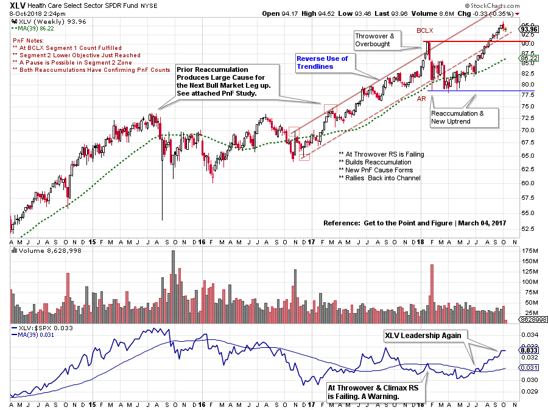
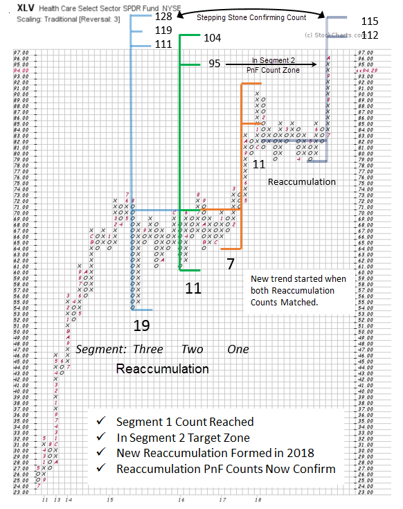

# Health Care Plan

URL: https://articles.stockcharts.com/article/articles-wyckoff-2018-10-health-care-plan/
Date: October 08, 2018 at 03:16 PM
Author: Bruce Fraser

In March of 2017 the Health Care Sector (XLV) emerged from a large Reaccumulation structure into a fresh new uptrend. Much has happened since then. Let’s update the status of this uptrend.

After a sustained advance from 2009 to 2015 the trend stopped and a Reaccumulation formed. This trend stopping area was flagged by a base PnF count (click here to view). After the Reaccumulation the uptrend resumed. The PnF Counts have provided a useful road map for the likely direction and extent of the trend. Recently a Count has been fulfilled. Does this suggest that XLV has completed a bull run? Or is there more to go for this important leadership theme?

---

(click on chart for active version)

Note how the resumption of the uptrend began while the large Reaccumulation was still forming in 2016. As this major Reaccumulation concluded, the stride of the next Markup phase formed and the Trend Channel could be drawn. After a year-long uptrend and a Climactic surge in early 2018, price failed below the bottom of the channel. XLV demonstrated its resilience by forming a new Reaccumulation and hatching a fresh uptrend at mid-year. The Health Care Sector reemerged into a leadership role. Let’s take a PnF count of this new Reaccumulation to determine if there is more life in the big bull trend of XLV.

Three Segments have been identified in the large Reaccumulation of 2015-17. Segment One was fulfilled at the BCLX surge in early 2018. Segment Two (lower objective) has just been reached, and may have further to go (to the higher target zone). The upper trend channel line (see vertical chart) has not yet been reached, and the high target ($104) of the PnF range of Segment 2 is very near this trendline price level. A Stepping Stone Confirming PnF count is at work here. Note how the 2018 Reaccumulation and Segment 3 of the previous Reaccumulation both nest at the same price target zone. The trend may need a rest soon, as the Segment 2 objectives are met. There is still potentially higher PnF price objectives ahead for this most important leadership group. Ongoing XLV leadership is encouraging for the continuation of the long term bull market for stocks.

All the Best,

Bruce @rdwyckoff

Announcements:

Point and Figure Workshop:

Please join fellow Wyckoffian Roman Bogomazov and me for a new three-webinar series: Projecting Point-and-Figure Price Targets Across Multiple Time Frames. While Roman and I have previously taught a foundational Wyckoff Point-and-Figure (P&F) course, the upcoming October series is based on entirely new material. We will provide detailed, step-by-step instruction on how we apply P&F analysis in different time frames as charts unfold, including some advanced refinements, such as learning to recognize the directional bias of a trading range using P&F alone, and enhancing the quality of your P&F analysis by incorporating trading volume. Please click HERE to learn more and to sign up!

You can still register for this PnF Special webinar series! You will receive access to the October 4th session recording, so you’ll have plenty of time to review it before the next webinar (October 11th)!

Power Charting on StockCharts TV

Past episodes of ‘Power Charting’ are now available ‘On-Demand’ on the StockCharts TV youtube channel (click here for a link).
