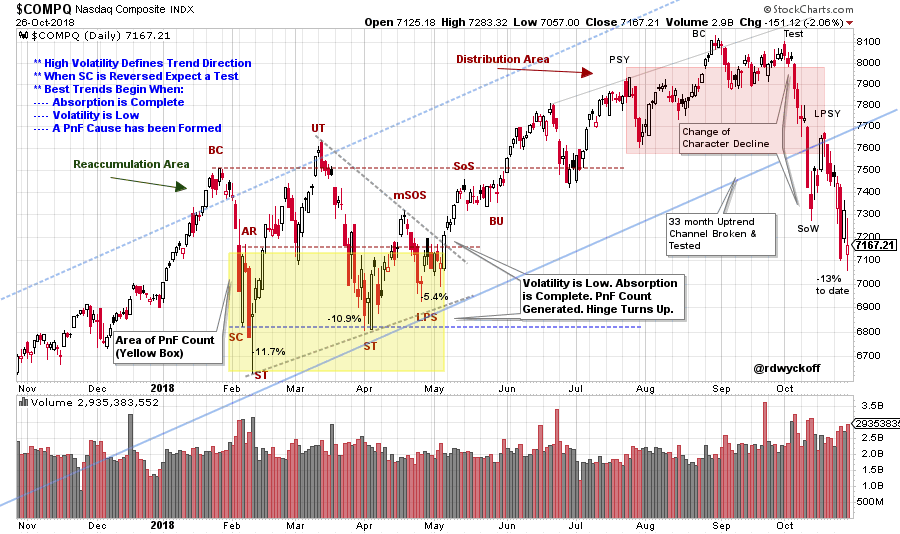
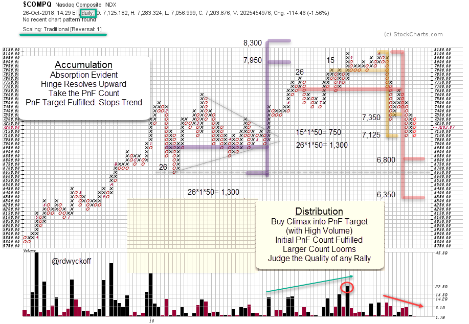

# Nasdaq Composite. Down for the Count?

URL: https://articles.stockcharts.com/article/articles-wyckoff-2018-10-nasdaq-composite-down-for-the-count/
Date: October 27, 2018 at 06:06 PM
Author: Bruce Fraser

The current decline was accompanied by a large increase in volatility and volume. Can the Wyckoff Method help guide our thinking and improve our tactics? A recent parallel is the decline in January and February of this year and the market action that followed in its aftermath.

Wyckoff provides a road map in the form of Accumulation and Distribution schematics. Accumulation is the process of stock being absorbed by large institutional interests. The completion of absorption is represented in the price and volume behavior on the vertical bar charts. The opposite is the case during Distribution. Where stock is systematically sold and removed from these institutional portfolios.

---

When we read the charts correctly they signal when absorption is complete and the Accumulation phase turns into a fresh new Markup with a robust uptrend. When Distribution ends Markdown begins and a new downtrend is underway. Let’s study the Accumulation that formed in the first half of 2018 for clues about how to handle this recent volatile decline.

(click on chart for active version)

In January the Buying Climax was followed by a ‘Change of Character’ (CHoCH) decline that fell -11.7% in 11 days. A range-bound condition was expected thereafter with the Buying Climax (BC) and the Low (here labeled a Secondary Test) being the outer boundaries of the trading range. In this trading range either Reaccumulation or Distribution was expected to form. Wyckoffians will look for evidence of absorption to confirm Reaccumulation. This takes time as institutions need to methodically and carefully buy up shares of stock in the lower half of the trading range. In this case study, the uptrend began in early May. There was evidence of the NASDAQ Composite ($COMPQ) being stealthily bought by large institutional interests after the February low. Let’s review some of the key attributes of the early 2018 Reaccumulation phase. First, the decline from the BC is the deepest and the quickest. The next drop from the UpThrust (UT) fell less and made a higher-low (and took more days). The final drop in April was very shallow, and made another higher-low. A hinge formed, which illustrated volatility being squeezed out. Then the $COMPQ rallied sharply out of the hinge to start a new uptrend. At the Last Point of Support (LPS) a Point and Figure count could then be taken. The turn up from the LPS is the ideal spot to begin a new Wyckoffian Campaign. Stock had been absorbed and it became difficult for institutions to buy in quantity. Under such conditions stocks can move up with ease.

This month’s decline from the Test to the recent low is -13% (in 20 days, so far). Price has also fallen out of a three year uptrend channel. In addition, a complete Distribution structure has formed. What can we conclude from the current circumstances? A CHoCH decline with volatility and volume indicates large amounts of Supply are engulfing the $COMPQ. We must surmise that institutions have been Distributing stock, systematically, prior to this recent drop. These institutions have removed sponsorship from the stocks in the $COMPQ for the time being. There will be a price level where these large operators will identify value and begin buying again (defined as a Selling Climax). A new uptrend would be preceded by the building of a new Cause and another round of institutional absorption. This will take time. A new Cause would produce fresh new PnF counts. Let’s look at the recent PnF counts.

The Accumulation count that developed in early 2018 was recently realized and this stopped the uptrend. The rally from the Hinge to the fulfilled PnF objective was a classic campaign. Now two Distribution PnF counts have formed. The smaller PnF count has just been reached (in the range 7,350 / 7,125). Any attempt to rally from this 7,125 area will be watched and judged for its quality. A failure of price at this new low (now or after a rally attempt) puts the larger Distribution count in play. This is an important place on the chart. A rally from the 7,125 zone would produce another higher-low in the year and potentially preserve the long-term uptrend. A decline to the lower PnF objective (6,800 / 6,350) could produce two bearish events. First, would be to put the $COMPQ at new lows for the year below the February support level. Second, would be to establish a lower-low, which threatens the long-term uptrend.

To summarize, building a Cause takes time. Patience is needed. Wyckoff helps with this through the concept of ‘Context’. The current markdown is the result of prior selling by large interests. They will step in, at a point, and Support the market (normally defined as a Selling Climax). Thereafter they will systematically accumulate shares and build a position. This is the process of building a Cause, and it takes time. Wyckoff shows us how to identify these actions on the charts. And where to become active by aligning our activities with the large informed interests to participate in the new uptrend. For a link to prior articles on Accumulation and Distribution click here and here and here.

A critical juncture is now at-hand for the $COMPQ. Evidence of the signs of new absorption would be welcome. But, as Wyckoffians, we must be objective in our judgment and be prepared for the winds of change to blow through the stock market.

All the Best,

Bruce @rdwyckoff
