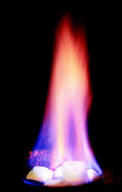
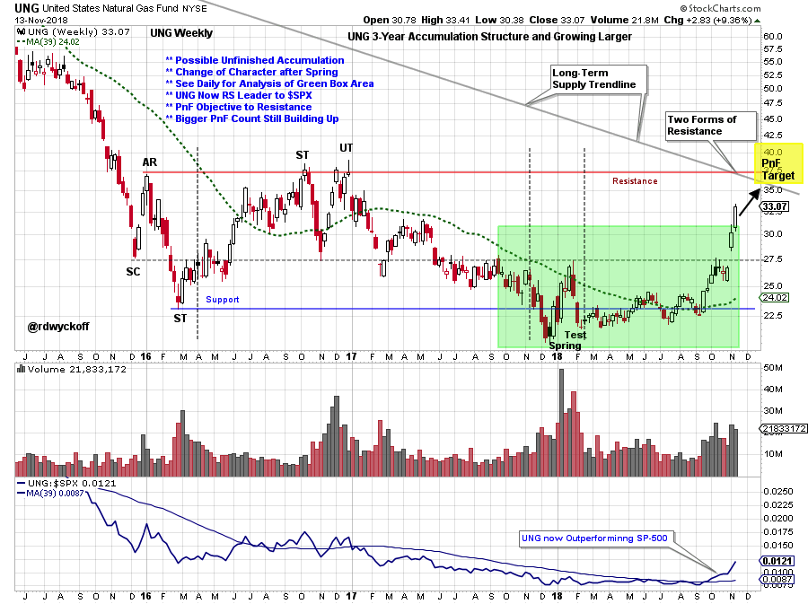
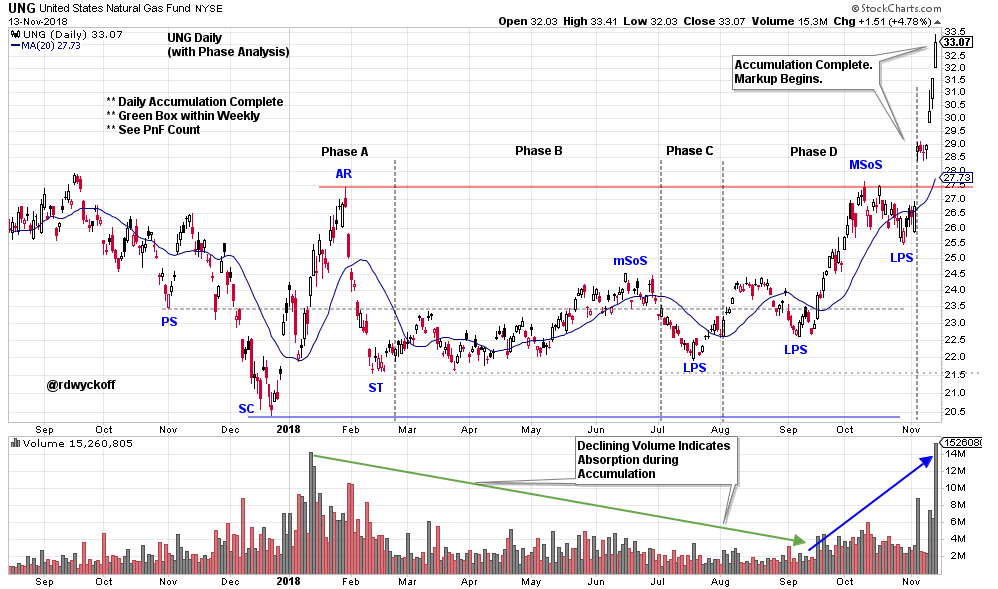
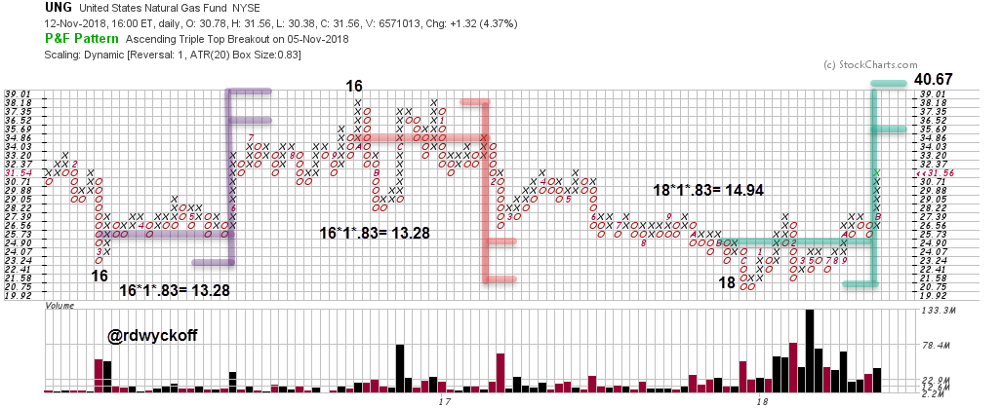

# Natural Gas Lights Up

URL: https://articles.stockcharts.com/article/articles-wyckoff-2018-11-natural-gas-lights-up/
Date: November 13, 2018 at 07:45 PM
Author: Bruce Fraser

U. S. Natural Gas Fund (UNG) made an important ‘Spring’ low at the end of 2017. A Change-of-Character (CHoCH) emerged in the trading behavior of UNG in the new year. On the weekly chart UNG had been in a one year downtrend that concluded with a Spring and a Test. Much of the trading in UNG after the Test was lackluster and hovered around the Support line. But each succeeding low was higher and a clue that gas was finding good bids. Just as the third quarter was ending UNG abruptly lifted off.

---

Just as the stock market ran into trouble in October, UNG began an important rally which is now heading toward the Resistance level. Note the Relative Strength line (compared to the S&P 500) which is now strongly rising away from the uptrending long term moving average. This has been one of the few places to hide during the recent stock market weakness. The green shaded area has the look of Accumulation within the larger 3 year structure seen on the weekly chart.

This Accumulation structure on the daily chart appears to be complete through Phase D and into Phase E. Let’s take a PnF count of the area from the Last Point of Support (LPS) through to the Preliminary Support (PS) and estimate the potential for how high UNG could rise.

The PnF counts appear to be working well. The most recent count carries to 35.69 / 40.67 which is right into the zone of the Overhead Resistance and the long-term Supply trendline (see weekly vertical chart). Visualize on the weekly this area being reached. A Major Sign of Strength (MSoS) and a Backup (BU) type pause into a Last Point of Support would complete the Accumulation formation on the weekly chart. Then a major PnF count could be generated to indicate the potential for a substantial new bull market for UNG.

All the Best,

Bruce @rdwyckoff

Announcement: I will be a guest on MarketWatchers LIVE this coming Wednesday, November 14, 2018. I hope to see you then. Click here for a link.
