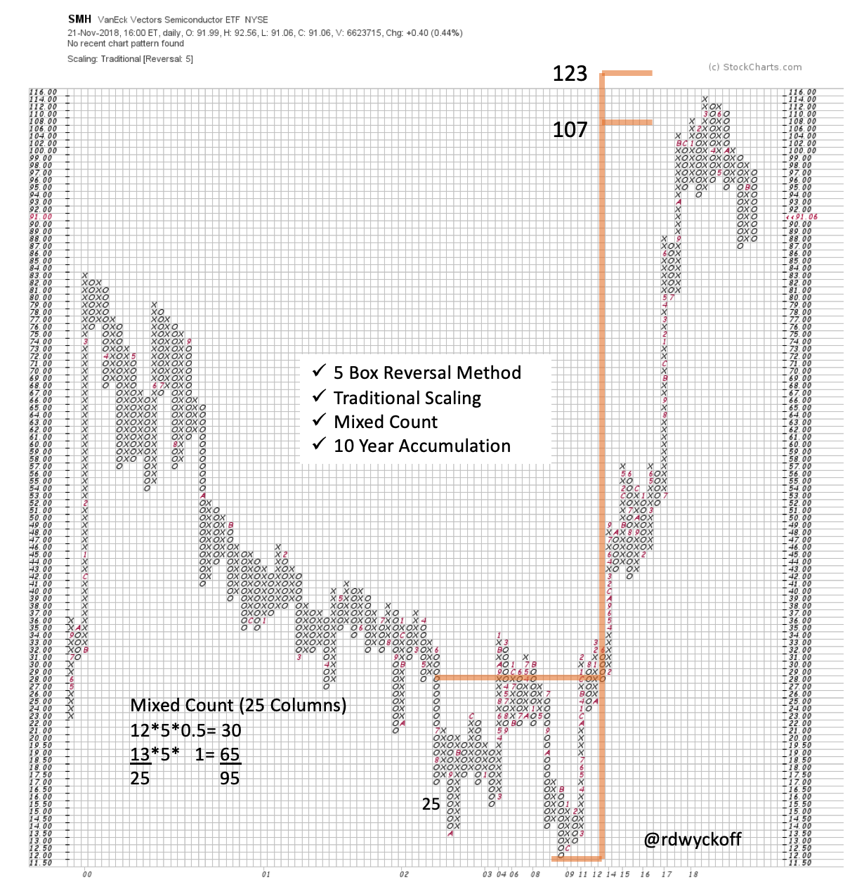

# Semi. Campaign. Completion?

URL: https://articles.stockcharts.com/article/articles-wyckoff-2018-11-semi-campaign-completion/
Date: November 25, 2018 at 02:48 PM
Author: Bruce Fraser

As Wyckoffians we like to celebrate long holiday weekends by looking at Point and Figure charts. Allow me to contribute to your weekend chart stack with this case study on the semiconductor stocks (VanEck Vectors Semiconductors ETF will be our proxy). Semiconductor stocks have been important leadership during this long bull market. Does a leadership theme signal its intent prior to a major price ascent? As Wyckoffians we expect a Cause to form prior to a trend (the Effect). A preparation phase should have developed in the Semiconductor group prior to the major uptrend. This should be evident on a Point and Figure chart.

---

Using 5-Box reversal PnF method we are able to see the entire Accumulation area which spans a 10 year period. The Accumulation area can be counted using this PnF methodology and a price objective estimated. A very large Cause formed and produced a leadership uptrend in the Semiconductor stocks. The vertical ascent of SMH fulfilled the Accumulation count objective in 2018. After the objective was reached SMH had a change in trading character and now appears to be range-bound.

This is a campaign case study so zoom in to smaller timeframes and study the trading activity of SMH. This can be done by reviewing recent blog posts. Start your review with the post ‘Do Semiconductors Still Compute?’ from December 2017 (click here for a link). The multi-year Reaccumulation PnF count was fulfilled with a Climactic surge into the target zone of 100 / 109. A second PnF count using 60 minute data confirmed this larger objective. Note the Change of Character (CHoCH) reaction once the PnF objective was reached. This is valuable confirmation of the conclusion of the advance (and is labeled an Automatic Reaction). PnF counts in three timeframes have been fulfilled. Wyckoffians must be on the alert for potential Distribution.

In September 2018 we reviewed what happened next in ‘Semi-Tough’ (click here for a link). There were classic attributes of Distribution throughout the year. Note the under-performance of SMH to the NASDAQ 100. In addition ASML Holdings is evaluated (a leadership stock in the group). ASML hit the wall after fulfilling a large PnF Accumulation count objective. Click on SMH and ASML to make them active and bring them up to date. Carefully study what has happened during the year and since September.

With Gratitude,

Bruce @rdwyckoff
