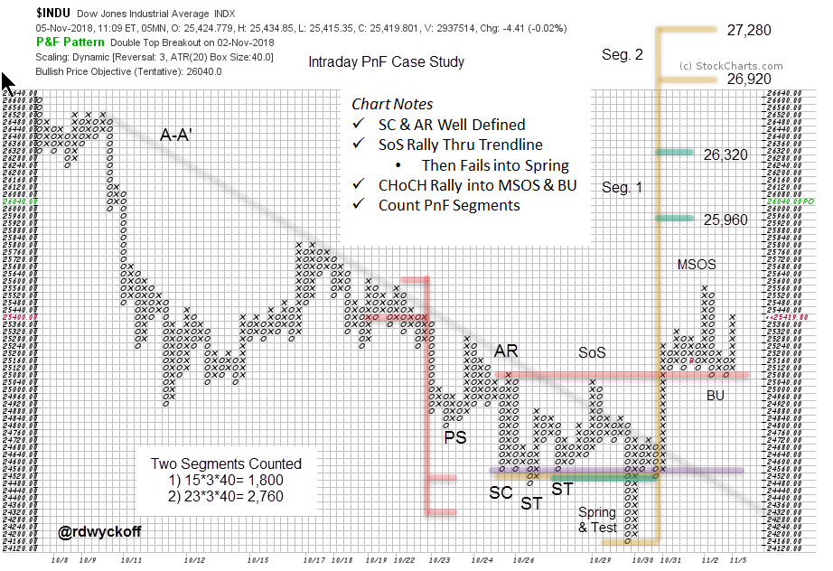

# Using PnF Charts for Intraday Trading

URL: https://articles.stockcharts.com/article/articles-wyckoff-2018-11-using-pnf-charts-for-intraday-trading/
Date: November 05, 2018 at 11:47 PM
Author: Bruce Fraser

Point and Figure charts are useful tools for more than calculating price objectives. Many Wyckoffians start their analysis with PnF charts and then turn to vertical bar charts when and if needed. Classic Wyckoff analysis uses a combination of vertical and PnF charts. But it is excellent practice to develop an eye for the unfolding conditions as they appear on a PnF chart. And the truth is that, for many Wyckoffians, the PnF chart is the first chart studied and where the most time is spent. Let’s conduct an intraday case study using only a PnF chart.

The X-axis on a PnF chart is a function of volatility, not of time. The only way to make entries in the next column to the right is for a reversal of price to occur. Therefore, a well constructed PnF chart shows only the essential up and down swings. These swings build the horizontal counts that generate price objectives.

---

Elements that we depend on when evaluating vertical charts are present here. Downtrend line A-A’ has set a stride for the decline. This 3-box reversal PnF chart of the Dow Jones Industrial Average ($INDU) covers nearly the entire month of October, using 5-minute data. The important swings are evident throughout the decline. The Selling Climax (SC) and the Automatic Rally (AR) stand out as the sharp rallies are equaling the volatile declines. This is evidence of large operators buying at bargain prices. Demand is becoming an equal force to the Supply that has been dominant in October. Support and Resistance lines are drawn at the SC and the AR levels. Buying is turning up prices at the Secondary Tests (ST). A minor Sign of Strength (SoS) pushes the $INDU up through the downtrend line to the level of Resistance where Supply is expected and a new decline begins. Recall that large operators are always testing for the presence of Supply in a potential Accumulation, and that is the case here. Breaking Support sets up a Spring that reversed back above Support quickly. Wyckoffians would conclude that Demand was present and that Supply became exhausted setting up a ‘Change of Character’ (CHoCH) rally. Note the Test. It drifted down into the Support line. Compare the rallies and reactions as they appear on the PnF chart. Demand can be seen to be dominant over Supply as the X-Columns moved up easily and steadily after the Spring and Test. The Major Sign of Strength (MSOS) rally easily exceeds the Resistance line, which becomes Support as $INDU Backs Up (BU) to it.

All of this analysis is present on the PnF chart. PnF can clarify our studies because it simplifies the view. Reducing noise on the chart can make it easier to see the essential chart elements and sharpen analysis.

Once we have identified the area of Accumulation then PnF count objectives can be taken. Counting the area from the Test of the Spring results in two segments to count. These two counts are attractive price objectives and very campaign worthy as swing trades.

Election day is still ahead and is a call for an abundance of caution. We note that $INDU is pushing up into an area of a prior peak from mid-October. There is also a PnF count in this price zone. A classic place for the Composite Operator to pause their activities and wait for election results. They accumulated positions at lower prices and may even have done some selling here. We must always brace for Supply to emerge at overhead Resistance and as PnF count objectives are approached.

Develop your Wyckoff analytical skills to the point that you can see the important chart elements on PnF charts. Hone your Wyckoff PnF chart reading skills as well as your vertical bar chart reading abilities. You will notice that PnF can illuminate the essential activities of the large operators.

All the Best,

Bruce @rdwyckoff

Power Charting is Now Available On-Demand

Past episodes of ‘Power Charting’ are now available ‘On-Demand’ (click here for a link). The current episode is available by clicking here.
