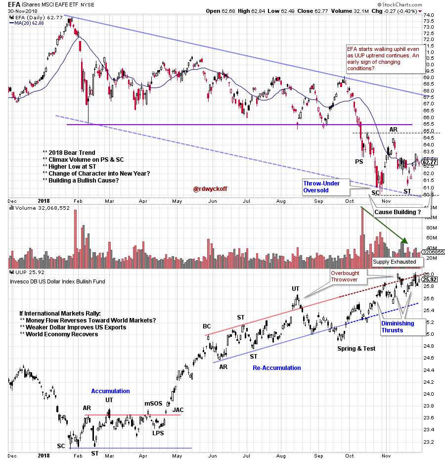
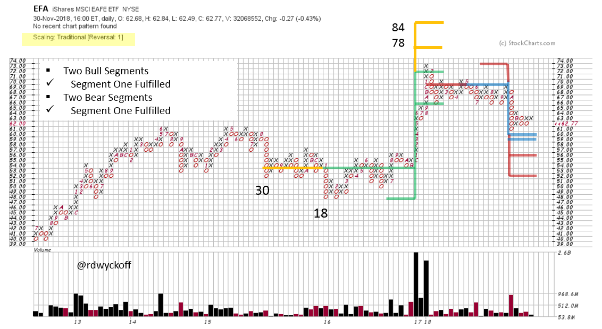
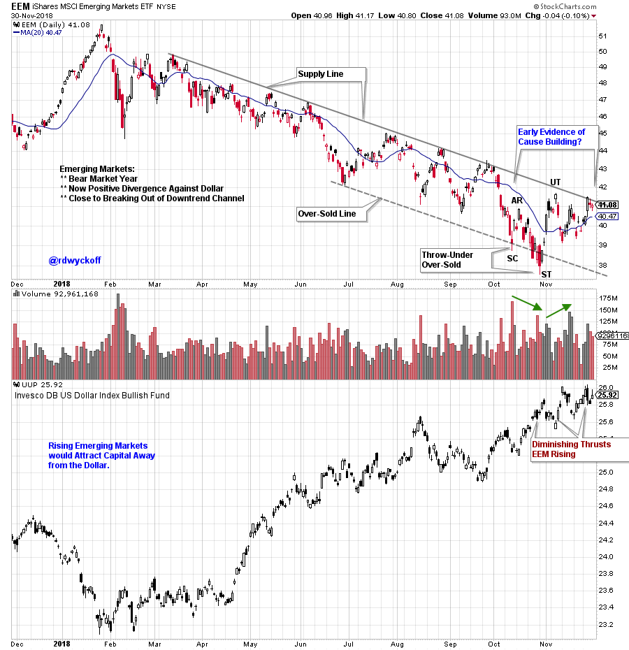
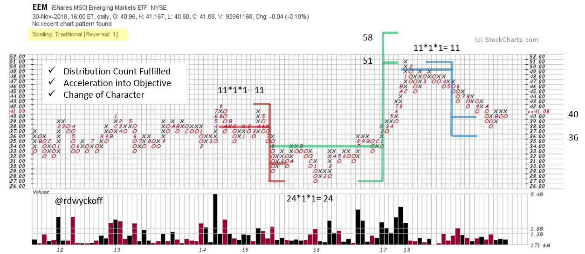

# International Intrigue

URL: https://articles.stockcharts.com/article/articles-wyckoff-2018-12-international-intrigue/
Date: December 03, 2018 at 07:00 AM
Author: Bruce Fraser

Rolling into the New Year can often bring seismic shifts in financial markets. In January of 2018 stock indexes climaxed and reversed. This set the tone of market action for the year. International markets were among the hardest hit during the year. The iShares MSCI Emerging Markets ETF (EEM) declined -12.25% through the end of November. The iShares MSCI EAFE (EFA) was down -8.95% in the same period. There may be change in the wind for these International Indexes as 2018 comes to an end.

---

Note the climactic conclusion to the bear trend of the MSCI EAFE Index (an index of developed stock markets outside of the U.S. and Canada). The EFA has done poorly in comparison to the domestic U.S. stock indexes. One reason for the contrast has been the very strong dollar trend. The UUP (Invesco Bullish Dollar Index) formed an Accumulation early in 2018 and began an important uptrend. International stock markets were weighed down by money flow into dollar denominated assets. Could this trend be reversing? Since October the EFA formed a Selling Climax (SC) while the UUP has continued to push higher. This has the makings of a positive divergence of International stocks to the dollar. Could a reversal be in the works where the dollar has a bout of weakness and money flows can reverse back toward international stock markets?

Two bullish and bearish Point and Figure (PnF) segments are counted above for the EFA. In each case segment one is fulfilled. After a sharp and climactic drop in October the EFA stopped within 1 box of fulfilling the segment one PnF count of $60. On the vertical chart the Selling Climax had an Oversold Throw-Under of the Trend Channel producing a sharp Automatic Rally (AR). If Accumulation is forming it likely has more work to do before completion.

Let’s study the emerging international stock markets. The iShares MSCI Emerging Markets ETF (EEM) will be our proxy. As expected Emerging Markets were weaker than Developed Markets. The downtrend has been persistent. Where the uptrending UUP has been the mirror image of the EEM recently they have begun diverging. After a Selling Climax (SC) EEM is now making higher lows. Also study the recent momentum thrusts in the UUP. Each is less powerful than the prior and is a visual illustration of a slowing uptrend. The Selling Climax (SC) and the Secondary Test (ST) threw under the Trend Channel where EEM became Oversold. An immediate reversal and higher low have put EEM on the upper channel line. Getting out of the downtrend channel will be a sign of strength for Emerging Markets.

Two prior PnF counts work well and give added confidence for future PnF objectives for EEM. The Distribution count is now fulfilled and a bounce followed. A close look at the downtrend reveals how price accelerated into a Selling Climax as the PnF objective was being reached and reversed.

As 2018 concludes the pendulum appears to swinging toward international markets. A softening dollar trend could make for a better world economy for U.S. companies to sell their goods into and provide much needed liquidity for international stocks.

All the Best,

Bruce @rdwyckoff

Announcement: I will be a guest on MarketWatchers LIVE this coming Thursday, December 6, 2018. I hope to see you then. Click here for a link.

Roman Bogomazov and I will be conducting our first 'Wyckoff Market Discussion'webinar of the year on January 2nd, 3:00 – 5:00 pm (PST) and you are invited. This first session of the year has become a Wyckoff Tradition. Join us as we kick off the New Year. To register for this free webinar, pleaseclick here.
