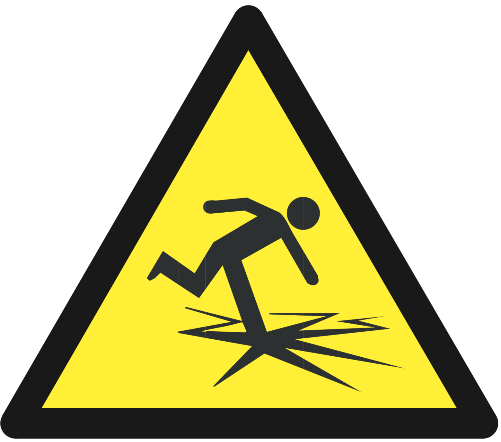
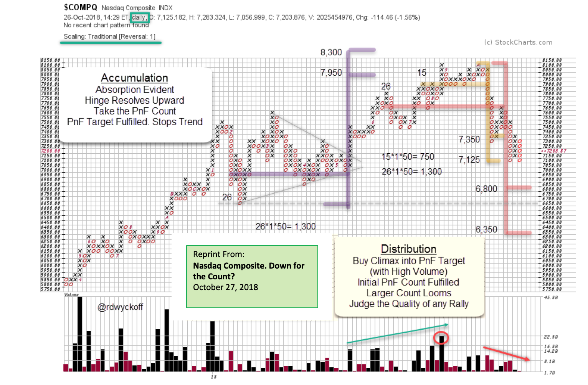
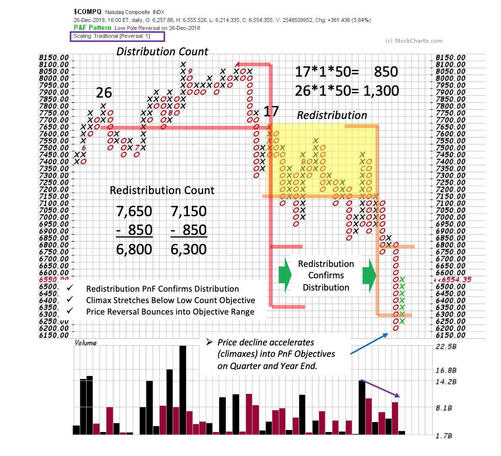
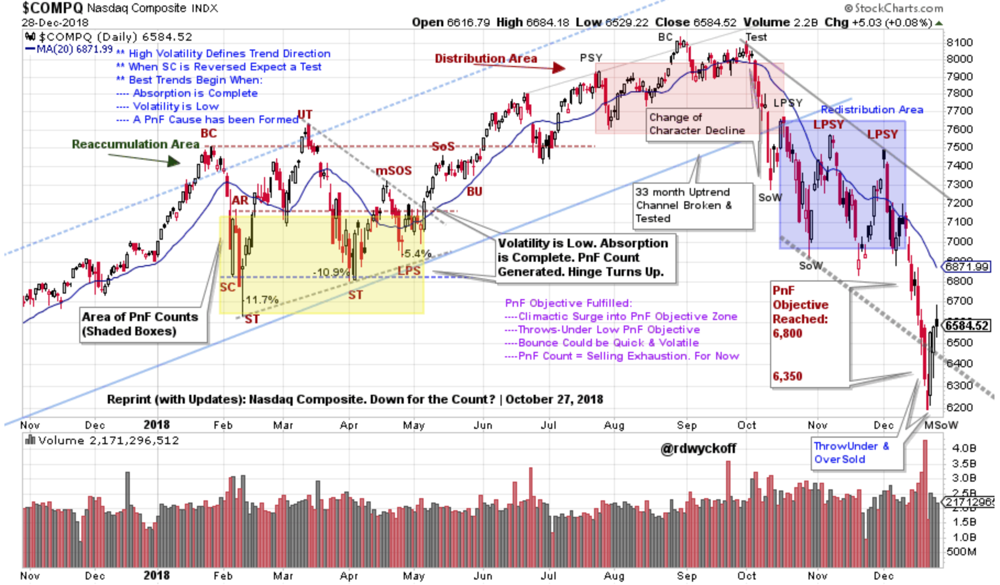

# The NASDAQ Composite Stumbles into 2019

URL: https://articles.stockcharts.com/article/articles-wyckoff-2018-12-the-nasdaq-composite-stumbles-into-2019/
Date: December 29, 2018 at 08:00 AM
Author: Bruce Fraser

For stock indexes, 2018 started dramatically and ended with even more drama. In January a Buying Climax (BC) stopped the long term uptrend of stock indexes and a sharp Automatic Reaction (AR) produced an important Change of Character from a trending into a trading range market environment. This sequence of events was discussed in the Wyckoff post ‘S&P 500 Notebook’ in March (click here for a link).

The NASDAQ Composite ($COMPQ) was a rich case study for Wyckoffians during 2018. Please take some time now and review the post: ‘NASDAQ Composite. Down for the Count?’ from October (click here for a link). As a partial analysis of 2018 we will bring the NASDAQ Composite charts up to date.

---

Here is a reprint of the $COMPQ Point and Figure Study (PnF). The PnF swing trading counts have been very effective. At the top, PnF generated a count to 7,350 / 7,125 (in yellow). As we will see later, a trading range formed in this count area. In October the smaller PnF had been fulfilled and a larger PnF was looming with counts that straddled the February 2018 lows (in Red with a 6,800 / 6,350 objective).

This chart brings the prior PnF up to date. The Distribution PnF and the subsequent Redistribution PnF are flagged on this chart. Note the near identical confirming count objective of the Redistribution. Also study the lower peaks and troughs in the Redistribution zone. This is an inherent sign of weakness in the index.

Four events combine to produce the conditions for a possible near-term low. First, a rapidly accelerating decline results in a Selling Climax (SC). Second, $COMPQ falls to, and through, two PnF count objectives and reverses quickly. Third, this potentially important Climactic low arrives right at the end of the quarter and end of the year. Fourth, the Index becomes Oversold with a Throw-Under of the downtrend channel during the Climax and reverses back into the channel (see chart below).

(click here for link to chart)

This chart is rich with Wyckoff principles. It was first published in the WPC post of October 27, 2018 (brought up to date here). Note how the fourth quarter began with an abrupt change into a persistent downtrend that has carried into to year-end. The extremely oversold condition sets up the potential for a short-covering rally as the new year begins. Institutions have aggressively sold FANG (and FANG style growth stocks) during the second half of 2018. Many institutions over-weighted growth stocks to enhance their overall performance. In 2018 these portfolio managers were caught off guard as growth stocks tumbled lower. Institutional selling of these growth stocks has accelerated into the end of the year and will likely subside in the new year. Year-end climactic selling of NASDAQ Composite stocks (portfolio window dressing) and short covering could hasten an oversold bounce in early 2019.

On January 3rd I will be Tom and Erin’s guest on MarketWatchers Live (tune in here….). Among other topics let’s further deconstruct the chart above with a Wyckoffian eye. Questions for us to consider; Is the entire chart structure during 2018 Distribution? Does the 4thquarter breakdown mean that a new bullish uptrend is not possible? If there is a short-covering rally ahead, how far can it go? These and other topics will be on the agenda. See you then.

All the Best,

Bruce @rdwyckoff

Announcements:

Roman Bogomazov and I will be conducting our first 'Wyckoff Market Discussion'webinar of the year on January 2nd, 3:00 – 5:00 pm (PST) and you are invited. This first session of the year has become a Wyckoff Tradition. Join us as we kick off the New Year. To register for this free webinar, pleaseclick here.

Roman Bogomazov will be conducting a complimentary webinar on Monday, January 7th. This is an introduction to his online series:Wyckoff Trading Course (WTC) - (3:00 – 5:00 p.m. PT). Please click here for the registration link.
