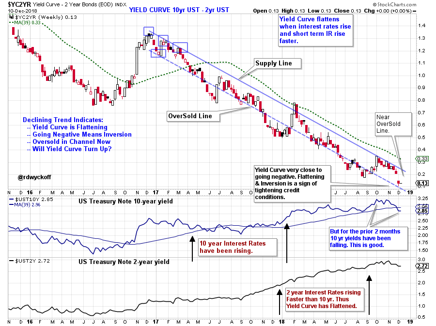
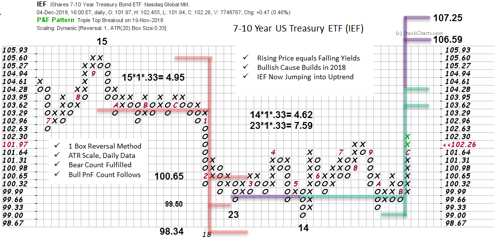

# Yield Curve Inversion?

URL: https://articles.stockcharts.com/article/articles-wyckoff-2018-12-yield-curve-inversion/
Date: December 10, 2018 at 07:10 PM
Author: Bruce Fraser

The recent weakness in the stock market was partially attributed to the flattening of the ‘Yield Curve’. When bond yields (typically U.S. Treasuries) are plotted in order of their time to maturity, a Yield Curve is the result. Typically, the shortest maturity instruments (T-Bills) have the lowest yield and the longest (30 year Treasury Bonds) have the highest yields. A normal relationship is when the short-term end of the curve has low yields and the long-term end has high yields. This is a typical (and steep) yield curve.

There are times in economic cycles when the yield curve flattens and can become inverted. This often happens in an aging economic expansion that has become overheated. For a variety of reasons demand rises for short term loans (putting pressure on short-term yields to rise). The Federal Reserve Bank simultaneously becomes concerned about the hot economy and starts a policy of raising interest rates. The result is short-term interest rates rise faster than long-term interest rates. The yield curve begins flattening. When, and if, short-term interest rates become higher than the long term, the yield curve becomes inverted. A flat or inverted yield curve is indicative of a ‘Tight Money’ environment in the economy. This will often precede the economy slowing and possibly entering recession.

---

The yield curve has been flattening for a long time which has been signaling tightening credit. Last week there was worry that yield curve inversion was starting which may have triggered additional selling of stocks. How should we be interpreting this late business cycle phenomena? Let’s put a Wyckoffian eye on current events and attempt to gain improved insight.

(click here for a link to the chart above)

Here is an elegantly simple way to observe the yield curve phenomena and apply Wyckoffian analysis. Above is the plot of the 10 year U.S. Treasury Note yield minus the 2 year U.S. Treasury Note yield. The multi-year downtrend visually represents the yield curve flattening. The downtrend channel captures the stride (trend) of the flattening. Study the 10 year and 2 year yield which are plotted on the chart. Both the 10 year and 2 year interest rate trends have generally been rising since 2016. But, because the 2 year yields have risen faster the curve has been flattening toward inversion.

Note something important that is happening; 10 year U.S. Treasury yields ($UST10Y) are now falling and have been for two months. The yield is now below the 39 week moving average. Ironically the yield curve is flattening because yields on the long end of the curve are dropping. This is a sign that pressure is coming off, and that interest rates are moderating. Worry about ‘Inversion’ is misguided if it is the result of falling interest rates. Even the 2 year U.S. Treasury yield ($UST2Y) has dropped slightly in the last month, and has been in a trading range since September. Pressure is coming off interest rates to rise.

Turning to Point and Figure analysis, how much can 10 year Treasury Note prices rise (as a result of IR falling)? There is a substantial cause built for a rally. The iShares 7-10 Year Treasury Bond ETF (IEF) has generated a meaningful Cause for a rally in bond prices (drop in yields) and has already jumped out of the Accumulation area.

Inversion of the yield curve is worrisome when interest rates across the entire curve are rising as a result of an overheated economy. That does not appear to be the case at this time. PnF analysis indicates that bond prices are set to rise for awhile (thus IR will be falling). Wall Street may be worrying about the wrong thing by focusing on inversion of the Yield Curve.

All the Best,

Bruce @rdwyckoff

Announcements:

Roman Bogomazov and I will be conducting our first 'Wyckoff Market Discussion'webinar of the year on January 2nd, 3:00 – 5:00 pm (PST) and you are invited. This first session of the year has become a Wyckoff Tradition. Join us as we kick off the New Year. To register for this free webinar, pleaseclick here.

Roman Bogomazov will be conducting a complimentary webinar on Monday, January 7th. This is an introduction to his online series:Wyckoff Trading Course (WTC) - (3:00 – 5:00 p.m. PT). Please click here for the registration link.
