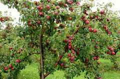
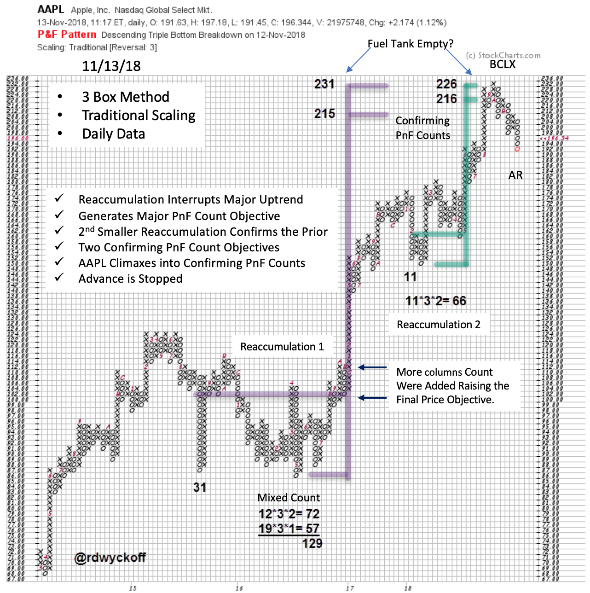
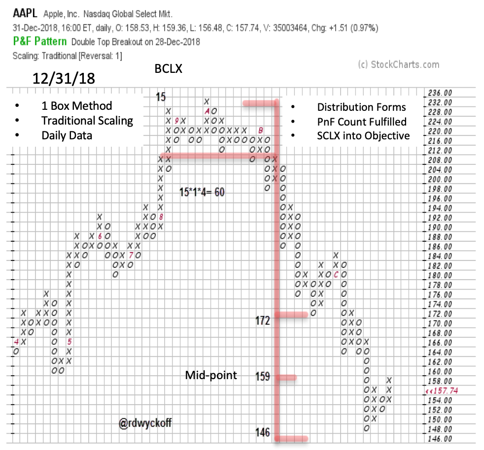

# AAPL Campaign Completed

URL: https://articles.stockcharts.com/article/articles-wyckoff-2019-01-aapl-campaign-completed/
Date: January 22, 2019 at 12:23 PM
Author: Bruce Fraser

Because the Wyckoff Methodology identifies elements of structure and context within price (Accumulation and Distribution schematics and Phase Analysis), it naturally strengthens the attribute of patience in its user. There is a time to watch, a time to act, and a time to sit in a trending trade. Horizontal Point and Figure (PnF) analysis has a role to play in this trading process. The Law of Cause and Effect requires that a Cause must develop prior to the Effect. Large interests will absorb available stock (Cause building during Accumulation) prior to the start of a major uptrend (the Effect). And the opposite occurs under Distribution.

---

Point and Figure analysis has a major role in this never ending cycle of Accumulation, Markup, Distribution and Markdown. Wyckoffians are always improving their skills in Counting the horizontal structures (Cause building). Wyckoff PnF is a powerful tool and it stands alone in its ability to project (estimate) price objectives. PnF analysis puts a number of tactical tools in our trading arsenal.

Patience to let a trade mature to completion is a major characteristic of PnF technique. Estimating the extent of the price objective, making the trade and then allowing the trend to reach its conclusion is an exercise in patience (no matter the timeframe one trades in). In our Apple Inc. case study, a major Reaccumulation formed. Stock went from weak hands to very strong Composite Operator hands as they absorbed shares for a major new upward price leg. As price pivoted upward into the emergence of the next price trend, a PnF count could be taken. A Wyckoffian follows in the footsteps of the large C.O. into an emerging new trend. Note that we analyzed AAPL as it was on the hinge of this new uptrend (click here to study). As a new Campaign emerges the Wyckoffian will brace for the long journey ahead, always focused on the PnF objectives, which strengthen the trading skill of patience.

Note the second Reaccumulation that formed during the uptrend (Wyckoffians are always on the alert for emerging Reaccumulations). This pause lasted long enough to produce a confirming PnF count objective that matched the larger count of the prior Reaccumulation. Once these PnF counts matched, the uptrend resumed (a wonderful timing technique). Reaccumulation pauses are tactical places to add to an existing position.

At the completion of Apple’s second Reaccumulation two confirming (matching) PnF count objectives aligned. As AAPL approached these objectives an acceleration of the trend produced a Buying Climax surge which confirmed the validity of these PnF counts. Tactically this was an appropriate place to sell some portion of AAPL holdings into strength. At the 215 / 231 price level AAPL’s fuel tank appeared to have been emptied, a new Cause would need to form.

Zooming into the area of the two Reaccumulation PnF price objectives, a clear view of the Buying Climax surge became evident. A climax is the start of a new Cause building process. Patience is needed to allow the nature of a new Cause to be revealed. Here we can see that AAPL formed a swing trading Distribution PnF count on the 1-box PnF (above). This Distribution seemed to form quickly but the count was large and potent. You are encouraged to draw a vertical chart of this area and label it. Patience was needed to allow the Distribution to form and complete. The resulting downtrend was rapid and climaxed into the lower count objectives. The lowest count objective was missed by only one box. The Selling Climax combined with the fulfilled Distribution count objective puts us on the alert for a change of trading character in AAPL. Cause leads to Effect and this phenomena repeats over and over. Wyckoff teaches us to patiently allow for this endless cycle to unfold and to identify the best times to act.

Congratulations to Instituto Wyckoff España for their outstanding 1st Annual Wyckoff Conference (1st Conferencia Wyckoff Internacional) this past weekend. This Spain based institute has become a vital center in the Wyckoff Method movement. Their first annual conference establishes an important new Wyckoff tradition. I am honored to have participated.

All the Best,

Bruce @rdwyckoff

Announcements:

TSAASF.org Webinar Announcement

Introduction to the TSAA-SF Technical Analysis Study Guide and Certification Exam

Sunday, January 27, 2019 at 10:00 AM PST.

This webinar will be an overview of the TSAA-SF certification exam and technical analysis study guide which was developed in partnership with StockCharts.com. The study guide was created by TSAA members as a low-cost way for charting enthusiasts and individual traders to obtain a thorough understanding of the broad body of Technical Analysis knowledge by leveraging StockCharts.com’s ChartSchool website. Webinar presenter, Brett Villaume is a TSAA-SF Board member, adjunct professor of technical analysis at Golden Gate University, and is the Vice President of the CMT Association

Register Here: https://attendee.gotowebinar.com/register/1069715258891422978

After registering, you will receive a confirmation email containing information about joining the webinar.

My Wyckoff Point and Figure Tutorials are now available on Youtube.com

To View Part One (click here)

To View Part Two (click here)
