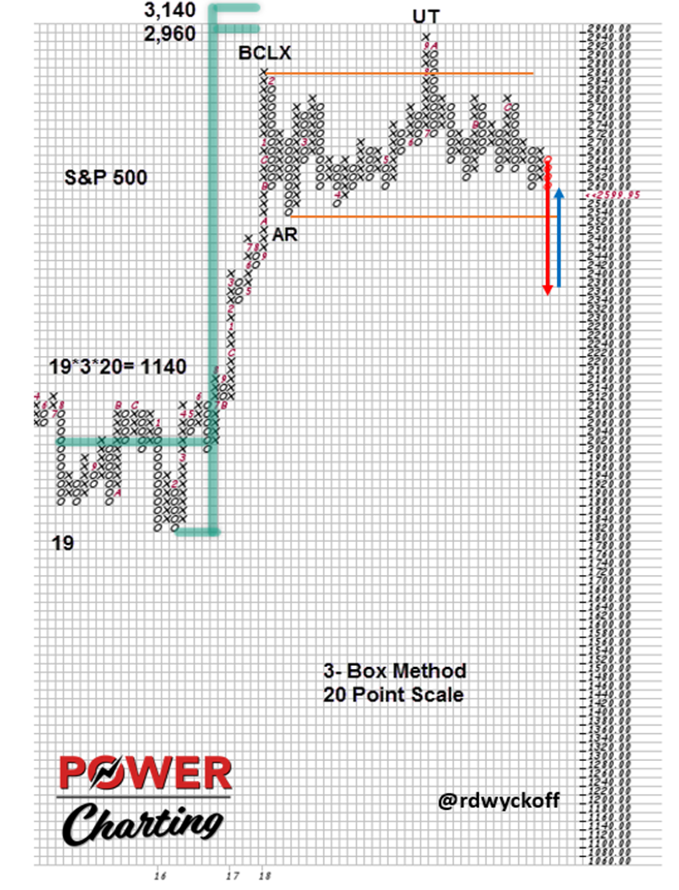
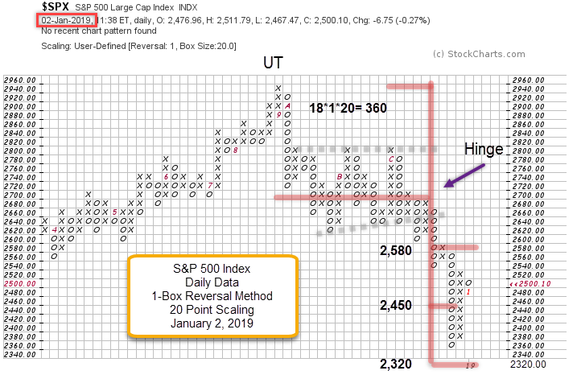
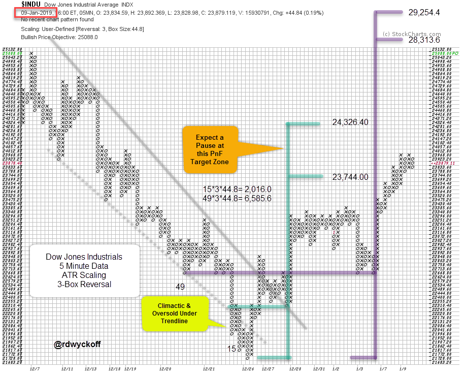

# Will PnF Light the Way in 2019

URL: https://articles.stockcharts.com/article/articles-wyckoff-2019-01-will-pnf-light-the-way-in-2019/
Date: January 10, 2019 at 06:00 AM
Author: Bruce Fraser

As 2018 was getting underway, a January Buying Climax (BCLX) and a February Automatic Reaction (AR) turned a robust uptrend into a ‘Range-Bound’ market for most of the remainder of the year. Was this large trading range preparing to jump upward or cascade lower? In the fourth quarter the broad indexes tipped their hand and sliced through the important Support lines. Now 2018 is looking as though it was Distributional and confirmed by the start of a Downtrend. What does 2019 hold for investors and traders now that major indexes have dipped below key Support and are now rallying? Is there a case to be made for the resumption of the epic bull market? These will be topics to cover early in this new year. Let’s begin by reviewing Point and Figure analysis from last year.

---

For context we will start with the large PnF Cause built in 2015-16. The fuel in the tank has been used up. Since the October Upthrust (UT), weakness has engulfed the S&P 500 ($SPX). Note the breakdown (Spring type decline and reversal) in the $SPX in 2016 just prior to the birth of the new uptrend, and the completion of the PnF count that projected 2,960 / 3,140 (the Upthrust stopped at 2,940). Could the 2018 year end decline be a Spring?

Using the 1-Box method, a PnF swing trading count has been taken of the $SPX, from the Hinge in early December to the UT in September. A wide count objective was the result of the very volatile drop from the UT peak at 2,940. The drop came within two boxes of fulfilling the lowest PnF count as the index broke down through critical support. This last drop had Climactic qualities, fulfilled the PnF count and began a sharp reversal.

Steady liquidation gripped the indexes throughout December. Two trendlines define the decline of the Dow Jones Industrials ($INDU) into month end. The throw under of the lower trendline is an oversold condition with a climactic surge. The reversal back into the channel is sudden and strong. This is a Change of Character. The rally through the upper channel line is a Sign of Strength and is followed by a Backup that Tests the trendline from above. A PnF count can be taken from the Test to the Selling Climax (light blue). The next pause produces a larger PnF count (in purple). These PnF counts estimate how much potential there is for an oversold rally bounce. The $INDU has just entered the lower count objective. A pause in the area of this 23,744.00 / 24,326.40 price zone is likely. An attempt to decline and Test the recent lows is possible. Also, there is important resistance at the 24,000 area. Note the very large PnF count (in purple). Fulfilling this objective would return the $INDU to the old high price level, and higher. This PnF objective will come into consideration after we have seen how well the markets can manage a Test of the late December lows. A shallow Test will be encouraging for a resumption of the prior uptrend.

All the Best,

Bruce @rdwyckoff

Announcement:

Join me for the first TSAASF.org event of 2019 on Thursday, January 10th. Free Webinar: 2019 Market Outlook with Joe Turner. Joe will share his wisdom from 50 years in the business. He is co-founder and portfolio manager at Pring Turner Capital Group with Martin Pring. Read more about the presentation here.
