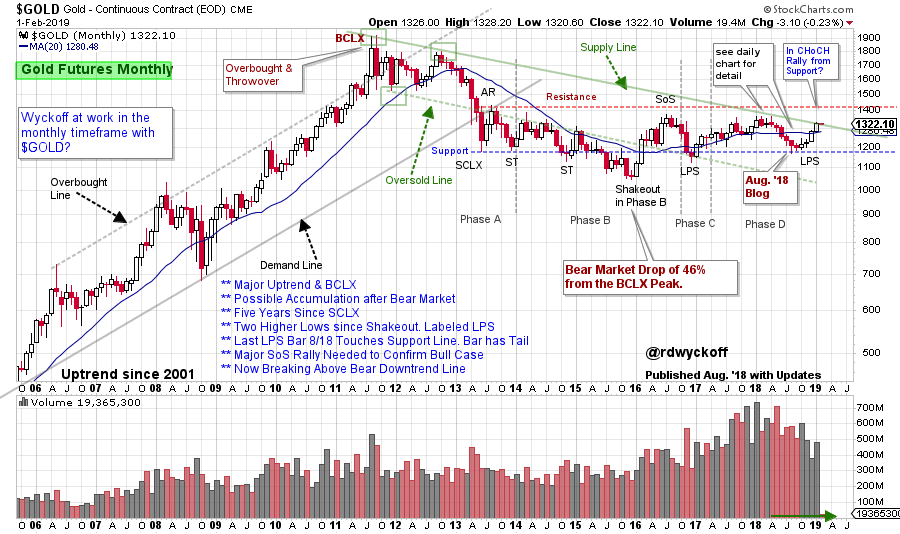
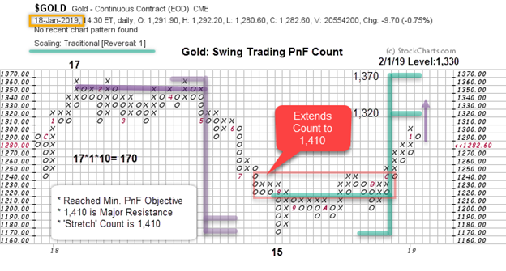
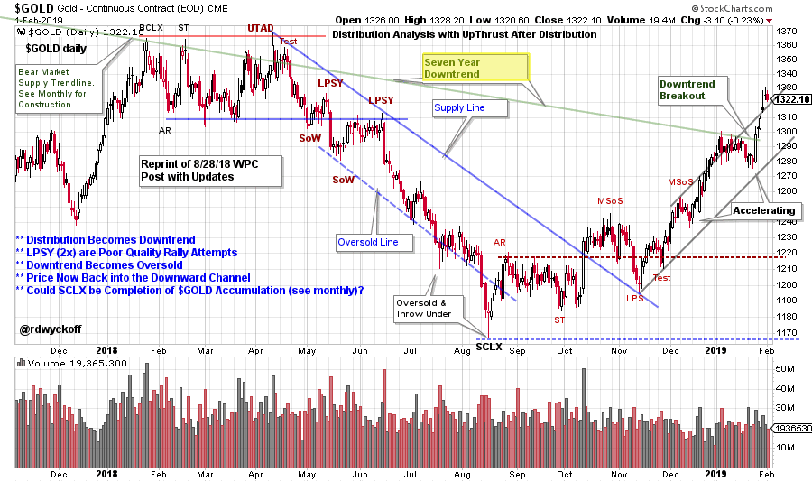

# Golden Ticket

URL: https://articles.stockcharts.com/article/articles-wyckoff-2019-02-golden-ticket/
Date: February 03, 2019 at 05:28 PM
Author: Bruce Fraser

In August of 2018 Wyckoff Power Charting published a monthly chart of the continuous contract of Gold ($GOLD). A very large Accumulation structure appeared to be forming after a cyclical bear market. Meanwhile a downtrend (see the Supply Line) had been in control for more than seven years. In that blog post it was noted that in 2018 $GOLD had persistently declined until it reached the long term Support Line. We drilled into the daily vertical chart and studied the eight month downtrend. Please take time now to reread ‘Prospecting for a Low in Gold’ (click here for a link).

---

(Click Here to Link to an Active Chart)

A Last Point of Support (LPS) terminating at the Support line was expected and then a rally toward Resistance. The Accumulation structure is so large that upward and downward swings between Support and Resistance are major trading events. The expectation in August was for a rally attempt toward Resistance near the 1430 area. Wyckoffians would judge the price ascent into year end to determine if there was a Change of Character (CHoCH) in the quality of the rally. A persistent advance that could reach and exceed prior highs would be an encouraging Wyckoff event (a Sign of Strength). Let’s attempt to judge the quality of the advance and the price potential measured by Point and Figure analysis (PnF).

$Gold produced a swing trading PnF Count after a Selling Climax (SCLX) in August. The conservative objective generated was 1,320 / 1,370. The Resistance line on the monthly chart is 1,434. The PnF count above can be stretched to 1,410. This would represent a Sign of Strength (SoS) as the 2016 and 2018 peaks would be exceeded. Currently $GOLD is in its swing trading target zone. On the daily chart below a climactic surge appears to be developing. $GOLD may need a rest soon.

(Click Here to Link to an Active Chart)

In August $GOLD threw under the downtrend channel and became Oversold on the daily chart. Into the end of the year a Cause was built for a swing trading rally. Two important features of the rally; 1) the rally has been accelerating, and 2) after stalling at the 1,300 level $GOLD has climbed through the seven year downtrend line. This important event demonstrates $GOLDs new momentum. Reaching to and through the 1,434 Resistance area would demonstrate that Accumulation is nearly complete. A pause following a new SoS could take some number of months to complete. These events would confirm to Wyckoffians that the large trading area since 2013 is Accumulation and a new campaign is emerging in $GOLD.

All the Best,

Bruce @rdwyckoff

Power Charting Videos:

Wyckoffians will find the AAPL Campaign to be a classic. To read the recent blog (click here). The companion Power Charting video is also available (click here).

In the most recent Power Charting episode Dr. RSI, Andrew Cardwell, joins me to discuss his Cardwell RSI EDGE trading method. (click here to view)

Announcement:

Andrew Cardwell will conduct Part Two of his presentation on trading with the Cardwell RSI Edge on February 11, 2019 at 5pm pst. This webinar is Free. Go to TSAASF.org to register.
