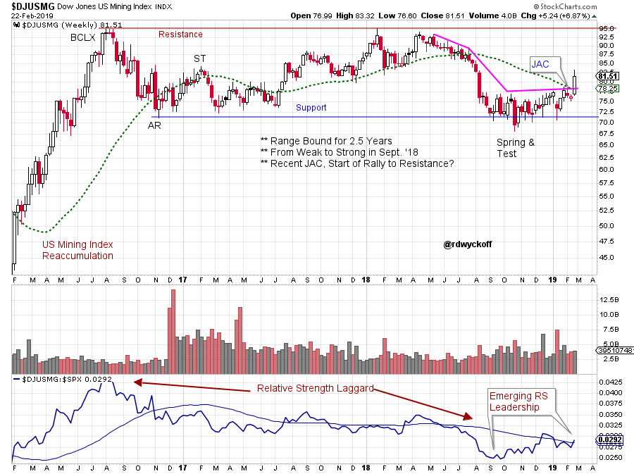
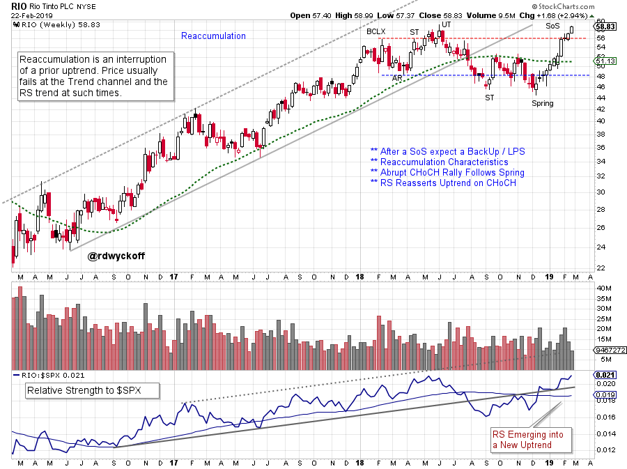
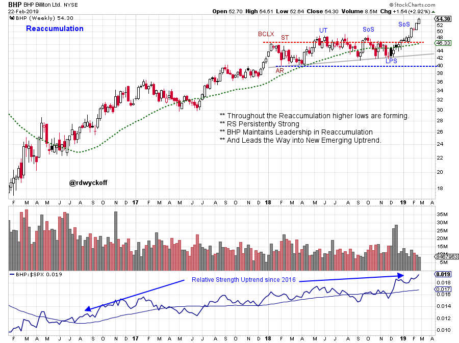

# Material Development

URL: https://articles.stockcharts.com/article/articles-wyckoff-2019-02-material-development/
Date: February 23, 2019 at 08:00 AM
Author: Bruce Fraser

The U.S. Mining Index is composed of industries that manufacture a broad spectrum of materials used in manufacturing and infrastructure projects. Typically, the Mining Index comes into a performance leadership position as the economy heats up. Therefore, in the middle to late stage of a business cycle expansion this group and the stocks within should be leading the way upward. In the current episode of Power Charting (StockCharts TV) Martin Pring leads a wonderful discussion on how to use the Pring KST to identify where sectors and asset classes are with respect to the business cycle. We thank Martin and look forward to more on this innovative technique.

---

(click here for a chart link)

The U.S. Mining Index ($DJUSMG) became range bound in 2016 after a dramatic rally. An extended 2.5 year trendless price action has been the result. Relative Strength studies illustrate underperformance in comparison to the S&P 500 ($SPX). We must conclude that institutions have been collectively avoiding this theme. Recently a Spring of the 2016 low has awakened the Mining Index. We can see the higher lows of the RS line after the September 2018 low. This will begin to attract the attention of institutions. Note the strength of the most recent price bar as it clears the long term moving average with a ‘Jump Across the Creek’. Continued strength to the Resistance area is possible from here.

(click herefor a chart link)

Rio Tinto PLC is an important diversified materials company in the $DJUSMG index. Make note of how much longer the uptrend persisted in RIO prior to entering a period of Reaccumulation. The range bound period for RIO has been much shorter in duration. After a Spring and Test RIO has briskly rallied up and out of the range. A quality response to this Sign of Strength (SoS) would be a pause with diminished volatility and volume as it rests, and remains at or above the Resistance area.

Relative Strength has remained in a strong leadership position until late 2018. And now RS is back in bull mode which adds confidence that the recent breakout can hold and an uptrend will follow.

(click herefor a chart link)

BHP Billiton Ltd. (BHP) is the other large diversified materials producer. Compare it to RIO and the U.S. Mining Index. It has been the strongest during Reaccumulation. The lowest low of the Reaccumulation was the Automatic Reaction (AR), each low was higher thereafter. The Composite Operator (C.O.) is putting bids above each prior low in the formation and is Absorbing all available stock. After the final Last Point of Support (LPS) BHP moves easily up and out of the Resistance area.

Relative Strength has remained in an uptrend since 2016. Note that each dip below the moving average has produced a buying opportunity. Now RS is accelerating. BHP is the leadership of the U.S. Mining Index with RIO a close second.

The long and laborious Reaccumulation of $DJUSMG has masked the advance of these two dynamic large capitalization leadership stocks. When we see an index or industry group in a state of Reaccumulation our next step should be to drill in and find the stocks that are leading the way. These are the stocks that will pull their indexes into new uptrends. These are the stocks we choose to campaign.

All the Best,

Bruce @rdwyckoff

Announcement:

New Power Charting Episode. Martin Pring reveals how to use KST for sector and asset class rotation within the business cycle. Click here to view.
