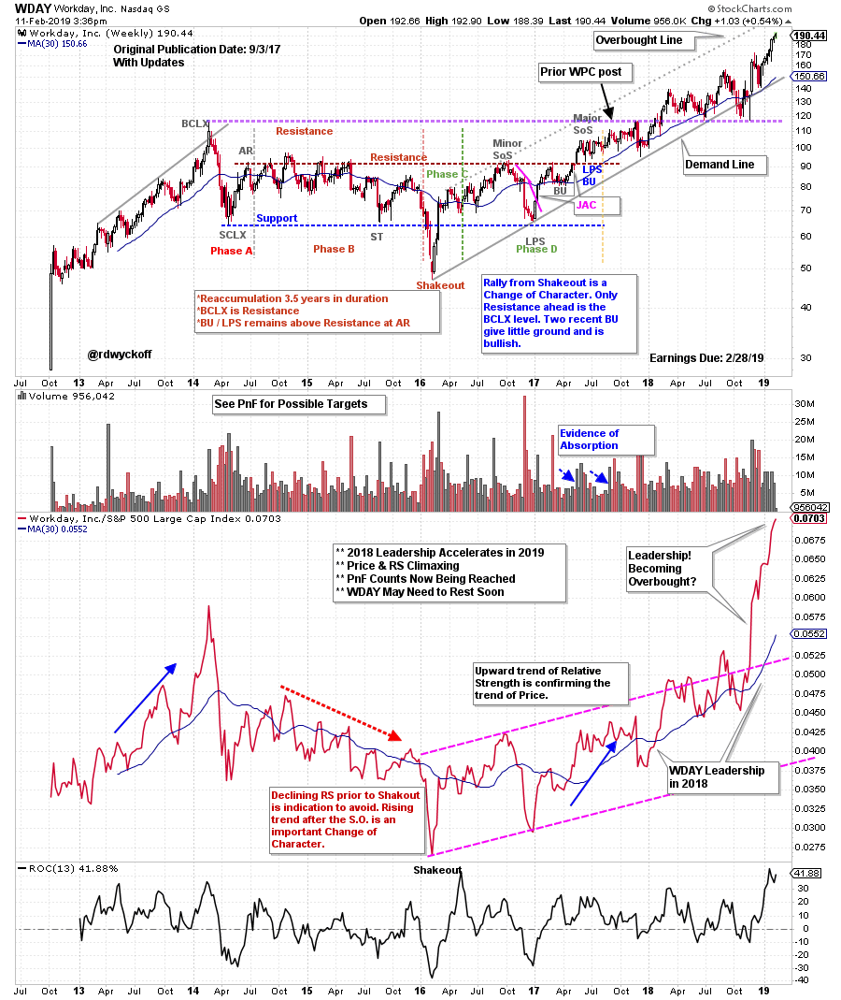
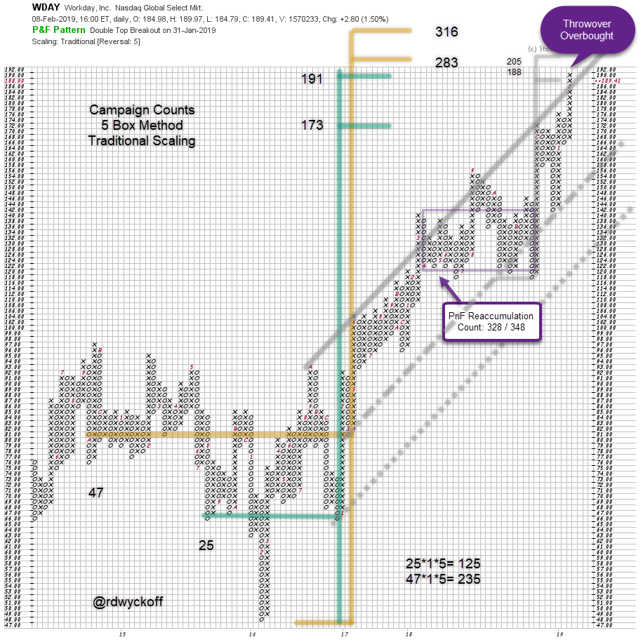

# WDAY Works Out

URL: https://articles.stockcharts.com/article/articles-wyckoff-2019-02-wday-works-out/
Date: February 11, 2019 at 04:37 PM
Author: Bruce Fraser

In a September 2017 blog, we studied Workday, Inc. (WDAY). We looked at WDAY as an emerging ‘Campaign Stock’. These stocks have characteristics that could propel their uptrends for years to come. The Wyckoff Method offers the tools to identify these candidates. Chief among them is structural chart analysis and Point and Figure studies. Take some time now to study the prior WDAY post and then we will bring these charts and analysis up to date (click here for a link).

---

(click here for active chart)

During 2017 price and relative strength entered confirmed uptrends (by both being above rising moving averages). During the first quarter of 2018 stock indexes became very weak. The WDAY uptrend did the opposite and became very strong. This strength pushed WDAY through the Resistance formed by the BLCX. The uptrend persisted throughout 2018. Relative strength went straight upward into year end. Now both price and RS are exhibiting Buying Climax characteristics with an accelerating rush upward into an overbought state in 2019

1. The smaller of two segments (in the Major Reaccumulation) has just been fulfilled.
2. WDAY has a Throwover of the trend channel and becomes Overbought.
3. During 2018 a smaller Reaccumulation confirms both larger PnF counts.
4. Higher counts (above 300) are still active. But a pause soon is suggested by PnF and RS.
5. Confirmation of a pause will be in the form of a sharp Automatic Reaction (AR).
6. The primary (Campaign) trend for WDAY still points to higher prices.

Note how Wyckoff structural analysis combined with PnF studies provide outstanding tools for identifying and positioning these outsized Campaign candidates.

All the Best,

Bruce @rdwyckoff

Announcements:

Upcoming Free Webinar: Trading With RSI - The Cardwell RSI Edge by Andrew Cardwell (Dr. RSI)

Date: Feb 11, 2019 at 5:00 PST

This is Part 2 of the Interview we conducted on Power Charting (to watch that interview click here)

(click hereto register)

Upcoming Free Webinar: 2019 Market Outlook (Part Two) with Martin Pring and Joe Turner

Date: Feb 19, 2019 at 5:00 PST

Join Martin and Joe as they reveal what their business cycle research is saying about financial market trends in 2019.

(click hereto register)
