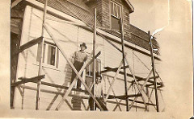
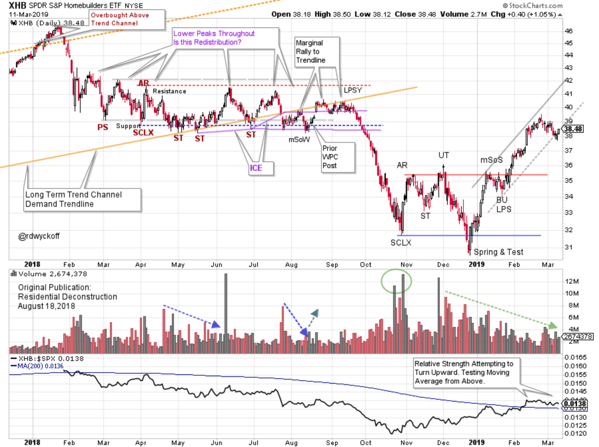
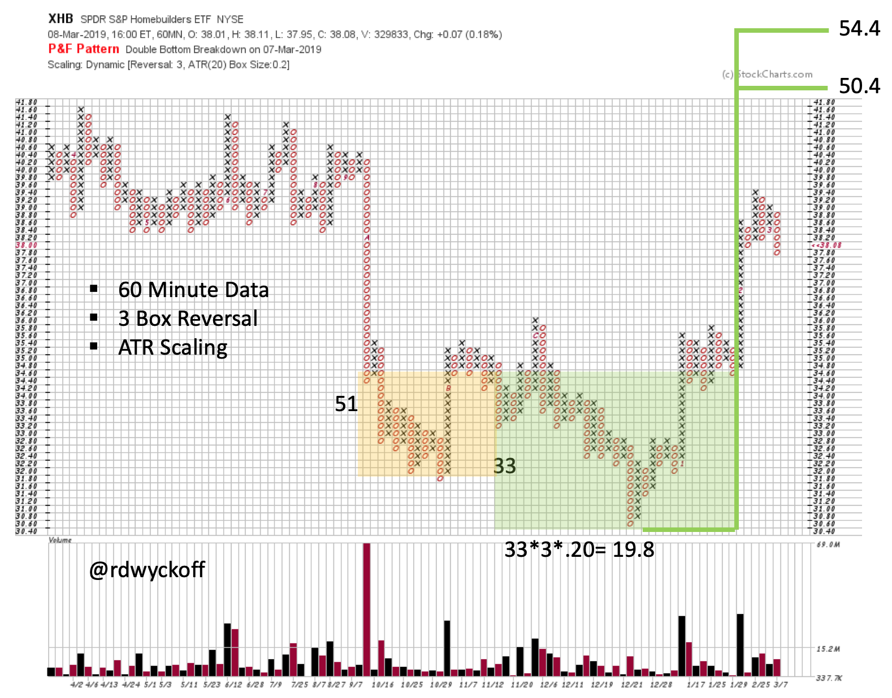
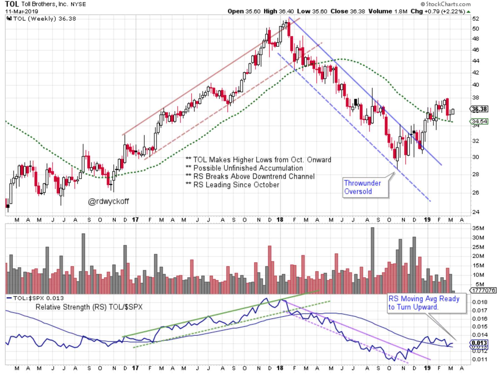
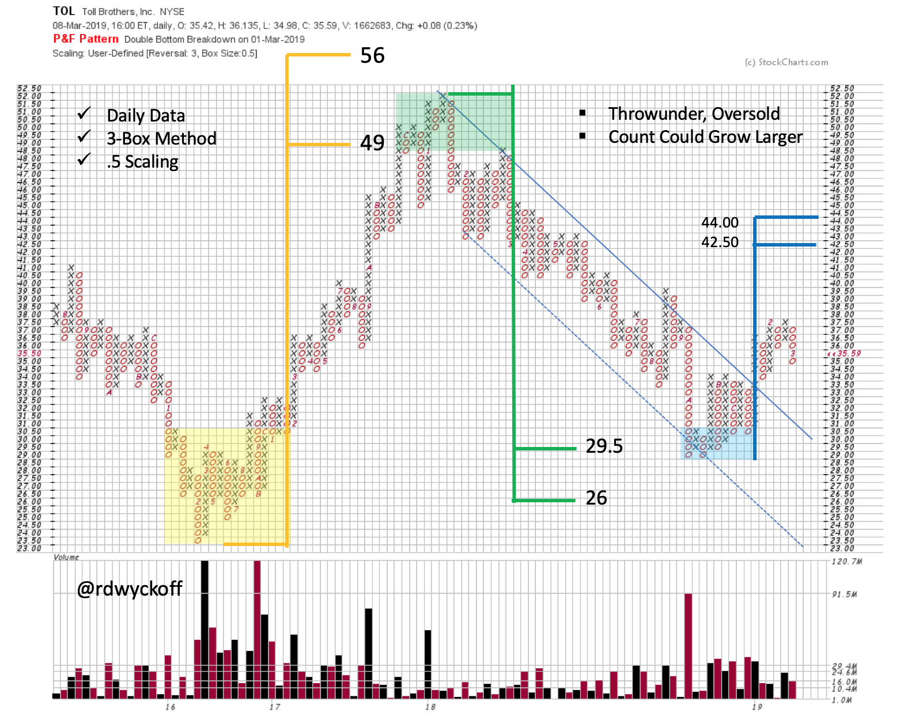

# Residential Constructive

URL: https://articles.stockcharts.com/article/articles-wyckoff-2019-03-residential-constructive/
Date: March 12, 2019 at 08:00 AM
Author: Bruce Fraser

In August of 2018 we studied the Residential Construction industry group (click here to view). This group was very weak throughout 2018. After a sharp January decline a long period of Redistribution set in. Rising interest rates during the year became a headwind for the group. In September, the redistribution concluded and a persistent downtrend followed. The bond market has had a major rally since October. Has this rally (falling interest rates) improved conditions for the home building industry?

---

For an Active Version of the Chart click here

The long term ‘Demand Trendline’ was stout Resistance above any attempt for the S&P Homebuilders (XHB) to rally. There was no lift in the XHB into September. Relative strength was in a confirmed downtrend throughout 2018. The climactic volume into the Selling Climax (SCLX) was substantial and stopped the decline. Volume dried up as Accumulation formed. Note that SCLX and Relative Strength (RS) lows coincide and then RS led the way up. XHB wants to be RS leadership. This Accumulation structure appears complete so let’s take a Point and Figure Count (PnF).

Using 60 minute data, we count the Accumulation formation in two segments. An objective range of 50.4 / 54.4 is estimated for the first segment. You are encouraged to flag the second segment for practice.

For an Active Version of the Chart click here

Toll Brothers (TOL) is an important stock in the Homebuilding group. The weekly chart above has demonstrated a tendency for TOL to trend in both directions. There were climactic surges at the final stages of both the up and downward trends. Close inspection revealed that TOL bottomed on the Oversold channel line in October. Higher lows followed and thus TOL led the major indexes and the XHB upward into year end. This was also illustrated in the rising RS line. Now TOL is above both the long term RS and Price moving averages.

TOL has produced valuable PnF counts at the critical turns, both up and downward. We are using ½ point scaling (user-defined) to capture better detail in the price data. With this adjustment the counts still work well. TOL has jumped out of the downtrend channel with a Sign of Strength. Now it is attempting to Back Up. When, and if, this Back Up turns up the PnF count can be widened. In the meantime, there is still upside life left in this swing trading PnF count objective.

All the Best,

Bruce @rdwyckoff

Special Wyckoff Event:

Wyckoff Trader and Educator, Gary Fullett will present; 'Where to Look for Trades Using Wyckoff Principles'. He will demonstrate where to look for trades on the right hand side of the trading range. He will give examples using current markets. This is a members only event so become a member of the TSAA-SF today. Learn more about the TSAA-SF and become a member by clicking here.

Videos of Interest:

Take the Fork in the Road. My recent guest presentation for MarketWatchers LIVE (click here to view)

Power Charting: The Importance of Contrary Thinking. Joe Turner, 50 year stock market veteran, presents on this most important topic (click here to view)

Power Charting: Wyckoff Video Workshops: Accumulation Review (click here to view). Reaccumulation Structures (click here to view)
