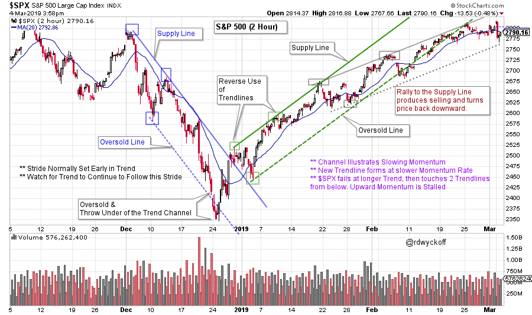
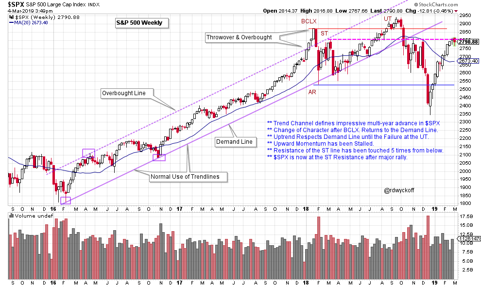
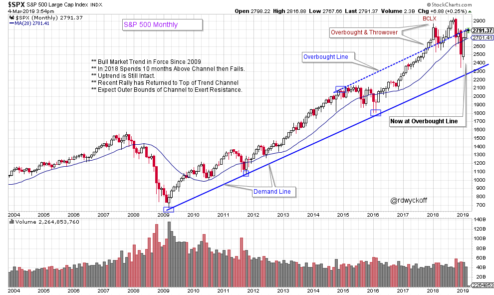

# S&P 500 Trending

URL: https://articles.stockcharts.com/article/articles-wyckoff-2019-03-sp-500-trending/
Date: March 05, 2019 at 07:00 AM
Author: Bruce Fraser

The Wyckoff Method constructs trendlines somewhat differently than other popular technical methods. Mr. Wyckoff’s trendline method is obscure and not in wide usage. The main benefit of this construction technique is to support effective trading setups as the trend is unfolding. Trends (all timeframes) tend to set the rate of their upward or downward stride very early. The essential value in identifying the new trend quickly is in how it supports more and better trading junctures as it grows and matures. Here we will review the recent activity in the S&P 500 while studying the procedure for drawing trendlines and trend channels.

---

For Active Chart Click Here

Two primary methods for trendline construction are the ‘Normal Use of Trendlines’ and the ‘Reverse Use of Trendlines’. Both techniques are useful and effective. Generally, ‘Normal Use of Trendlines’ is applied first. Reverse Use is employed if the Normal method cannot be applied. Examples best illustrate these applications.

The Downtrend (in blue) channel is a Normal Use example. In a declining trend the Supply Line is drawn first. Ideally two adjacent peaks early in the decline are used to scribe a line. This ‘Supply Line’ often defines the rate of descent for months or years to come. The term ‘Supply Line’ illustrates the emergence of Supply each time a rally approaches the line, resulting in selling that checks the advance and reverses the index (or stock) into a continuation of the decline.

A trend channel is constructed by extending a parallel line from the low that forms between the two adjacent peaks (three blue boxes identify the anchor points). Note how well the trend channel captures the decline. Also, in each example above, the channels are drawn very early in the emergence of the new trend. This is an important feature of this method of channel construction.

The uptrend employs the ‘Reverse Use of Trendlines’ method. The Supply Line is drawn first over the early rising peaks (solid line in green). A parallel (dotted green) line is extended from the intervening low thus producing a trend channel. This is the rally from the December 2018 low and note how well the channel contains the trading of the advance. Each approach of the edges of the channel are potentially actionable trading spots in the trend. A new channel forms (in grey) as the momentum of $SPX slows. Now the index has stalled and fallen out of the primary uptrend.

For Active Chart (click here)

Trendlines can illustrate important events on a chart. This weekly chart of the $SPX has followed a stride set in 2016. At the conclusion of 2017 the index accelerates into a Buying Climax (BCLX) by throwing over the trend channel. The quick failure of the BCLX into an Automatic Reaction (AR) returns precisely to the Demand Line. Buying then turns the index back upward toward the top of the channel for a Secondary Test (ST). Another round of weakness follows and price returns to the $SPX Demand Line. For sixteen weeks the index rides along the Demand Line until the rally accelerates into an Upthrust (UT). At the UT the $SPX fails to return to the Overbought Line. This is evidence of momentum waning, which is a warning. The decline that follows is sudden, sharp, volatile and drops through the Resistance and Demand line simultaneously. The multi-year uptrend was decisively over as price fell below the Demand Line. Now note the wide and volatile range-bound condition that has been in place for more than a year.

For Active Chart (click here)

Three touches of the Demand Line established the stride of the bull market uptrend on this monthly chart. As the trend matured a buying climax surge threw over the trend channel, and became overbought. The $SPX attempted to stay above the channel for ten months. A very sharp failure into the end of the 2018 returned the index back into the channel uptrend. The recent rally has returned the index back to the top of the channel. We will watch closely for evidence of Resistance forming at the Overbought line. The good news is the ten year uptrend is still in force. After the strong rally in the new year, Wyckoffians would look for any pause in the current uptrend to be shallow, and lack volatility and volume. This would indicate that stocks are once again in strong hands.

Drawing Wyckoff trendlines is an art. An art that can produce a trading edge.

All the Best,

Bruce @rdwyckoff

Announcements:

- This Thursday (March 7, 2019 12pm ET) I will guest host MarketWatchers LIVE with Tom Bowley. Join us for a lively market discussion. See you then.
- New Power Charting Episode: Friday (March 8, 2019 3:00pm ET) Joe Turner joins me to discuss an essential element of 'Peak Performance' in Trading.
- To review a prior blog post on Wyckoff trendline analysis and construction click here.
- Recent Power Charting Video:

Reaccumulation Workshop with a Review of Reaccumulation Schematics. (click here for a link)
