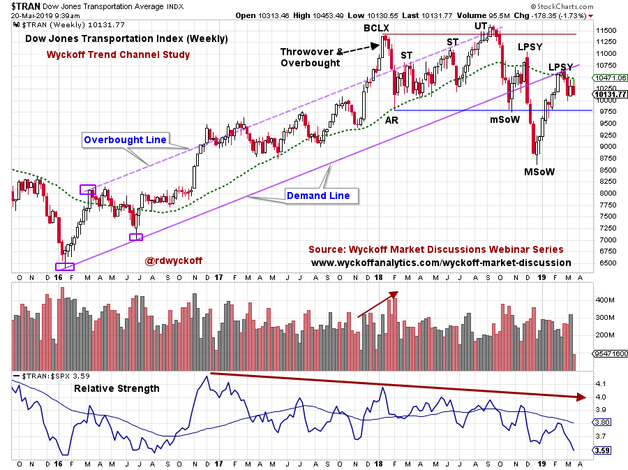
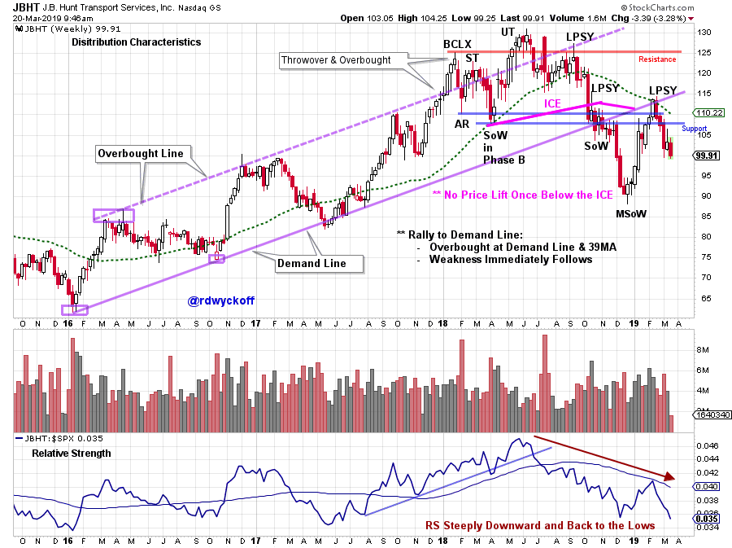

# Trucks. Trains. Airplanes.

URL: https://articles.stockcharts.com/article/articles-wyckoff-2019-03-trucks-trains-airplanes/
Date: March 20, 2019 at 02:52 PM
Author: Bruce Fraser

The Dow Jones Transportation Average, since its creation, has been considered a sensitive leading indicator of business conditions. The legendary ‘Dow Theory’ was created as a trend confirmation indicator of the Industrial Average to the Transportation Average. When they are both in-gear, upward or downward, the major trend is confirmed. To read more about the Dow Theory click here and here.

Since the ‘gross domestic product’ of the nation largely moves to market on the companies in the Transportation sector, let’s study this most important index. The future direction of the Dow Jones Transportation Index ($TRAN) may offer an indication of whether the economy will improve or fade.

---

For an Active Chart click here

A trend channel formed at the start of the uptrend in 2016 and was in force until the 4thquarter breakdown. The Buying Climax bulged above the channel in early 2018 in dramatic fashion and then price fell back during the Automatic Reaction (AR). Hugging the Overbought line for seven months, the $TRAN had a final Upthrust (UT) in September and failed on heavy volume (supply). A swift decline to the Demand line (with high volume) was an important Change of Character. For seven weeks $TRAN attempted to hold at the Demand Line, and then ultimately failed below the channel and the Support Line (again on high volume). The year end rally has lifted the $TRAN to the underside of the Demand Line (and the long term moving average) where weakness resumed. Note the Relative Strength weakness from the beginning of 2018. Three Relative Strength observations stand out; 1) $TRAN Relative Strength (RS) has been in a downtrend since the January 2018 Buying Climax (BCLX), 2) A RS new low was made in December, 3) Currently the RS has returned back to that prior RS low level.

For an Active Chart click here

J.B. Hunt Transport Services (JBHT) is a component of the Dow Jones Transport Index. Note the family resemblance of JBHT to $TRAN. The Upthrust (UT) arrived earlier for JBHT which also coincided with the RS peak. The Last Point of Supply (LPSY) touched the Overbought line of the trend channel in September, which was a lower high, while the $TRAN and the $INDU went to new high ground. The Relative Strength of JBHT was pointing downward from May onward. Confirmation was added to the LPSY by the weakness of the RS line at the end of the third quarter. The recent rally up to the Demand Line has turned down sharply. The return to the Demand Line from below is important Resistance. There are four forms of Resistance at that level, the Demand Line, two Resistance lines and the 39 week moving average. Could the Distribution of JBHT be complete and the Markdown now be in force?

Transportation stocks are generally weaker than the broad stock market. Is this historic index signaling the slowing of the economy in the months ahead? Take some time and review the 20 stocks in the Dow Jones Transportation Index and identify where the strength and the weakness is among these important companies.

All the Best,

Bruce @rdwyckoff

Videos of Interest:

Power Charting Video Page. Check this page periodically for newly uploaded Power Charting Videos (click here to view)

Take the Fork in the Road. My recent guest presentation for MarketWatchers LIVE (click here to view)

Power Charting: The Importance of Contrary Thinking. Joe Turner, 50 year stock market veteran, presents on this most important topic (click here to view)

Power Charting: Wyckoff Video Workshops: Accumulation Review (click here to view). Reaccumulation Structures (click here to view)
