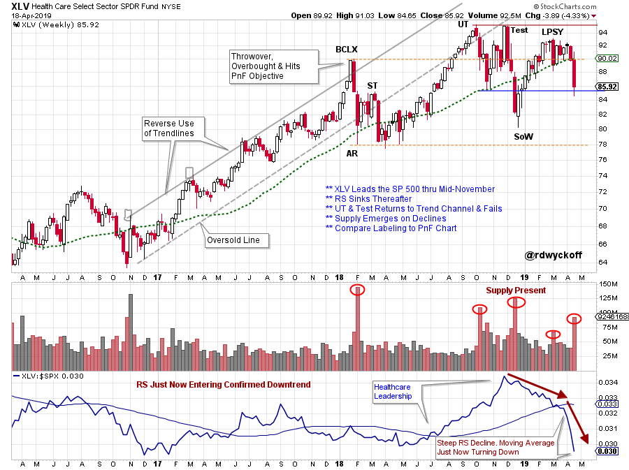
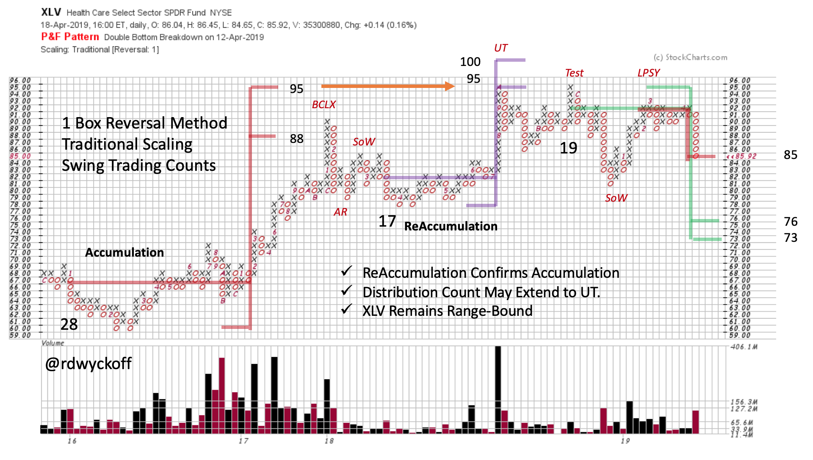

# Health Care Crisis

URL: https://articles.stockcharts.com/article/articles-wyckoff-2019-04-health-care-crisis/
Date: April 22, 2019 at 08:30 AM
Author: Bruce Fraser

The Health Care Sector (XLV) took a tumble this past week. In 2018 XLV was among the best leadership sectors of the stock market. Rotation is expected between sectors, industry groups and stocks throughout the business cycle. Were there technical clues that warned of the seemingly sudden weakness in the Health Care Sector?

---

(click on chart for active version)

The Buying Climax (BCLX) arrived with a ‘Throwover’ of the Trend Channel. The sharp reaction with large price spread and high volume announced the start of a Range Bound condition. The Upthrust (UT) of the BCLX resulted in another stiff reaction. There was evidence of selling (large Supply) from the BCLX onward. In November the ‘Test’ of the UT had climactic qualities as price touched the underside of the Trend Channel and reacted sharply. Relative Strength began declining at that time and XLV went from leadership to laggard (see RS line from mid-November onward). The December rally in XLV coincided with the broad market advance. But note how the Relative Strength dramatically deteriorated. This signaled that Healthcare was having important underperformance during the first quarter. It was evident that XLV was becoming a laggard after being prior market leadership.

The One-Box Reversal method of Point and Figure (PnF) is very useful for identifying Swing Trading opportunities. Three swing trading examples are showcased in this PnF chart. In 2016 a cause formed (Accumulation). A dramatic BCLX culminated into the swing trading target (88 / 95) where a sharp break confirmed the PnF count objective. Note how the Accumulation Count and the Reaccumulation count confirmed at 95. The Upthrust (UT) was stopped exactly at the 95 target. The reaction after the Test was the weakest on this three plus year chart history and was labeled a Sign of Weakness (SoW). A Last Point of Supply (LPSY) often follows the SoW, which is the case here. A swing trading down count has a 73 / 76 objective. Also note the minor count to 85 which may produce a bounce.

The Health Care Sector has become a Relative Strength laggard, after being an important leadership theme. It has been Range Bound since the Buying Climax peak of January 2018. Once again XLV is below the BCLX peak. There is ample evidence of Supply overhanging the sector. But we will assume the trading range is still in force until an outright breakdown confirms the Markdown Phase. Next blog, we will look at noteworthy Health Care stocks and Industry Groups.

All the Best,

Bruce @rdwyckoff

Announcement

Please join us for this special free session of the Wyckoff Market Discussion (WMD), a weekly review of current markets conducted by Roman Bogomazov and Bruce Fraser. They will present their Wyckoffian take on the current position and plausible future scenarios for the major U.S. indexes, leading and lagging sectors, industry groups, and stocks, as well as some key futures markets.

Click here to register for this FREE May 1st event:https://attendee.gotowebinar.com/register/6728599242528421890?source=bblog

Click here for a complete description of WMD: https://www.wyckoffanalytics.com/wyckoff-market-discussion/

Power Charting Video

Wyckoff (Horizontal) Point and Figure analysis is the subject of the most recent Power Charting episode. Intraday and daily (stock and index) case studies were examined. Distribution analysis of the US Healthcare Providers Index and one component (HCA) were analyzed. Click here to view.
