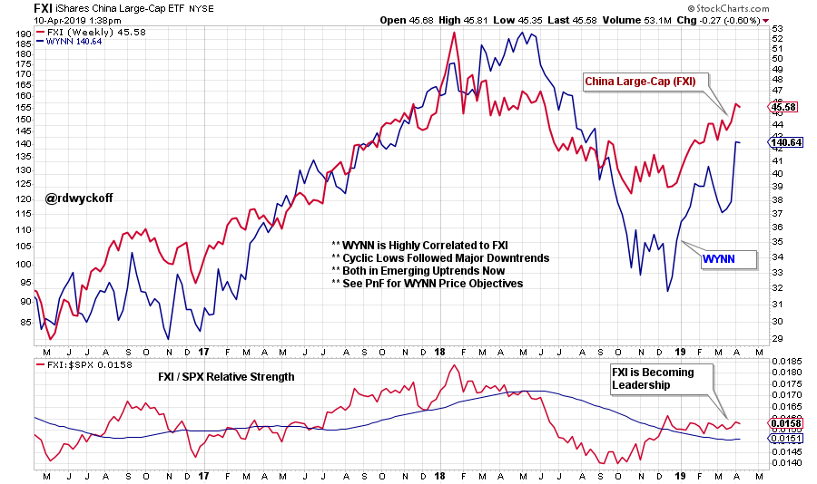
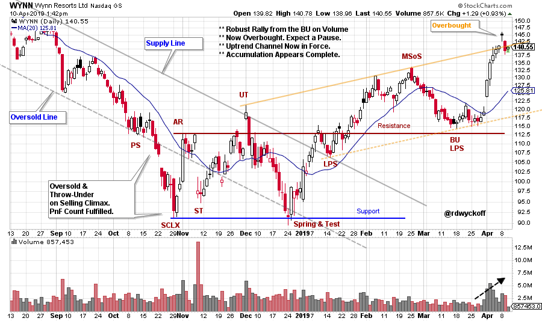
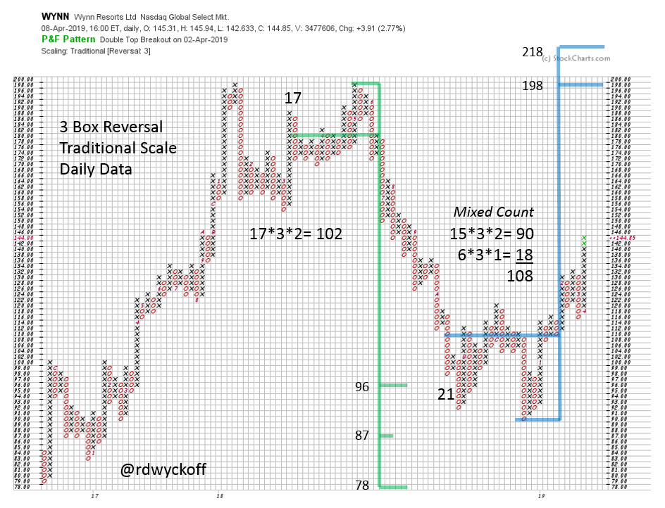

# WYNN Win

URL: https://articles.stockcharts.com/article/articles-wyckoff-2019-04-wynn-win/
Date: April 10, 2019 at 03:08 PM
Author: Bruce Fraser

Wynn Resorts is a favorite stock to study. WYNN tends to have big cyclical trends which repeat over and over again. These trends are wonderfully persistent in their upward and downward movements. Also prior to a major change of trend, a Cause builds for either Accumulation or Distribution. And these Causes can then be evaluated with horizontal Point and Figure (PnF) count objectives.

---

for active chart click here

Wynn Resorts has a large presence in the China gaming region of Macau. Let’s have a look at the China Large-Cap Index (FXI) as a measure of the health of their domestic economy. The FXI made a final low in October 2018 after a major decline during the year. The currently rising trend is discounting future improvement in economic conditions for China. Note that Wynn Resorts (WYNN) is highly correlated to the upward and downward trends of the FXI. Now both FXI and WYNN are in steeply rising price trends.

The relative strength trend of FXI to the S&P 500 is now decidedly leading the way upward. FXI has been leadership since October. Could it be that WYNN is a leveraged approach to participating in the new rising price trend of FXI?

for active chart click here

In October of 2018 WYNN had a Selling Climax. Selling accelerated below the channel into an Oversold condition. The Throwunder of the downward channel, into a Selling Climax also fulfilled a Distributional Point and Figure count objective. Notice the return back into the Downtrend channel with a rally into an Upthrust (UT). The Spring and a Test touched the Oversold line one last time. Then a stiff Change of Character rally took WYNN up above the Supply Line and the Resistance Line of the Accumulation. Accumulation appears to have been completed and a new uptrend has started. The recent rally has touched the top of the uptrending channel and now is Overbought. Price weakness back into the rising channel could produce another buying juncture for WYNN.

The Accumulation studied above has built a PnF cause quickly. The WYNN PnF count returns to the prior high prices. Both WYNN and FXI could be influenced by trade negotiations. Completed Accumulation, higher PnF objectives, and relative strength leadership point to a robust continuation of the uptrend. We will be patiently waiting for areas of Reaccumulation to reveal the best entry points. A rising FXI index puts a tail wind into the WYNN uptrend. These are the elements of a Campaign Candidate.

All the Best,

Bruce @rdwyckoff

Announcement

Please join us for this special free session of the Wyckoff Market Discussion (WMD), a weekly review of current markets conducted by Roman Bogomazov and Bruce Fraser. They will present their Wyckoffian take on the current position and plausible future scenarios for the major U.S. indexes, leading and lagging sectors, industry groups, and stocks, as well as some key futures markets.

Click here to register for this FREE May 1st event: https://attendee.gotowebinar.com/register/6728599242528421890?source=bblog

Click here for a complete description of WMD: https://www.wyckoffanalytics.com/wyckoff-market-discussion/

Power Charting Video

Andrew Cardwell (Dr. RSI) joined me for a discussion of his RSI methodology as applied to current markets and stocks. To view this episode of Power Charting click here.
