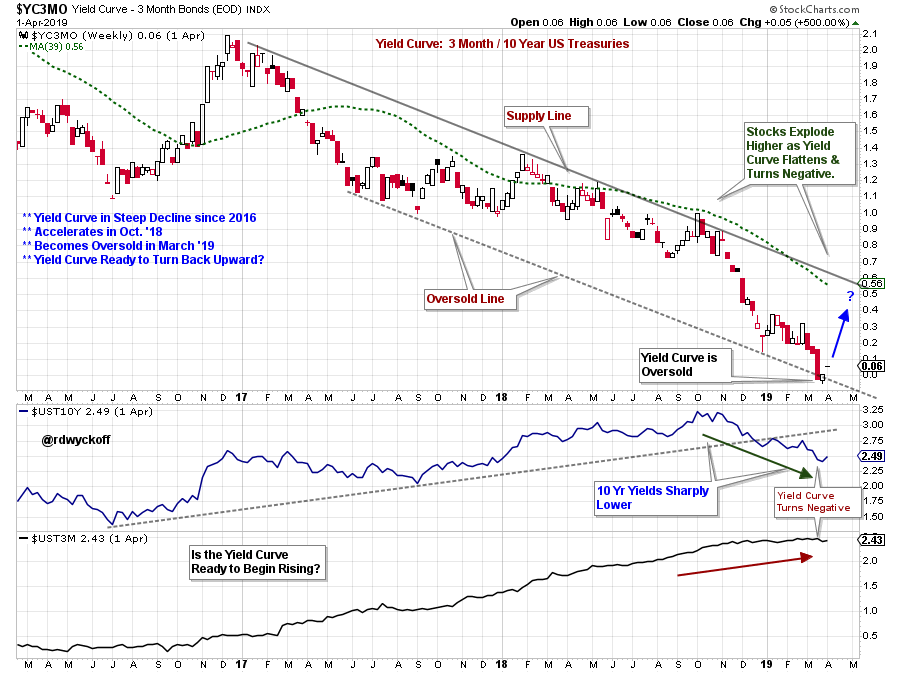
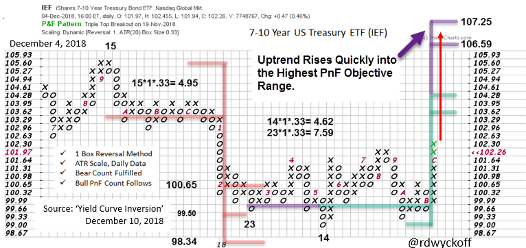
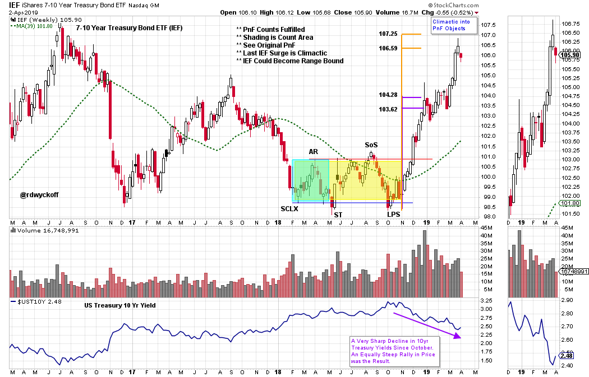

# Yields Flatten

URL: https://articles.stockcharts.com/article/articles-wyckoff-2019-04-yields-flatten/
Date: April 03, 2019 at 12:52 PM
Author: Bruce Fraser

The Yield Curve recently flipped negative (10 year compared to 3 month treasury yields). A negative Yield Curve is typically a ‘Tight Money’ indication which often leads to economic recession and weaker stock prices. The December 10, 2018 Wyckoff Power Charting blog was devoted to this subject. The conclusion was the flattening yield curve would likely not be a threat to the economy or stocks because US Treasury interest rates were falling not rising. By the end of the month stocks launched into a major rally. Take some time now to read this earlier yield curve blog (click here).

---

For an Active Chart click here.

The Yield Curve Trend Channel has contained the decline toward flattening for more than two years. The most recent leg down accelerated into an Oversold condition and Inversion. This chart plots the difference between the 10 year yield and the 3 month Treasury Bill yield (see each yield series plotted separately in the lower panes). The 10 year has been falling since October 2018 while short term interest rates have remained high. Thus, the reason for the Yield Curve Inversion. The Yield Curve has recently touched the bottom of the trend channel and has become Oversold. This decline has possibly come to an end with a climactic surge to the Oversold Line. A reversal upward from here would indicate a steepening of the curve. But the Yield Curve paradox we have been in since early December will likely continue.

Recall that bond prices and yields move inversely to each other. Above we studied (in the December 10th post) the trend of 10 year bonds using PnF analysis. We analyzed the Accumulation area (using 7-10 year Treasury Bond ETF as a proxy). The PnF count generated has just been fulfilled (red arrow denotes the recent rise in the price of IEF). This was the Treasury Bond rally that inverted the Yield Curve. The PnF count has now been fulfilled which suggests the end of the recent bond price rally.

For an Active Chart click here.

The entire bond rally can be studied on this vertical chart. Accelerating prices into the upper PnF objectives suggest the rally is nearly over.

Conclusion: The Yield Curve is likely on the verge of steepening. But the steepening Yield Curve could be the result of rising 10 Year Treasury interest rate yields. If the Federal Reserve Bank takes an even more dovish tone, 3 month T-Bill interest rates could start falling and the Yield Curve could steepen quickly. Wall Street would likely find relief in this news.

All the Best,

Bruce @rdwyckoff

Announcements:

Wyckoff Market Discussion

My colleague Roman Bogomazov and I host a weekly Wyckoff Market Discussion (WMD), during which we conduct an in-depth Wyckoffian assessment of the present positions and probable future directions of U.S. stock indexes, sectors, industry groups, stocks and several commodities. These Wednesday afternoon webinars are recorded and posted online immediately for WMD subscribers only. Our main intentions for WMD are to provide unique analyses of current markets and to impart first-rate Wyckoff-themed education to our community. To learn more, please click here.

Power Charting

- The next episode of Power Charting will feature Dr. RSI, Andrew Cardwell. We will discuss the application of the 'Cardwell RSI' method to the current markets. Tune in this Friday, April 5, 2019 at 3pm EDT with replays thereafter. Click here to tune in.
- Joe Turner introduces the concept of Peak Performance Trading using Mental State Management in this recent episode of Power Charting. Click here to view this episode.
