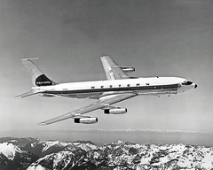
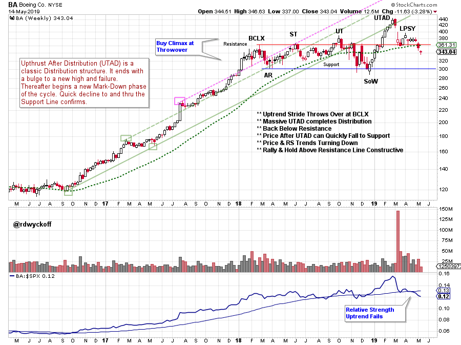
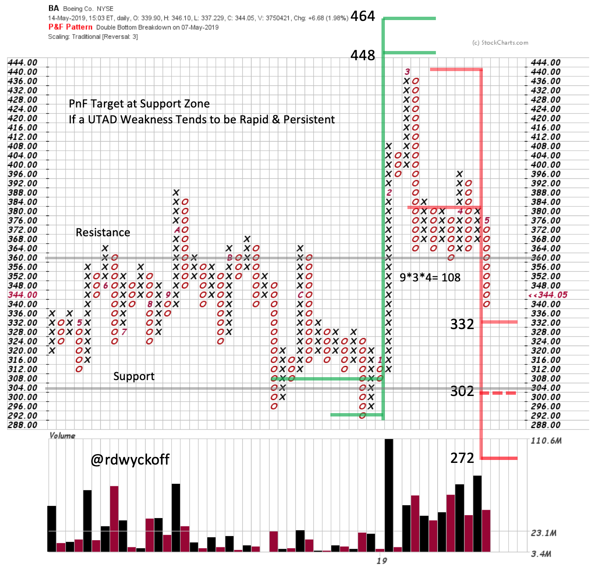

# Boeing is Big

URL: https://articles.stockcharts.com/article/articles-wyckoff-2019-05-boeing-is-big/
Date: May 15, 2019 at 01:19 PM
Author: Bruce Fraser

The Dow Jones Industrial Average ($INDU) is the granddaddy of stock indexes. Charles Dow created the predecessor of this index in 1880s. The publication and distribution of this index was the forerunner of the Wall Street Journal. Eleven important leadership stocks composed this original stock index. The calculation was made by adding together the closing stock prices and dividing the total by 11. This was considered a ‘price weighted index’ as the higher priced stocks had a larger influence on the movement of the index than lower priced stock components. In contrast, more recently developed indexes are typically capitalization weighted. Therefore, the larger capitalization companies have a proportionately larger influence on the value and price swings of these indexes.

---

The three Dow Jones Averages continue to be price weighted indexes. Consequently, the highest priced stocks have the greatest weight and influence on these averages. The calculation of these price weighted indexes has become convoluted. No longer can the 30 stocks in the $INDU be added together and then divided by 30. Spin-offs and stock splits must be adjusted for and this is done by changing the denominator (the divisor). Over many years of adjustment, the denominator of 30 has been reduced, and it is now a fraction. If I did the math correctly, the current denominator is 0.147445665. To calculate the DJIA index value add the most recent price of the individual 30 stocks and divide that total by the fraction above. For example, we add the closing price of the 30 stocks on May 13, 2019 which totals 3,734.06 and then divide that total by the fraction above to get the closing DJIA value of 25,324.99. The inverse of that fraction is 6.7822 (6.7822 = 1 / 0.147445665). To calculate the impact of the change of any Dow Jones Industrial stock on a given day multiply the daily change of that stock price by 6.7822.

Two examples will help clarify. Apple Inc. (AAPL) and Boeing Company (BA) are both important components of the Dow Jones Industrial Average. AAPL is about 4.5 times larger (in capitalized value) than BA. But in the DJIA, Boeing is more impactful because its stock has a higher price. In the case of AAPL its negative impact on the DJIA on 5/13 was -11.46 points multiplied by 6.7822 or -77.7235. While BA declined -17.3 points and when multiplied by 6.7822 produced an impact of -117.331 DJIA points. On May 13 when the DJIA declined -617.38 these two high priced stocks contributed -195.055 (-77.7234 plus -117.331) to the DJIA movement. Many think of the DJIA as an anachronism but it continues to be a very widely followed stock index. It is good for us to know the unique nuances that affect the calculation of this index.

click on chart for active version

Boeing Company being the highest price stock in the Dow Jones Industrial Average, makes it distinctly important. The above Wyckoff analysis makes the case for completed Distribution for BA. A Throwover of the trend channel in the first quarter of 2018 is labeled a Buying Climax (BCLX) and the beginning of a range bound condition. An impressive rally from December 2018 took BA to an even higher high. Now BA is rapidly failing and is back below the BCLX Resistance level. A classic characteristic of an Upthrust After Distribution (UTAD) is the rapid and persistent decline through the prior, and lower, range bound condition (following the Upthrust). If Support is reached easily Wyckoffians would brace for Distribution to be complete and Mark-Down to be underway. Recall the impact that BA has on the value of the DJIA ($INDU).

Note how the Redistribution PnF count has an objective at the Support Line (see vertical chart). The rapidity of the reversal of BA back into the trading range is classic UTAD price action. To rally and hold above the 15 month Resistance line would help to negate the UTAD scenario. We will be watching Boeing very closely because of its unique importance.

All the Best, Bruce @rdwyckoff

Read more about Distribution Definitions (click here)

Read more about Charles Dow and the Dow Jones Averages (click here)

To Watch the Most Recent Power Charting Episode: 'Wyckoff Intraday Point & Figure Analysis' (click here)

The next episode of Power Charting: Andrew Cardwell (Dr. RSI) will join me for a discussion of the current markets. Join us Friday May 17, 2019 at 3pm ET with replays thereafter (click here for a link)
