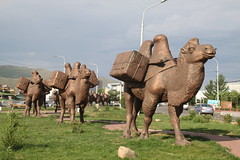
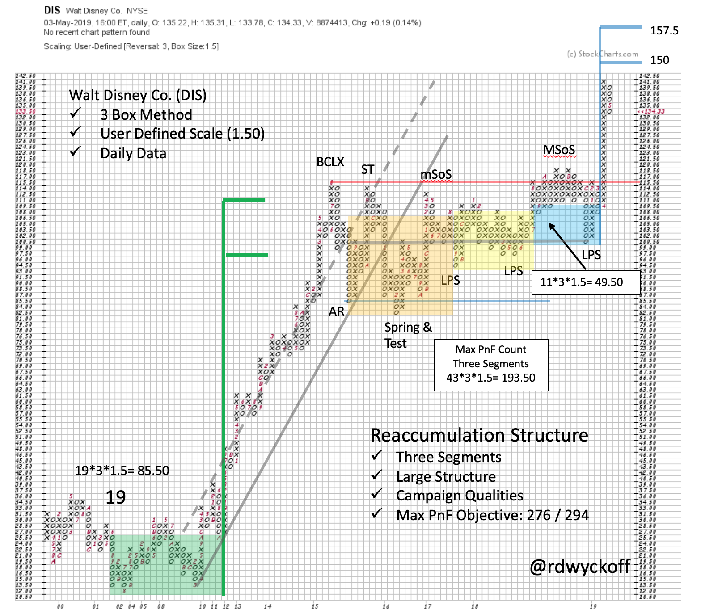
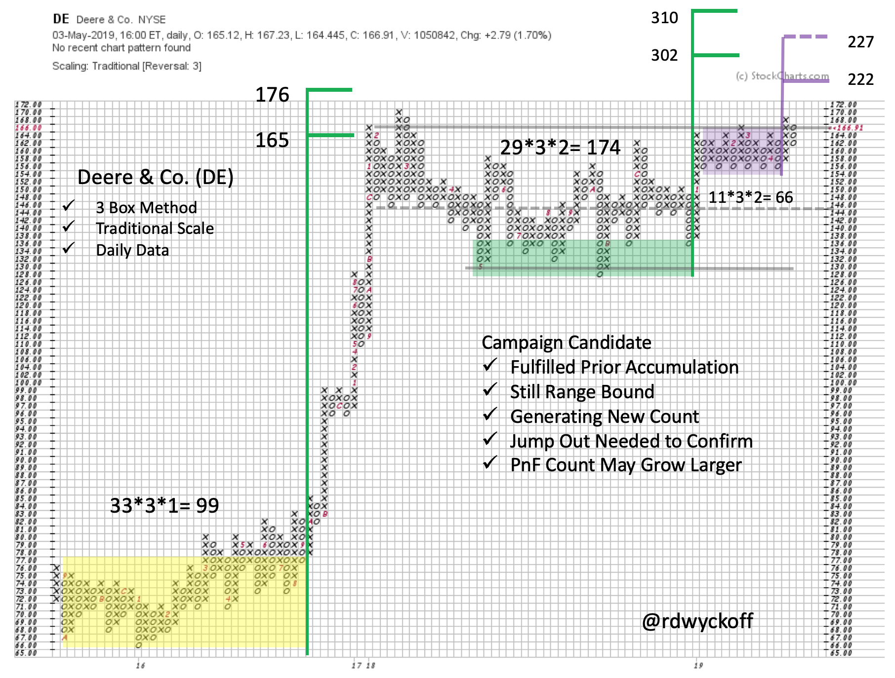

# Campaign Caravan

URL: https://articles.stockcharts.com/article/articles-wyckoff-2019-05-campaign-caravan/
Date: May 07, 2019 at 05:30 PM
Author: Bruce Fraser

For most investors Campaigning stocks is an acquired skill. A stock campaign is typically a multi-year endurance event. In a classic uptrend a stock will have trending periods followed by consolidations (Wyckoffians call them Reaccumulations). These pauses can last months to a year or more in duration. Wyckoff Campaigners resist the urge to sell stock, and take profits during the consolidation phases. Because once a position has been liquidated, it is often extremely difficult to reestablish the trade again after a Reaccumulation resolves into a fresh new uptrend. Especially when a new markup phase begins, it can be a sudden and dramatic surge of the stock price. For the Campaigner who has abandoned the stock position this event is a source of stress and discouragement. Reaching up (and often paying higher prices) is a difficult trading action to execute.

---

Wyckoff has an excellent tool set for identifying best candidates for multi-year trends. Trendline analysis, 3-box and 5-box Point and Figure counting methodology, Accumulation and Reaccumulation structure analysis and Relative Strength studies are all used for Campaign analysis. These tools are also used in the Wyckoff ‘Swing Trading’ technique. For Campaigning purposes, the time frames studied are larger and encompass bigger price structures.

Horizontal Point and Figure counting methodology adds a useful dimension to the Wyckoff Campaign approach. With the ability to measure the potential for price appreciation, Campaign candidates are identified. Disney (DIS), depending on the entry price, has a twofold plus appreciation potential from the Reaccumulation zone. A big Jump has taken DIS out of the Reaccumulation area. This confirms that DIS has been under methodical absorption by large interests. The Jump out suggests that stock is in strong hands. A mild Backup toward prior Resistance (new Support) would be the best scenario for initiating or adding to DIS. Stops are important in Campaign trading and are typically placed further away than in Swing trading circumstances. DIS was a case study profiled in a StockCharts TV special ‘Wyckoff Point and Figure Tutorial' (click here and here to view).

Deere & Co. (DE) has not escaped from the Reaccumulation area. It is hugging the Resistance zone in a quiet and dull fashion. This could be evidence of the completion of Absorption. PnF segments are being counted differently here. The lower area count (in green) is being treated as a stand alone count and reaches above $300. This by itself is a Campaign quality PnF count. The smaller count (in purple) is more of a Swing Trading situation that would represent an attractive Jump out of the Reaccumulation zone. If an uptrend can begin, combining segments would be the next step. Clearly DE has a large count potential.

Both DE and DIS had prior Accumulation counts that were useful in flagging the ultimate price objective of important uptrends. After resting for a considerable period both stocks have generated possible Causes that could propel them upward for months to years. The fact that both respected their prior PnF counts and had robust uptrends bodes well for their potential in the future. We will continue to hone Campaign skills in the weeks to come. The Wyckoff Method offers unique tools and tactics for this powerful approach.

All the Best,

Bruce

@rdwyckoff

Announcement: See two specials on Wyckoff Campaign Trading. Click here and here to view.

Wyckoff Market Discussion Special Offer:

Traders who are not current WMD subscribers: you can attend the next three WMD webinars – May 8, 15, and 22 - for only $30 ($10/session)! You can sign up here to take advantage of this special offer before it expires tomorrow, May 8th!
