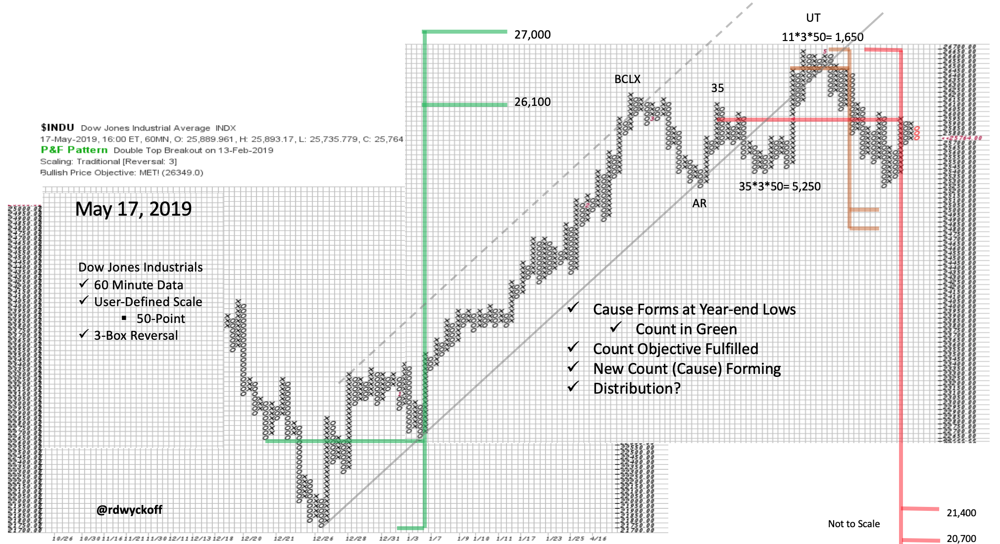
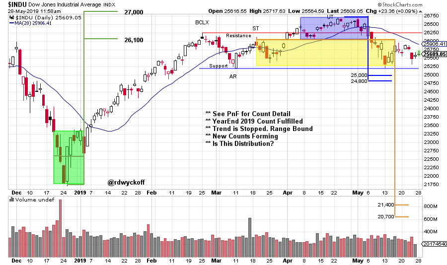

# Where There's Smoke...

URL: https://articles.stockcharts.com/article/articles-wyckoff-2019-05-where-theres-smoke/
Date: May 28, 2019 at 12:18 PM
Author: Bruce Fraser

In early May (see my 5/2 MarketWatchers LIVE appearance) it seemed that a hint of smoke was noticeable at the tippy top of the market rally. We looked at the attributes of Distribution that were evident in the smaller intraday time frames. During the May 10th Power Charting episode, we revisited this intraday analysis with additional data. Is it possible that a full blown conflagration is emerging from that whiff of smoke seen early in the month? Let’s readjust our view into a larger timeframe and have a look. Click here to review the Power Charting Episode: Wyckoff Intraday Point and Figure Analysis (May 10, 2019).

---

We zoom out to a 60-minute timeframe to capture the rally phase from December. This Point and Figure chart is a 3-box reversal, 50-point scale chart of the Dow Jones Industrials ($INDU). An upward channel beautifully frames the advance, with a climactic throwover as the PnF objective is being fulfilled. We expect a Cause to be formed for the next market movement. That appears to be the case since the climactic surge. The Upthrust (UT) creates a small PnF count that has yet to be reached. A persistent decline followed the Upthrust into the Support area. A larger PnF count segment is being entertained here. This count should only be taken seriously if there is a failure of the Support area (to the minor count objective of 25,000 to 24,800) and a sharp rally does not follow. The bulls would be looking for a Spring back above the Support zone and a swift rally back toward the highs.

(click on chart for active version)

This daily chart will hopefully clarify the above Point and Figure analysis. The shaded boxes represent where the PnF counts are taken. Also, this chart updates the market data through May 24th. Note the diminished quality of the $INDU rally in May. The index has turned back down and is near the Support line again. A Spring of the Support area at the 25,000 area and a good rally upward would make the case for this trading area (since late February) to be Reaccumulation. Weakness with expanding price spread and volume and an inability to rally would be a bearish turn of events.

All the Best,

Bruce @rdwyckoff

Announcement:

Sector Analysis (part one) is the subject of the latest episode of Power Charting. View it by clicking here. In part two we will complete the Sector Analysis and drill into some interesting Industry Groups and Stocks. Tune in this coming Friday at 3pm ET with replays thereafter.
