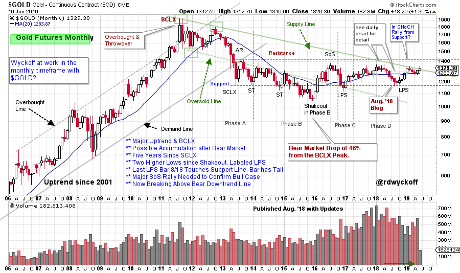
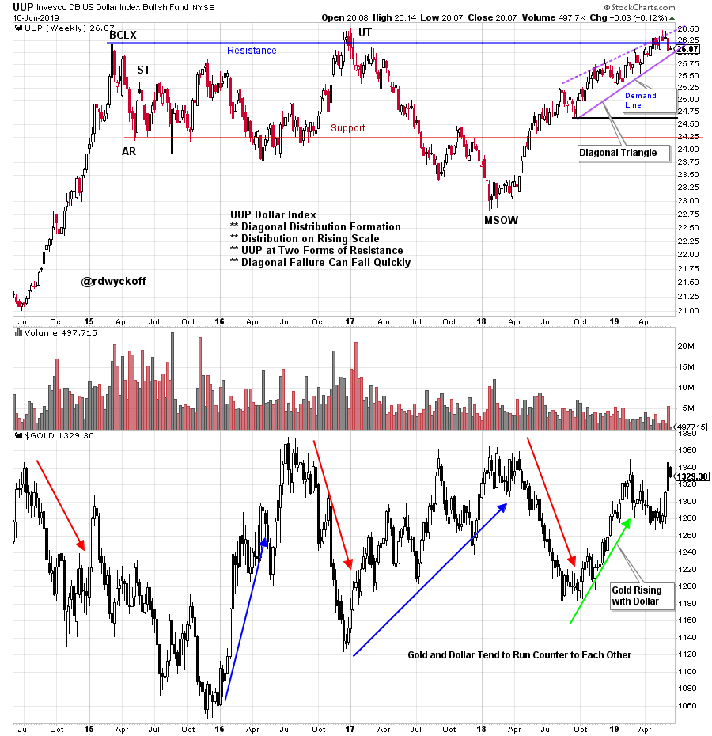
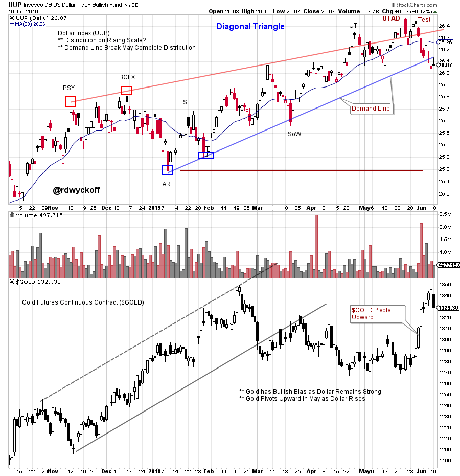
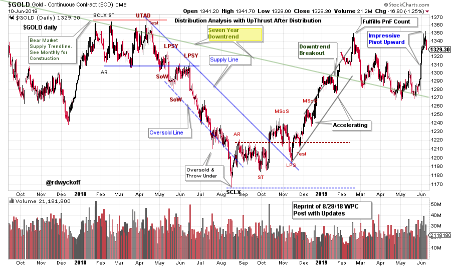

# Gold v. Dollar

URL: https://articles.stockcharts.com/article/articles-wyckoff-2019-06-gold-v-dollar/
Date: June 11, 2019 at 08:00 AM
Author: Bruce Fraser

Gold and the Dollar are natural adversaries. They both represent a store of value. When the Dollar is strong, in comparison to other currencies, gold tends to underperform. Recently the Dollar has been a dominant currency, largely as a result of the strong domestic economy and higher interest rates. There has been a subtle change in the price relationship between Gold and the Dollar that could be indicating a shift. What is this shift and does it reflect an important change of trend?

---

(click on chart for active version)

First let us review this very useful monthly chart of Gold (using the $GOLD futures contract). This 7½ year downtrend held back $GOLD until this month, June 2019. Also note the touch of the Support line in August 2018 (see that blog post by clicking here). Exceeding the downtrend line could free up $GOLD for a quick run up to the Resistance line, and beyond. Note that $GOLD has been making higher lows since the end of 2015. Gold now has a very large (six year) Accumulation structure that appears to be near completion. To confirm that a new Markup is in full force the $GOLD price must rise above the overhanging Resistance area near 1,410.

(click on chart for active version)

UUP (Invesco U.S. Dollar Bullish Fund) is our proxy for the Dollar. UUP has been in a strong rally phase since early 2018 as the economy has heated up and the Federal Reserve has been raising interest rates. Study the remarkable Dollar rally in 2014 and the Buying Climax (BCLX). The conclusion of that rally produced a large 4½ year range-bound market. The UUP has now rallied to the Resistance produced by the BCLX. The final phase of this rally has the structure of a Diagonal Triangle. This is often a bearish structure. Elliott Wave students view these as five wave affairs and the conclusion of an advance. The failure of a Diagonal Triangle can be swift and sudden.

Since August of 2018, $GOLD had a change of behavior where it got into sync with the Dollar and they rallied together. Let’s take a closer look.

(click on chart for active version)

Distribution often occurs on a scale upward. Diagonal Triangles are an example of Distribution on a rising scale. Here is a Wyckoff interpretation of the Diagonal Triangle in UUP. Please review my discussion of these markets in my most recent Power Charting Video (click here). I have made one change on this chart since the video. I have relabeled the Last Point of Supply (LPSY) as an Upthrust After Distribution (UTAD). Mainly because UUP has sharply declined through the Demand Line of the Diagonal Trend Channel. A classic target for the UUP break would be the Automatic Reaction (AR) area. If this is a true Diagonal Triangle the drop to the AR could happen quickly.

Turning our attention to the $GOLD chart note the quick pivot upward. This Jump has put $GOLD above the long term downtrend line on the monthly chart. Gold tipped its hand starting in August 2018 when it rallied with the Dollar. Now the relationship appears to have ended (or decoupled) as the Dollar has fallen out of the Diagonal Triangle with notable weakness and Gold has come to life. Could a Change of Character propel $GOLD through the Resistance line overhead (at about 1,410) on the monthly chart?

(click on chart for active version)

Let’s finish up with this daily chart of $GOLD. The swing trading structures for $GOLD are classic Wyckoff. See prior WPC blog posts for Point and Figure (PnF) analysis, which worked very well. A shallow Backup (BU) to 1,270 after the rally to 1,350 set up the current upward pivot. Note the speed of the liftoff.

Summary:

- Gold Futures are breaking above a 7½ year downtrend in early June 2019. Next stop is the Overhead Resistance on the monthly chart. A six year Accumulation may be near completion. A rise above the Resistance line would signal a new Markup phase.
- The Dollar (UUP) is at two forms of Resistance. A Diagonal Triangle in the Dollar may be Distribution on a rising scale. UUP has just broken down out of this structure. Sudden weakness on the failure of a Diagonal Triangle is typical. This is also the case with a UTAD. Weakness in the Dollar would provide a tailwind for Gold.
- Gold has been uncharacteristically strong since August 2018 and has rallied with the Dollar.
- A shallow Backup in early 2019 for Gold has set up a sudden upward pivot. A near term target is Resistance at 1,410 which is also a Swing Trading PnF price objective. Stops (for swing traders) would be placed below the Pivot (Backup) near 1,270.

All the Best,

Bruce @rdwyckoff

For Links to Prior Gold Blog Posts click here and here and here.

For Links to Prior Dollar Related Blog Posts click here and here.`

Link to the Latest Power Charting Video click here.
