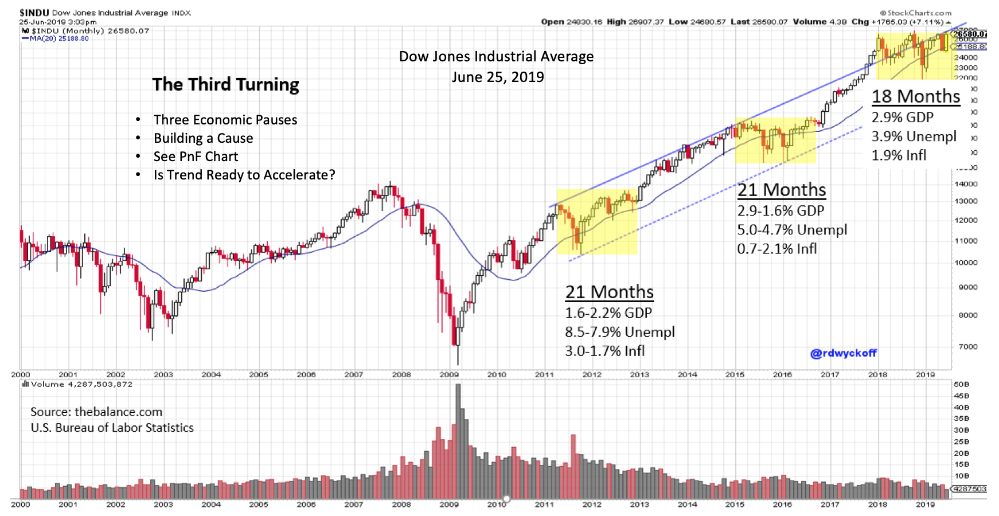
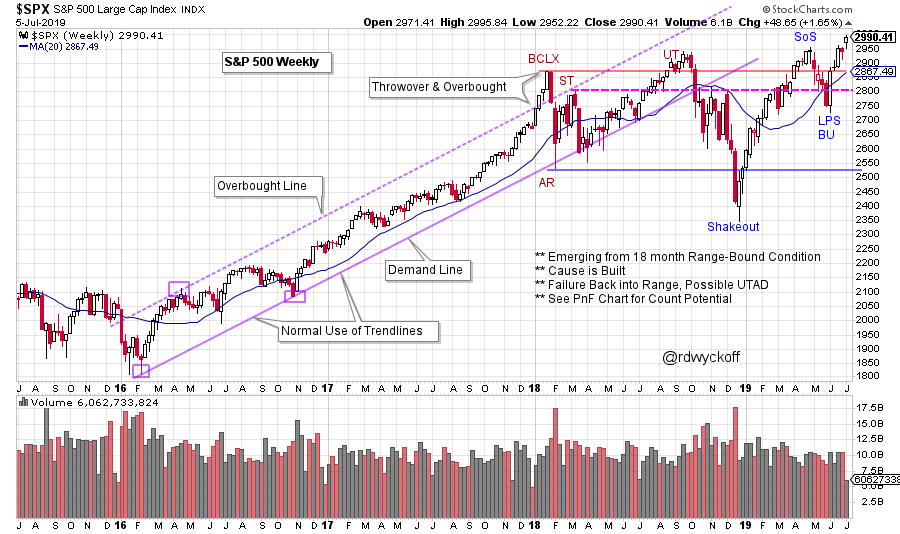
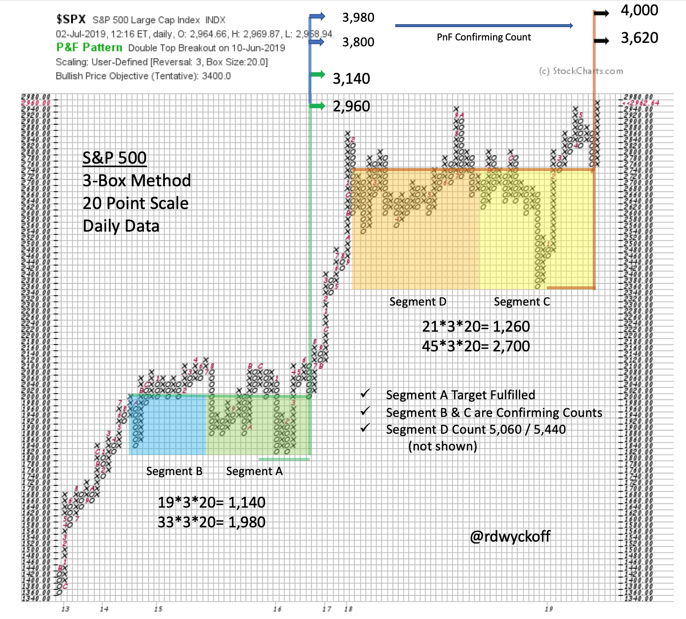

# On the Razor's Edge

URL: https://articles.stockcharts.com/article/articles-wyckoff-2019-07-on-the-razors-edge/
Date: July 08, 2019 at 08:00 AM
Author: Bruce Fraser

The S&P 500 Index appreciated 17.35% in the first half of 2019. But from the climax high close in January 2018 the S&P 500 has risen only 2.4%. Despite the stellar performance during 2019 the large capitalization indexes have remained ‘range-bound’ during the past 18 months. Wyckoffians accept the importance of these trendless market conditions as preparation phases. Richard D. Wyckoff’s Law of Cause and Effect applies to the environment that has been unfolding over the last year and a half. Let’s see how.

---

The markets remain in the epic bull market run that began in 2009. The yellow shaded areas on this $INDU chart represent economic and stock market pauses in the ongoing uptrend. These were large Cause building phases that prepared the indexes for the next uptrend (the Effect). What typically stops a bull market is an overheated economy. The Federal Reserve Bank (the Fed) is compelled, under such circumstances, to cool off the economy with a policy of tightening (producing higher interest rates). In the chart above we can see that Gross Domestic Product (GDP) is generally rising and Unemployment is falling. But inflation is moderate and steady. The economy is getting stronger, but it is not overheating.

The Fed has raised interest rates 9 times from the end of 2015 through last December. This has moderated the rate of growth of the domestic economy and some Fed watchers believe the Fed to have overstepped with the December 2018 interest rate increase. But the treasury bond market began a huge rally 8 months ago bringing interest rate relief to the broad domestic economy. This huge decline in treasury bond interest rates sparked the major rally in stocks that produced a 17.35% first half performance. This rally has returned the major stock indexes to the top of the trading range. Is this resistance area, once again, the end of the rally? Or has a Cause been completed for a resumption of the major bull market uptrend?

(click on chart for active version)

In January of 2018, a magnificent uptrend became overbought above a two year trend channel and was stopped by a Buying Climax (BCLX). Thereafter major stock indexes have remained largely range-bound. As the 2ndquarter comes to an end the S&P 500 has pushed up into new high ground. This is a precarious position for the market indexes. The resistance that has held back the indexes for the prior 18 months could again exert a downward force. Or is there a case to be made for the markets breaking free of this trading range and lifting into a new uptrend? As can be seen in the prior two trading ranges, once the Reaccumulation (Cause) was complete the uptrend resumed (the Effect).

A rally into April completed an important advance into Resistance which is labeled a Sign of Strength (SoS). The May reaction was brief, shallow and volume diminished throughout. The subsequent rally returned to the highs quickly and volume expanded. The bulls would look for this to continue as earnings season gets underway. Prices moving above and beyond this trading range suggests the start of a new long term uptrend.

This truly is the Razor's Edge. If the S&P 500 reverses down from this Resistance area, the Upthrust After Distribution (UTAD) scenario will loom large. A UTAD will surge to a new high at the conclusion of Distribution and then fail back into the trading range. A volatile decline to Support at the bottom of the trading range would be expected. Though this is a less likely event, we will know soon. There is a benefit of being on the Razor's Edge. Stops can be set tighter and thus risks are more manageable.

In my recent appearance on Market Watchers LIVE entitled ‘As the Economy Turns’ the case was made for improving conditions (click here to view). The Federal Reserve Bank is likely to err on the side of the economy running hot throughout 2020. Long term interest rates have come down dramatically and this is economically stimulative. If progress can be made toward a tariff resolution, worldwide business activity and confidence could start to improve. We can hope.

If Wyckoffians suspect a Cause to have been built and near completion, the next step is to calculate the Point and Figure Objectives (PnF). On the S&P 500 PnF chart above, the last two Reaccumulation pauses can be seen. Note the family resemblance between the two price structures. In each, the volatility increases over time and they conclude with a Spring / Shakeout of the trading range. They both rally to resistance where they Backup (BU). The big question is whether the current BU and pivot emerges into a new uptrend. So far, so good. Note the large Reaccumulation PnF count in the current structure. Two segments are identified. Segment C target range is 3,620 / 4,000. Segment D reaches to 5,060 / 5,440. Impressive potential to be sure! Note the Segment A count, it missed the top of the current structure by one box. We will be watching the resolution of this breakout very closely.

All the Best,

Bruce @rdwyckoff

Free Webinar Replay: Dow Theory with Alex Ivanov. Join Alex for a discussion of the history of the Dow Theory. On July 19thAlex will follow up with a two hour demonstration on how to use Dow Theory in real time to find trends and trade (a TSAASF member event). Go to TSAASF.org to view the recording and learn more about the upcoming live event.
