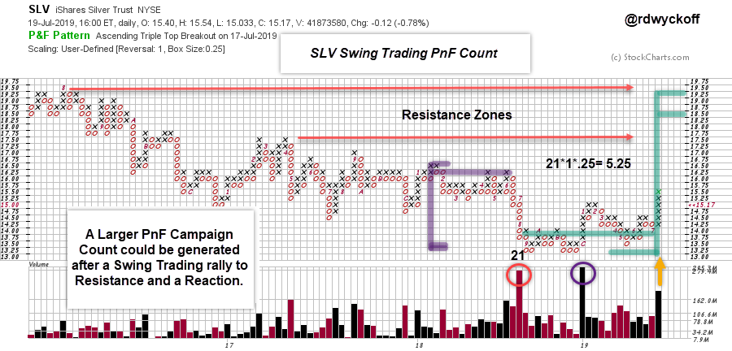
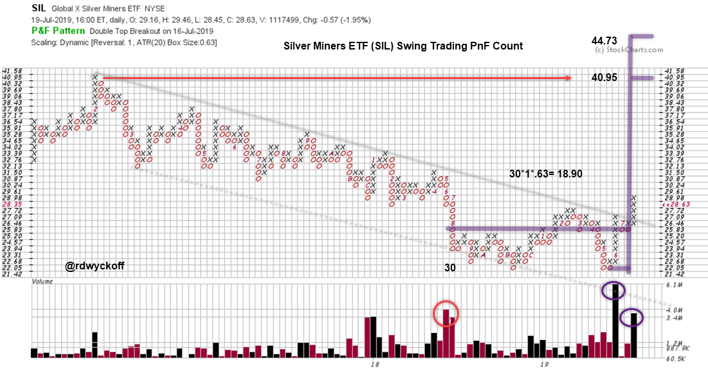

# Silver Standard

URL: https://articles.stockcharts.com/article/articles-wyckoff-2019-07-silver-standard/
Date: July 23, 2019 at 11:26 AM
Author: Bruce Fraser

An important oversold condition and Point and Figure objective were reached in August of 2018 for Gold ($GOLD). A Last Point of Support (LPS) formed at the Support line generated by the Selling Climax (SCLX) low in 2013 (to see the chart analysis – click here and click here). Since this LPS low, a rally in Gold has propelled it upward to the all-important Resistance line formed by the Automatic Rally peak in August of 2013 at $1,434.00. The rally in $GOLD, so far, has been 24.6%, low to high, from that August 2018 low. In 2016 we studied this immense price structure in $GOLD (click here to view this earlier blog) and in 2019 it remains unfinished.

What does this emerging strength in $GOLD suggest for Silver prices? Typically, speculative interest in Gold spills over into the Silver market. As expected Gold is leading the way here, but Silver has come to life and has risen about 18.5% since last September. Let's turn to Point and Figure (PnF) analysis to see what may come next.

---

The iShares Silver Trust (SLV) is our proxy for Silver prices. A swing trading PnF count has formed back to September of last year. Note the climactic volume that stopped the decline. Thereafter two bullish rallies surged upward on strong volume. A secondary test after the SCLX decline to the $13.25 Support level is on very low volume. This is a bullish volume and price signature of decreasing Supply and rising Demand. And now that SLV has pivoted upward, a swing trading PnF count can be taken. The PnF price target of 18.50 / 19.25 is in the vicinity of the overhead Resistance area. A meaningful swing trading rally could be ahead for SLV. Also, a much larger PnF count could be generated on a reaction from the Resistance area.

Silver Miners were in a steady downtrend that concluded in mid-year 2018, with a selling climax accompanied by large volume which stopped the decline. This marked the beginning of a potential Accumulation structure. Using the Global X Silver Miners ETF (SIL), let's estimate a swing trading PnF count. The Silver Mining stocks are typically more volatile than the underlying metal. Evidence of Accumulation can be seen on the tests of the SCLX on very low volume. Also, on the expansion of volume on the subsequent rallies. This suggests Supply is diminishing and being absorbed and Demand is increasing. Using the one box reversal method we estimate a swing trading count objective of 40.95 / 44.73. This price target is in the area of overhead resistance. We can visual the potential for a larger PnF count to occur after resistance has been reached and there is a reaction. Such an event would indicate that a much larger campaign for SIL is in the offing in the months and years ahead. For now, we will let the Silver Miners light the way. The current trajectory of silver and gold argues that supply has been Accumulated and is nearly complete, as evidenced by the ease of upward movement. Gold is at a multi-year Resistance level. We will watch closely how Gold and Silver respond to this critical level.

All the Best,

Bruce @rdwyckoff

Announcement:

TSAA-SF Annual Conference 2019. Saturday September 14, 2019

The TSAA-SF has just announced the All-Star lineup for this years conference. To see the list of speakers and to register click here.
