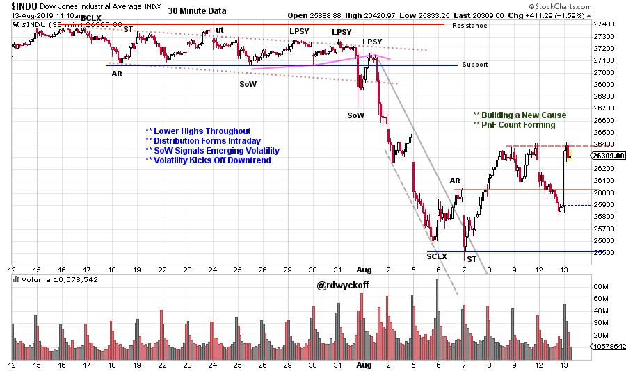
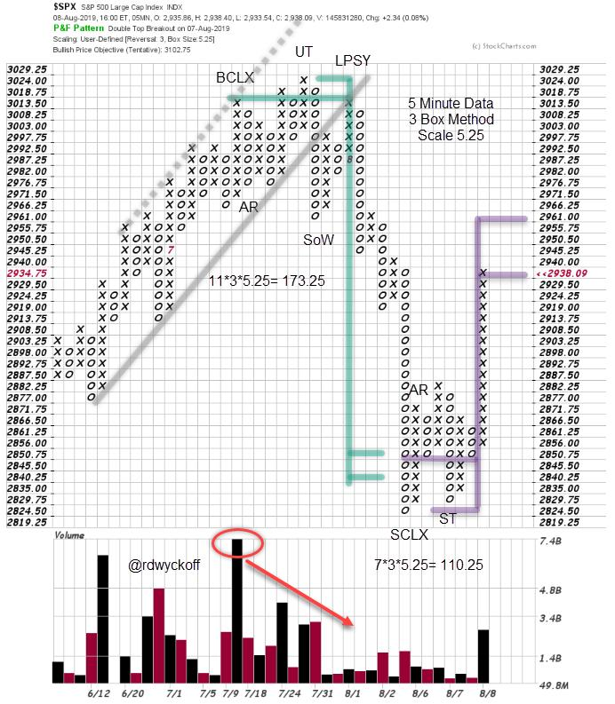
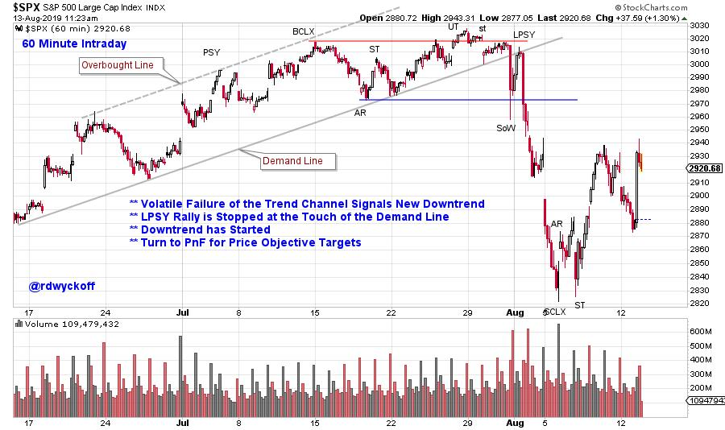

# Stock Market Time

URL: https://articles.stockcharts.com/article/articles-wyckoff-2019-08-stock-market-time-315/
Date: August 13, 2019 at 11:51 AM
Author: Bruce Fraser

Recently the stock market indexes entered a period of extreme volatility. Seemingly random events sent the indexes into rapid declines. These unexpected events blindsided many traders and investors. Stops were hit on positions that only moments prior seemed to have a safe cushion of profit.

When markets become volatile and uncertain, traders will employ techniques and indicators that are more sensitive and can react quickly to changes. The Wyckoff Method works very well in the intraday time frames. This can be an excellent way to detect the motives of the stock market and the likely emergence and conclusion of swing trading and short term trends. Let's study the recent market as a case study into how to best utilize these Wyckoff tools.

(click on chart for active version)

Within the 30 minute time frame there was evidence of Distribution in the Dow Jones Industrial Average ($INDU). This action took about half of July to complete. The second Sign of Weakness (SoW) was followed by a rally attempt into the final Last Point of Supply (LPSY). This rally stalled just above Support which completed Distribution and ushered in a cascading Markdown. The sudden expansion of volatility into the SoW and the following LPSY was the warning of the $INDU change of behavior into a Downtrend. Rapid expansion of volatility is the warning of the emergence of a new trend. Study the small base that formed after the Selling Climax (SCLX) and the rally that followed. A modest PnF Count formed and price has reached the rally objective. We will watch for more potential testing of the recent lows and the building of a new PnF Count.

· Uptrend concludes with Onset of Distribution in July

· SoW out of Channel is on High Volume

· Rally Touches Channel and Fails into Downtrend

· PnF Count is Complete. SCLX Stops at PnF Count Area

· Small Upward Count has just been Reached

· Larger PnF Count may be in the Works

(click on chart for active version)

· Volatile Failure of the Trend Channel Signals New Downtrend

· LPSY Rally is Stopped at the Touch of the Demand Line

· Downtrend has Started

· Turn to PnF for Price Objective Targets

The stock market will typically tip off its future intentions, as was the case here. The intraday timeframe can illustrate with great detail Distribution or Accumulation. Also, the study of the intraday timeframe offers us more Wyckoffian Tape Reading Practice.

All the Best,

Bruce

@rdwyckoff

Announcements:

TSAA-SF Annual Conference 2019. Saturday September 14, 2019

The TSAA-SF has just announced the All-Star lineup for this years conference. To see the list of speakers and to register click here.

Upcoming Wyckoff Events:

Wyckoff Market Discussion, Free Session (Wednesday, August 28th): Roman Bogomazov and I will be offering a complimentary webinar on August 28th: please click hereto register now! For more informationclick here.
