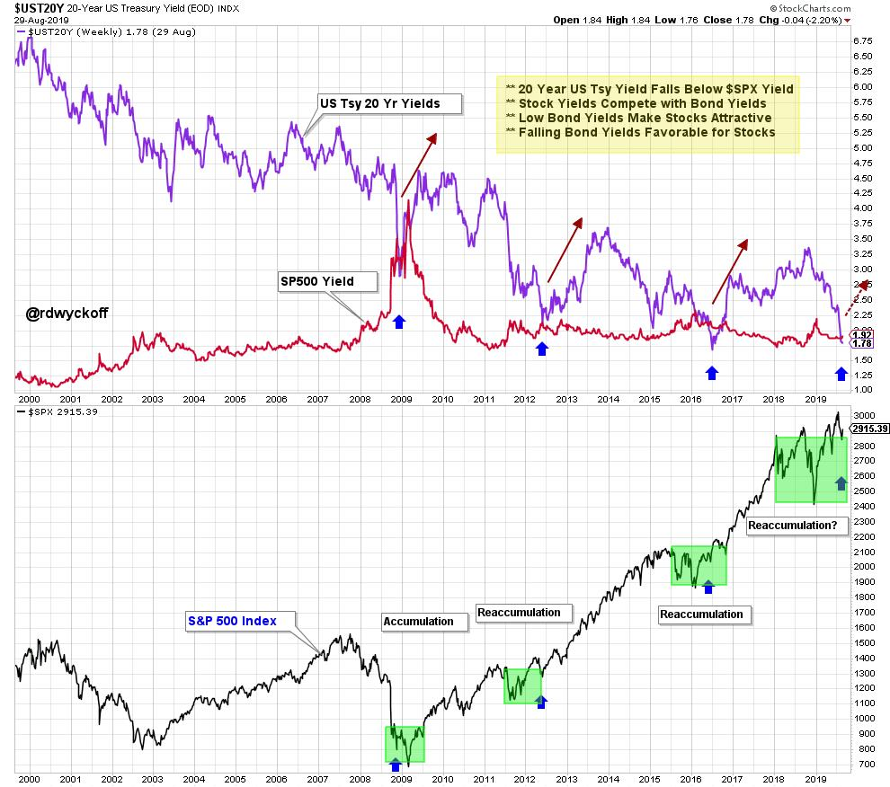

# Stocks Yield. Bonds Don't

URL: https://articles.stockcharts.com/article/articles-wyckoff-2019-08-stocks-yield-bonds-dont-514/
Date: August 30, 2019 at 02:09 PM
Author: Bruce Fraser

A characteristic of this economic cycle has been the disappearance of yield. Yield has been like a glacier melting ever downward and eventually disappearing into the yawning gap it created. In this brave new world of minimalistic interest rates how does an investor create income? Negative interest rates infect most of the bond markets in the world. The United States has the majority of the positive yielding bonds, and these yields are very low and falling. What about stocks? Many stocks pay dividends. Are stocks a reasonable yield substitute for the bond market? Many public companies pay steady dividends and raise those dividends regularly. Also, well run corporations typically grow their sales and earnings. Rising dividends and earnings usually lead to growing stock prices. This total return characteristic can make stocks dynamic growth machines. Let's compare the current state of bond yields and stock dividend yields. How do they measure up to each other? Does this provide a clue about the trend of these two asset classes?

(click on chart for active version)

(to see the recent Power Charting episode where this chart was introduced and profiled click here)

During the bear market of 2008, U.S. Treasury 20 Year ($UST20Y) yields converged with the dividend yield of the S&P 500 ($SPX). This convergence coincided with the end of the bear market. At this yield parity between stocks and bonds, stocks became ‘super bargains'. Since then bond yields have ground their way downward. In the years of 2012, 2016 and 2019, bond yields and stock dividend yields touched. Shortly thereafter stocks emerged into an important new uptrend. Recently bond yields have once again fallen to parity with stock yields.

Chart Notes

· Accumulation and Reaccumulation structures (green box) have been near completion when $UST20Y and $SPX dividend yield became equal. In each case (chart above) an uptrend in stocks was the result.

· An economic growth slowdown coincided with each Reaccumulation period.

· Falling interest rates kick started each new economic expansion.

· Rallying economy and stocks reversed interest rates upward. This resulted in bond bear markets (red arrows).

· Currently $SPX appears to have completed a large Reaccumulation structure and is pulling back to test the breakout area from above. This is simultaneous with the $UST20Y falling below the $SPX yield. Are dividend stocks a bargain here?

With the inversion of the yield curve there is much angst on Wall Street about an approaching recession. During each of the interest rate declines profiled in the chart above recession was a worry. A recession could be dead ahead. But stocks appear to be one of the last remaining viable investment arenas. This raises the question; What if the economy went into a recession and the stock market didn't care? And is it possible that tumbling interest rates stabilize the economy and sparks another advance?

All the Best,

Bruce

@rdwyckoff

Announcements:

TSAA-SF Annual Conference 2019. Saturday September 14, 2019

The TSAA-SF has just announced the All-Star lineup for this years conference. To see the list of speakers and to register click here. Special $125 rate for Wyckoff Power Charting readers.

Upcoming Wyckoff Events

Best of Wyckoff Online Conference

BOW 2019: Mastering the Markets with the Wyckoff Method. September 2, 2019 – watch live or on-demand. This is the Wyckoff event of the year. Click hereto learn more about this Epic Conference and to register now.

Wyckoff Trading Course

Roman Bogomazov will be conducting a complimentary webinar on September 9th @ 3:00pm PDT. This is an introduction to his online series: Wyckoff Trading Course. Click hereto reserve your seat for the complimentary first WTC webinar! Orclick hereto learn more and register for the series at a special rate.
