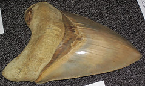
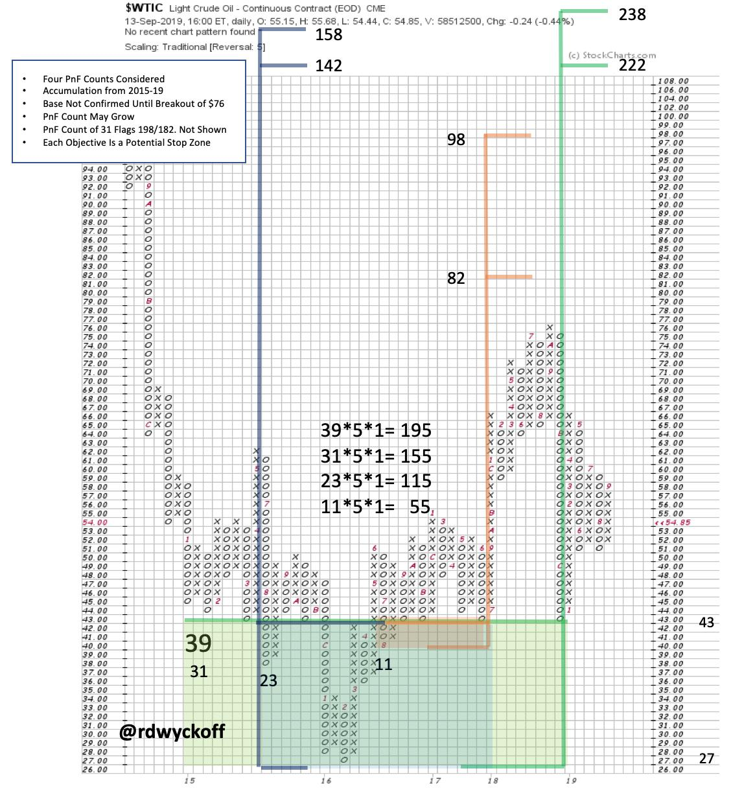
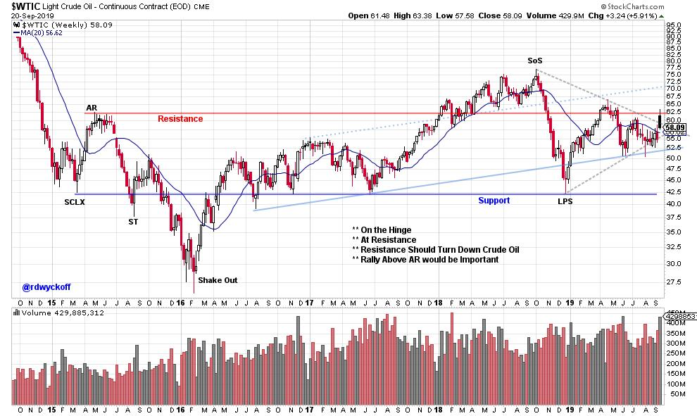

# Meg-Oil

URL: https://articles.stockcharts.com/article/articles-wyckoff-2019-09-megoil-576/
Date: September 23, 2019 at 09:00 AM
Author: Bruce Fraser

The plot of the B-Movie ‘The Meg' is the discovery of a living prehistoric shark the Megalodon. This movie shark was so big (the actual prehistoric Meg could reach 59 feet in length) that it could swallow ‘Jaws' whole. Megalodon is similar in size to the current crude oil Point and Figure chart ($WTIC). The only way to get a view of the entirety of this monster chart of oil is to zoom out to the 5-box PnF with Traditional scaling.

Very recent events in the Middle East have stirred up fear in the crude oil market and could ignite a new uptrend. When bullish news coincides with the completion of Accumulation the Jumps can surprise the investment community. Recently in Power Charting episodes we have been profiling oil stocks (see sector ETF XLE) as having attractive dividend yields and deep value. It is difficult to predict the events that can cause a rally. But high dividend yields will pay for an investor to be patient.

Wyckoffians attempt to time purchases to the transition from Accumulation (inactivity) to Trending (activity). Therefore, the dividends are terrific, but best enjoyed while prices are rising. In this post we will study the long term Point and Figure chart of crude oil prices.

This very large PnF price structure reaches back to early 2015. It has the attributes of Accumulation. In 2018 it had a very large surge into a Sign of Strength (SoS) rally and Backup (BU). The BU showed much weakness from 76 down to 43 in 2018. This decline did not go to the prior low at 27. It has since rallied and has been hovering around the 55 breakout zone. This old Resistance has become new Support. And Middle East trouble suggests $WTIC could rally away from this Support zone.

Chart Notes:

· Three PnF Horizontal Counts are Shown. Shaded areas Represent Count Zones. There is a fourth PnF count for you to study and flag.

· If a new uptrend is starting, each of these count zones could generate a Stepping Stone Reaccumulation trading range.

· It can take years for a large PnF objective to be fulfilled.

· The initial liftoff is often the most dramatic.

· Though crude oil price increases tend to produce future inflation the Federal Reserve Bank will often disregard such events in their policy making decisions. They will consider geopolitical incidents to be out of their control and temporary. Wyckoffians understand the large PnF Accumulation structure to be the likely kickoff of a major new bullish uptrend event.

· Typically, a late business cycle expansion is when to expect emerging inflation pressures. We will be on the alert for evidence of this in stock and commodity prices.

(click on chart for active version)

The catalyst for a Jump into a new price trend is often unexpected. But prices mysteriously prepare for such events. In the case of crude oil prices these conditions are obscured unless and until we zoom out and view the entire landscape.

All the Best,

Bruce

@rdwyckoff

Announcement:

Wyckoff Market Discussion, Special 3 for $30 Offer (Wednesday, September 25, October 2 and October 9, 2019): Roman Bogomazov and I will be offering three weeks of the Wyckoff Market Discussions for only $30: please click hereto register now! In the Wyckoff Market Discussion, we evaluate the present position and probable future direction of major indices, sectors, industry groups and stocks. Our main intention for the WMD is to impart unique Wyckoff-themed education and analysis. Join us on 9/25 from 3pm to 4:30pm (PDT) for this first WMD session and receive special offers for future WMD sessions. For more informationclick here.
