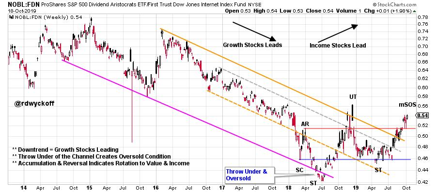
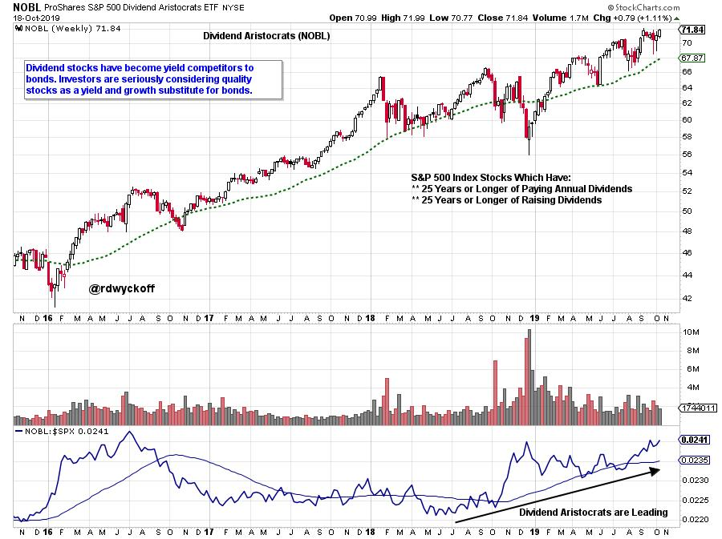
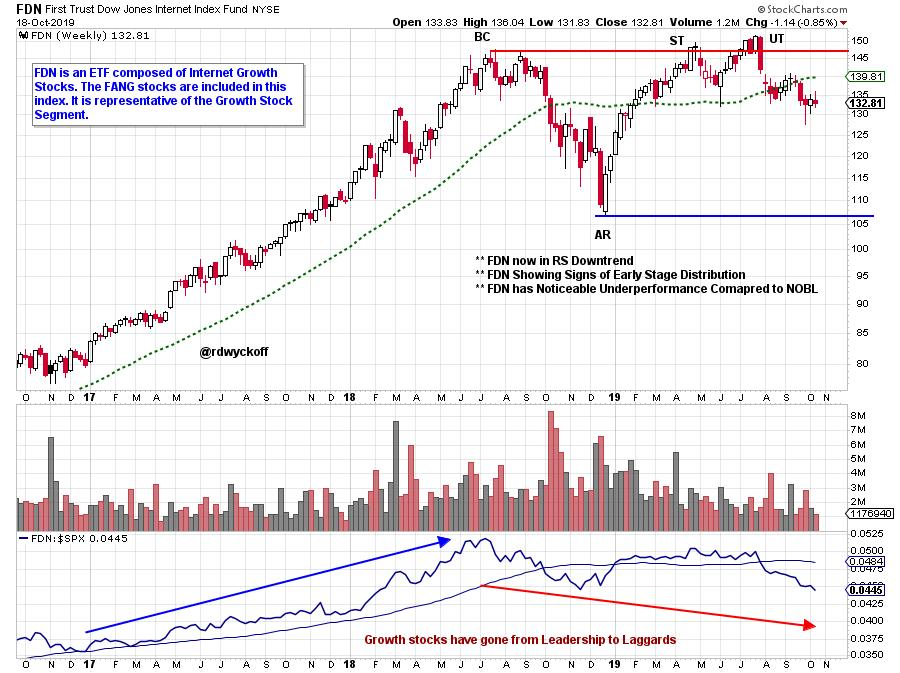
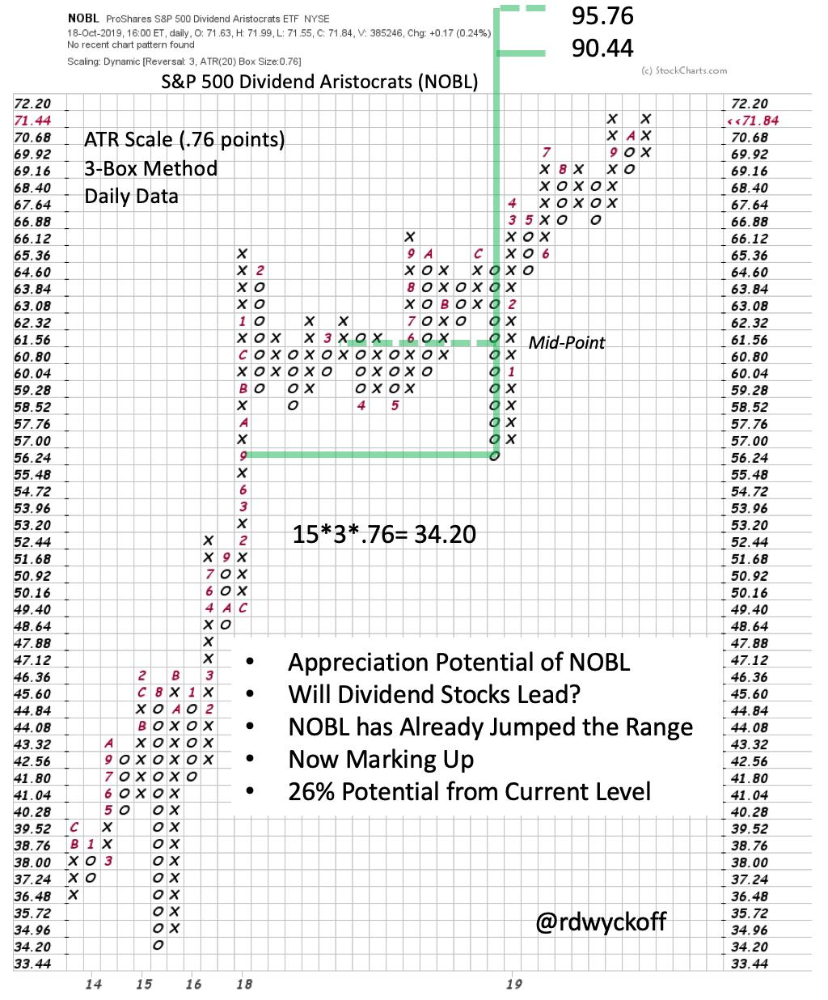

# Dividends Rule!

URL: https://articles.stockcharts.com/article/articles-wyckoff-2019-10-dividends-rule-647/
Date: October 20, 2019 at 04:36 PM
Author: Bruce Fraser

Growth stocks and Income (Value) stocks often perform in opposition to each other. When the growth theme is strong, the value theme is lagging. On a secular scale two time periods come to mind. From about 1977-83 growth stocks dominated with the raging IPO market signaling the conclusion of the growth stock theme. The bull market did not end there as the more blue chip companies came to life and took the mantle of performance for a number of years. In the dot-com era, growth stocks were in control (during the mid-1990s) climaxing into 2000. Value and Income stocks lagged badly during this period, and led many to believe that this stock segment was permanently broken. The epic bear market into 2002 in the NASDAQ Composite ($COMPQ) changed that view. In some cases, the disregarded blue chip names barely declined during this period. These Value and Income stocks then guided the way higher once the new bull market got underway. Investment themes that resisted the decline and emerged into new leadership were: Home Builders, Banks, Oil & Gas, and Insurance among many others.

Today we may be seeing a departure of Value from Growth as occurred in 1984 and 2000. There seems to be cracks in the IPO market as illustrated by Lyft, Uber and WeWork. Also, some of the more mature growth names are showing sagging Relative Strength comparisons. Meanwhile classic blue chip stocks are emerging into new leadership. Let's have a look at some proxies for these opposing themes as their market roles are shifting.

click on chart for active version

Here we use two ETFs to capture the relationship of Growth to Value. Relative Strength analysis illustrates a long term trend toward Growth leadership since 2014. In mid-2018 a Throwunder of the Channel rang the bell for the exhaustion of the downtrend. Since then a range bound condition signaled that Value (Income) and Growth were on an equal performance path. Doing a classic Wyckoffian analysis reveals an Accumulation base for NOBL (Value) in relation to FDN (Growth).

Dividend stocks appear to be signaling a Relative Strength reversal. An immense driving catalyst for this is the competitive yield advantage of stocks to bonds at this time. These stocks have comparatively better Value, and yield which could produce a total return (Income & Appreciation) that is very attractive. So, the driving force for this appreciation may come from capital migrating away from the bond market and toward Value stocks. There is over $40 trillion invested in bonds, which is far greater than the approximately $30 trillion capitalization of the stock market. A slight shift from bonds to stocks could propel Value stocks higher.

click on chart for active version

NOBL is entirely composed of S&P 500 dividend stocks with a long term record of paying and growing their yield. Remarkably when NOBL is compared to the S&P 500 it has distinct leadership. Therefore, the Income and Value segment of the index is dominating the Growth segment. This is supporting our thesis. The upward sloping Relative Strength line illustrates the current domination of Value (Income) in the S&P 500.

click on chart for active version

The Internet Index (FDN) ETF is sagging. It has underperformed the S&P 500 since mid-2018. Relative Strength is in a confirmed downtrend. Growth is not a monolith, and many Growth stocks will continue to perform well. But thematically the more mature and extended Growth stocks (think FANG) will be vulnerable. Intense focus on the Relative Strength of these stocks will reveal when trouble is brewing.

Take time to watch the October 18, 2019 episode of Power Charting (click here for a link). Point and Figure analysis is done on selected NOBL components. If these stocks are poised, en masse, to appreciate then their PnF counts should be aligned and signaling higher prices ahead. NOBL PnF is counted here and has an objective 26% above the current price level. If NOBL is a proxy for the direction and extent of the blue chip market then an important market rally could be ahead of us.

All the Best,

Bruce
