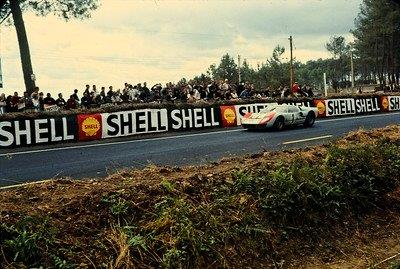
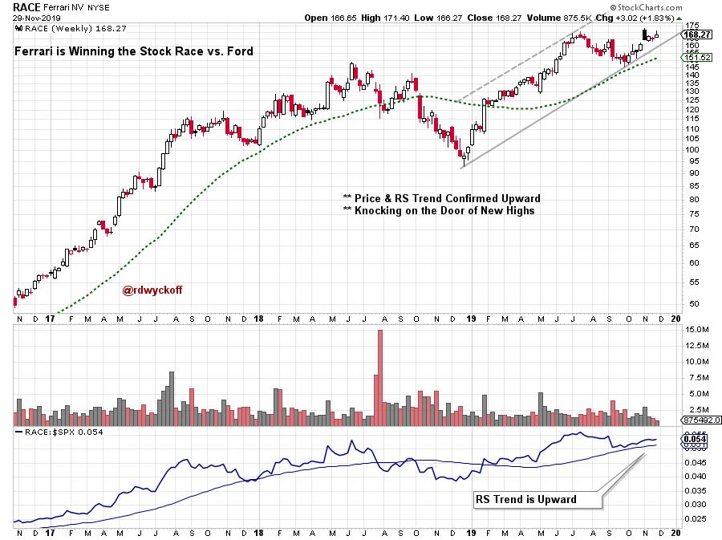
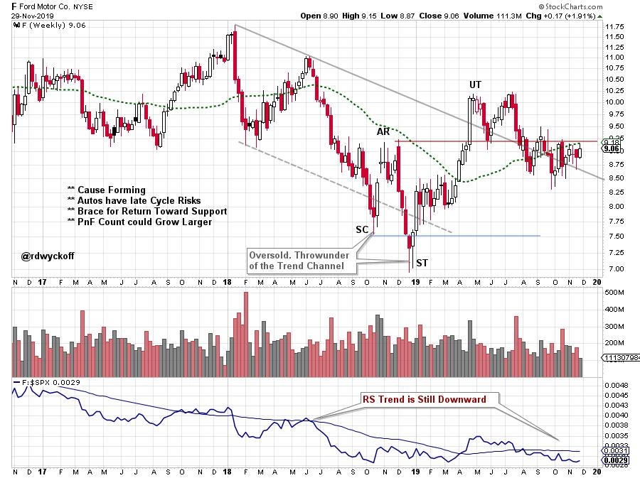

# Ford v Ferrari. A Movie about Trading.

URL: https://articles.stockcharts.com/article/articles-wyckoff-2019-11-ford-v-ferrari-a-movie-about-t-725/
Date: November 30, 2019 at 06:52 PM
Author: Bruce Fraser

During this Holiday shortened week go see the movie Ford vs. Ferrari. It is a movie about trading. No wait, it is a movie about an epic battle between two automotive titans to win the 24 Hours of Le Mans. There was and is no more prestigious an achievement, as an automotive manufacturer, than to win this race.

Ford set out in the early 1960s to campaign and win the Le Mans manufacturers championship. Ford hired legendary race driver and boutique auto manufacturer Carroll Shelby to create the racing team that would compete with and attempt to unseat the dominant Le Man competitor Ferrari. This is where the fun begins.

Ford needed to build a race car that had the endurance to compete at high speeds with the Ferrari cars for 24 hours. Ferrari had honed their cars and their skills for years to win this race. Le Mans is a campaign, an all consuming effort to compete and win a punishing endurance race. Respect is due Enzo Ferrari and the Ferrari organization who dominated this race year after year. It has been said that Mr. Ferrari lived to race and win. That he only sold Ferrari cars to the public to raise the money to race.

The Ford team had equally devoted leaders in Carroll Shelby (Matt Damon), legendary race driver Ken Miles (Christian Bale) and Phil Remington (Ray McKinnon). This small independent team of competitors clashed endlessly with the colossally large Ford organization. They were often at odds with each other as competing goals and objectives collided.

click on chart for active version

I will try not to spoil the movie for you, but here are some of the trading lessons that spoke to me in the movie. When I taught in the classroom we would often study ‘trading movies' and students would find additional, and important, lessons and messages. You will discover them too.

Keep Your Eye on the Prize. Having clearly defined goals in trading is essential. The Shelby Team was very clear about their outcome; Build an Organization that Could Win the 24 Hours of Le Mans. In all things there are obstacles. The Ford Motor Company was both obstacle and resource. They would make demands that were detrimental to the main goal. And these did produce setbacks. All traders have environmental obstacles that will impede or deny success. Shelby could not fire Ford, but he did find unique ways to solve his environmental problems while moving the organization toward the big goal. Be willing to negotiate with your big and small environmental problems, while always striving for solutions compatible with your mission and goals.

Endless Practice Stress Tests Your Methodology. Trading is a Campaign of Endurance. Your trading campaign will bend, twist, and at times fail. Ken Miles knew that the GT40 transmissions would overheat by morning. He had a strategy to change driving style at that time to destress the transmission and keep it cool. This reminds me of the mid-campaign correction that produces a ‘Reaccumulation' trading range. The trader must adjust to endure a long period of underperformance before a new uptrend is ready to go. Ken Miles was not allowed by Ford to race in the first race and the transmissions did fail in the morning.

Match Your Emotional Makeup to the Trading Method. Ken Miles would drive for hours at their test facilities to sharpen his mental endurance while driving the race car at speed to stress the car. In addition to strengthening his mental toughness Miles was searching for the areas of weakness that could be improved and also to know when to alter his driving style to destress the race car late in the campaign. This is a campaign to develop ever higher levels of driving (trading) mastery.

click on chart for active version

Always Ask How to Innovate your Method for Constant Improvement. In a 24 Hour Endurance Race the GT40 brakes would wear out. After careful study of the rulebook the Shelby team realized the entire suspension arm assembly with new rotors and brake pads could be swapped out. So, the team innovated a quick swap method that put all new brake and suspension parts on the car late in the race. Periodically look at all aspects of your trading method with fresh eyes and seek incremental innovation that brings constant improvement. This is the Mastery Path.

Another example of this was the aerodynamic testing the team carried out because the GT40 was overheating as a result of how air was flowing over the body.

Mental Rehearsal. The Perfect Lap (a tip of the hat to Wyckoffian Steve for submitting this excellent point). Ken Miles talked about the ‘Perfect Lap' with his son. He described the Perfect Lap which revealed that Miles had been doing endless mental rehearsal on the Le Mans track (even though the Shelby facility was in Southern California). The subconscious mind interprets all incoming data as desirable. The subconscious mind can't tell the difference between mental rehearsal of racing the perfect lap at Le Mans and actually racing that lap. At the end of the race Ken Miles was clocking his fastest (track setting) laps. The Perfect Laps. Remarkable because he was accomplishing this with a GT40 that had raced for nearly 24 hours. Ken Miles was a true racing Master.

The Perfect Trade (this segment was submitted by fellow Wyckoffian Steve Moore and is used with permission).

The Perfect Lap from the movie Ford vs. Ferrari. Watch the Perfect Lap clip here:

The Perfect Lap from the movie Ford v Ferrari.

The Perfect Trade is analogous to this expression of the Perfect Lap in the movie Ford v Ferrari.

You have to feel the market and its movements and feel how an individual equity is moving with the market. You cannot force the trade. You have to feel the trade, how the equity is progressing before purchasing and feel how the trade is advancing afterwards. Are you nervous or comfortable with the trade?

If you are going to campaign a trade, you have to have a sense of its limits, your limits, and your level of risk tolerance. Look out there, out there is the perfect Trade; no mistakes, every purchase is correctly timed; every leg-up is correctly anticipated; and every pull-back is correctly foreseen.

Price targets are correctly calculated through the use of PnF Charts and Counts; price targets are struck and the Trader then re-evaluates their position. The Trader has to be patient for anticipating the correct time to buy-in. The Trader has to wait and wait and wait for the price movements to progress through Phases | A |, | B |, | C | and then you initiate a position, a Probe Investment as it exits Phase | C | and moves into | D | and eventually into | E |. The Trader watches, monitors and waits to see the level of commitment from Professional Money. With each movement through these latter Phases there are key Point-of-Entry for the Trader.

You see it?

Most people cannot see it but it is out there. Most people don't know it's out there, but it is.

Through what I have learned from you two (Bruce and Roman), plus many other people but primarily you two, is how to see those Perfect Trades: they are out there; I can see them. And I continue to strive for that Perfect Trade each and every time. This is my philosophy in trading.

Thank you for sharing your knowledge. Richard Wyckoff would be proud of you.

Thank you, Steve, for sharing these wonderful insights about the Movie, the Perfect Trade and Wyckoff!

Conclusion

The competitive battle between manufacturing titans Ford and Ferrari is comparable to what takes place in the stock market every day. Everything that can be said about Ford's competitiveness at Le Mans was also true of Ferrari. To compete at the top requires a tested methodology, razor sharp strategy, carefully prepared equipment, and the best, most talented team of crew and drivers. This can also be said of all the best Wall Street teams. When we, as traders, step into the speculative arena we are competing with the very best. We must grapple with the idea that when we take a trade, the very best may be taking the other side of that trade.

The untold Ferrari story is very inspiring. This very small boutique auto maker dominated Le Mans for years with limited resources. They had a fraction of the resources of Ford Motor Company. But they existed to compete and win. A lesson here is that one does not need to be biggest to be best. Clarity of vision is everything to mastery and success.

Trading mastery can be achieved by anyone. While mastery is not an accident. It emanates from deliberate purposeful practice. A willingness to constantly improve. An ability to see what is not working and to reinvent that part of the trading process. Finally vision and commitment are an essential part of the recipe for long term trading success.

This Holiday Season treat yourself to this thoroughly entertaining movie and be prepared for some trading inspiration

All the Best,

Bruce

Photo Credit: ZANTAFIO56. '24 heures du Mans 1966' Drivers: Ken Miles, Denny Hulme
