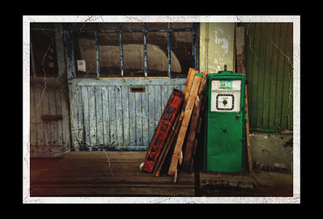
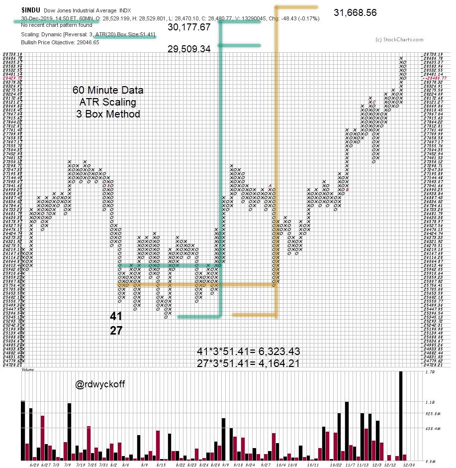
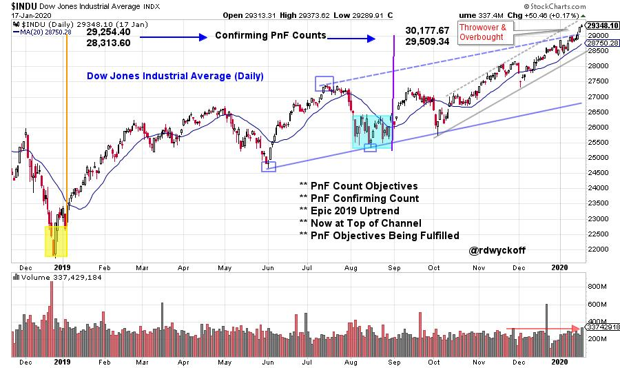

# Dow Jones Industrials. Out of Gas?

URL: https://articles.stockcharts.com/article/articles-wyckoff-2020-01-dow-jones-industrials-out-of-g-654/
Date: January 20, 2020 at 01:56 PM
Author: Bruce Fraser

In a number of cases we have studied classic Wyckoffian Overbought and Oversold conditions that emerge at the conclusion of a market move. Such a condition typically presents as Climactic action. Three or more unique events will often combine to setup exhaustion of a trend. Fulfilment of a Point and Figure Count Objective indicates that the fuel in the tank has been used up. Acceleration of the price trend in the late stages of an advance indicates a Climactic surge, which is unsustainable. The Throwover (or under) of an established Trend Channel is another indication of trend exhaustion.

The base PnF count formed at the start of 2019 and produced an objective of 28,313.6 / 29,254.4 ($INDU) and the upper bound has been slightly exceeded. See that blog by clicking here. A Reconfirming PnF count formed in August of 2019 generating a price objective of 29,509.34 / 30,177.67. This lower objective is very close to being fulfilled.

The count in green is the primary working count. There is a larger count available (in gold) that produces an objective of 31,668.56 that will be considered only after the fulfillment of the lower count range. To conclude, the PnF fuel in the base and Reaccumulation counts has been mostly used up.

click on chart for active version

The two PnF counts are flagged on this vertical chart and they are in the range of being fulfilled. In the new year $INDU has accelerated and thrown over the trend channel. This is a classic Overbought condition. Volume is high.

What to do now? Climactic acceleration can carry on to, and through, the highest PnF objectives. A Climax is an irrational and emotional moment in markets. This is also reflected in the year-end ‘CNN Fear and Greed Index' (sentiment indicator) reading of 94 (on a scale of 100). An Automatic Reaction (AR) is the classic response to the conclusion of a Buying Climax (BC). An AR would return the index back into the Trend Channel. A trading range typically follows a BC and AR. Only time will tell if this is the start of a Reaccumulation or Distribution.

For additional discussion on this topic please view the recent Power Charting video '2020. Change is in the Wind':

Power Charting Video: '2020. Change is in the Wind'

All the Best,

Bruce
