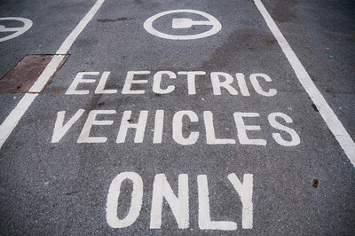
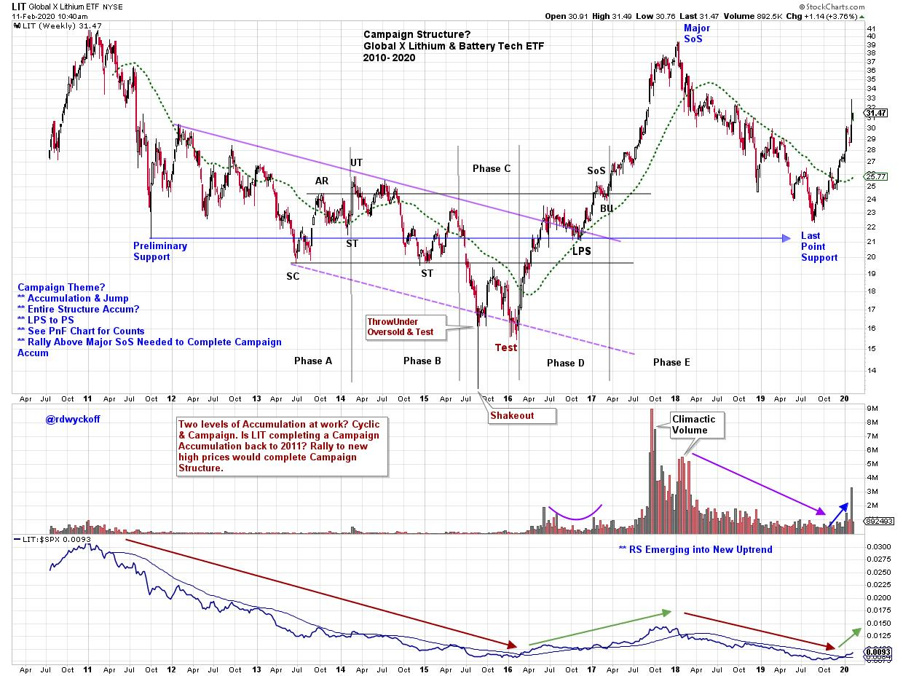
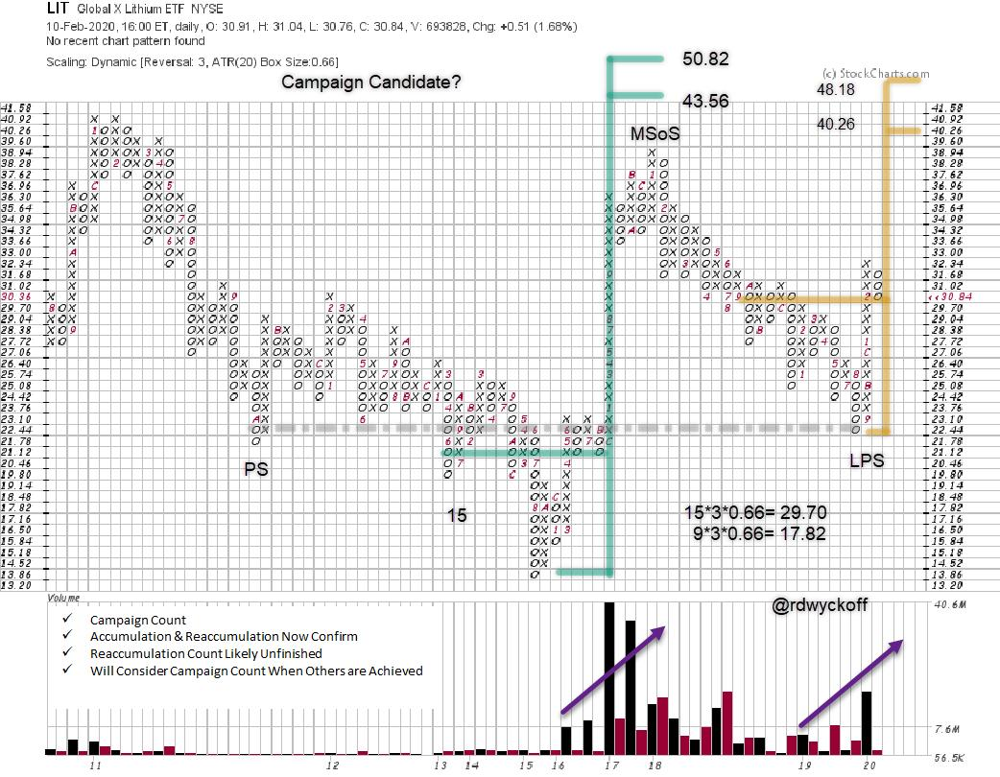
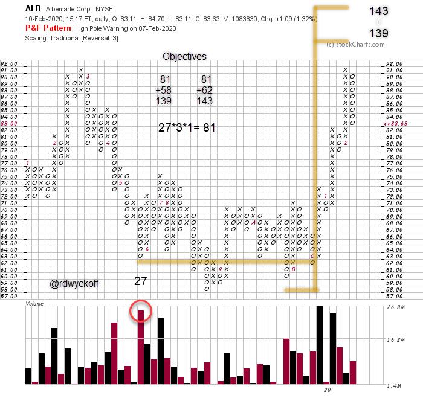

# Lithium is Charged Up

URL: https://articles.stockcharts.com/article/articles-wyckoff-2020-02-lithium-is-charged-up-604/
Date: February 11, 2020 at 12:31 PM
Author: Bruce Fraser

During the 4th quarter of 2019 Tesla came to life and leaped out of a multi-year trading range. Tesla's recent appreciation is likely indicating a period of robust business expansion for the electric automobile manufacturer (and battery producer). By some estimates there will be 15 new Electric Vehicles (EV) on the market by the end of 2020. All of these EV models will be equipped with battery packs primarily composed of lithium. The demand for lithium is ramping. Let's have a look at lithium stocks to see if they are confirming the recent move in TSLA and the upcoming surge in EV production.

Lithium & Battery Tech ETF (LIT) is our surrogate for participation in the Lithium Battery industry (click here to read more about this ETF). Note the classic Wyckoffian Accumulation structure formed into early 2017. This multi-year base had a dramatic Shakeout and Test to conclude the decline in 2015. A Change of Character in price catapulted LIT out of the Accumulation. During 2018-19 LIT became weak again, returning back to the prior Accumulation. We must ask, Is there a larger Accumulation at work here? Now that LIT has pivoted upward again is a bigger base being completed? If so Lithium, as an investment theme, could become a major campaign. Tesla is a holding in LIT and could influence overall performance.

The Point and Figure has three distinct Count areas to consider. The original Accumulation Count (in green) was followed by a dramatic ‘Catapult Wall' that reached $39. Massive volume on the price surge is a demonstration of a new level of Demand. This volume became Climactic and LIT declined thereafter into late 2019. Note the Selling Climax into the 22.44 price level. Price reversed dramatically upward and volume reemerged. We take a conditional PnF count here and it confirms the Accumulation Count. This Reaccumulation count could grow larger if LIT stalls here prior to a continuation of the rally. If and when these two PnF counts are achieved we will then take the Campaign Count that reaches back to 2011.

Albemarle (ALB) has been a favorite stock to study in this blog (click here and here and here to view these prior posts). ALB has completed a cyclic Accumulation and is Marking Up robustly. ALB is the largest holding in the Lithium & Battery Tech ETF (LIT). Here is a PnF count of the Accumulation area. Note the drying up of volume indicating absorption of shares of stock and then expansion as price lifts out of the Accumulation area.

Take some time to study the individual holdings in this Lithium ETF. A dramatic campaign could be straight ahead.

All the Best,

Bruce @rdwyckoff

Wyckoff Point-And-Figure Charting Workshop (part III). February 13-20-27, 2020

Develop a systematic approach to trading using Wyckoff Point-and-Figure Charts during this 3-week workshop. Join Roman Bogomazov and Me (Bruce Fraser) for this essential Point and Figure Workshop. Topics include: Taking proper PnF counts to generate accurate price objectives. Matching best chart construction for personal trading time frames. Best techniques for measuring Distribution counts. Intraday technique for short term trading. Tape reading and trading off PnF charts. Using Volume with PnF charts. And much more. Join us!

(click here to learn more and to register)
