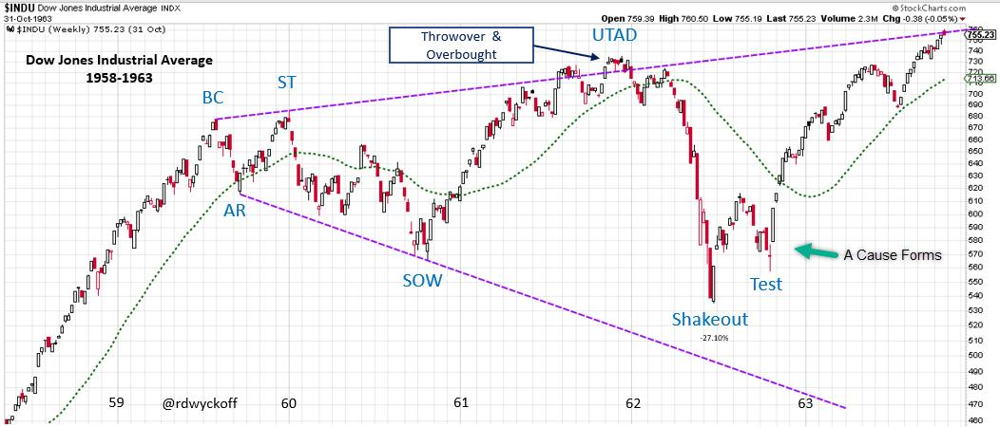
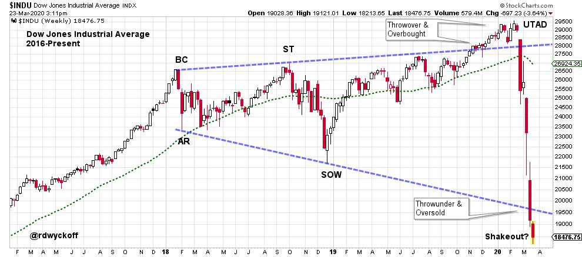
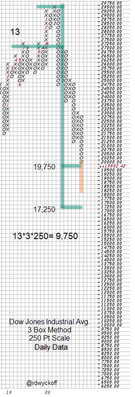

# Where Were You in '62?

URL: https://articles.stockcharts.com/article/articles-wyckoff-2020-03-where-were-you-in-62-231/
Date: March 23, 2020 at 03:49 PM
Author: Bruce Fraser

In 1959 a dynamic uptrend Climaxed. This began a range-bound market with Broadening features. Higher highs and Lower lows persisted into 1963. In 1962 a surprising waterfall decline fell below the lows of the 1960 SOW, then formed an Accumulation and a fresh new uptrend. This Broadening structure has eerie similarity to the recent market index action (comparing the Dow Jones Industrial Average 2018-present).

Dow Jones Industrial Average 1958-1963

A clear family resemblance exists between these two market periods. Both are Broadening Formations. Each begins with a Buying Climax (BC) following a long Bull Market Runup. Volatility increases throughout the multi-year event. After the Sign of Weakness (SOW) a dramatic rally, of approximately equal duration, takes the average to an Overbought condition (a Throwover) of the upward sloping Trendline. This Throwover is labeled an Upthrust After Distribution (UTAD). The failure back below the Trendline results in waterfall decline that quickly retraces the entire prior advance and has a Shakeout of the previous SOW low. In 1962 a Selling Climax reverses before reaching the lower trendline. The Test (4 months later) was at the time of the Cuban Missile Crisis. A Multi-year uptrend followed that Test.

Dow Jones Industrial Average 2017-Present

There are some notable distinctions between the 1962 example and today. So far the entire structure is shorter in duration. The decline from the UTAD to the lower Trendline took about three months in 1962. The current decline is 5 weeks in duration (so far) and has already reached the down sloping Trendline. Recall that in 1962 the decline (a 27.1% drop) did not reach to the lower Trendline.

The problem with analogs is that they eventually fail to work. What must happen in the current case study is the conclusion of a Selling Climax (SC) at the ‘Shakeout' level followed by a quick reversing Automatic Rally (AR). Until this happens the downtrending Markdown Phase is still in full force. Markdown phases have momentum and tend to persist. The current markdown has extreme momentum and could be difficult to stop.

But there are reasons a low could form in this area. First the SOW low has been breached in a climactic fashion. Second the declining Trendline has been reached and exceeded. Third, a Point and Figure Count Objective has been (minimally) fulfilled. If a rally could begin soon it should be brief in duration (an Automatic Rally). A test of the Shakeout low would reveal much about the possibility of a new Cause forming. My advice is to not attempt to trade Selling Climaxes but to wait for the completion of Accumulation or ReDistribution (since either is a possibility).

This Point and Figure Distribution Count formed during 2019. The current decline has fallen into the middle of the objective range. This fast moving decline could easily reach to (and through) the lower estimate of 17,250. Notice that 9,750 $INDU points of potential was generated in this count.

If the 1962 analog can hold for the current market we would expect a Selling Climax and an Automatic Rally to form and start an Accumulation Phase. In 1962 the Accumulation setup a beautiful Uptrend that carried into 1966 and took $INDU to 1,000 for the first time. In the current instance it will be well worth the wait to confirm the Accumulation structure and the continuation of the 1962 analog.

The most recent Power Charting video has a discussion of the 1962 analog. See it here:

Power Charting Episode of March 20, 2020

All the Best,

Bruce

@rdwyckoff
