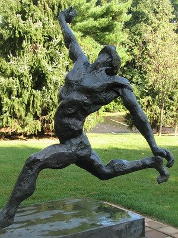
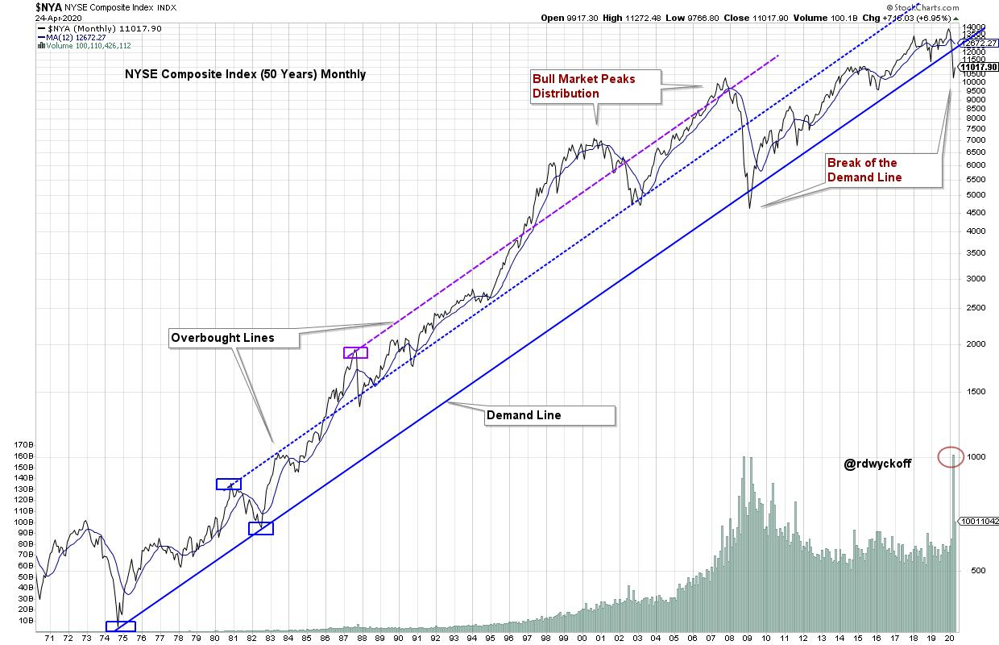
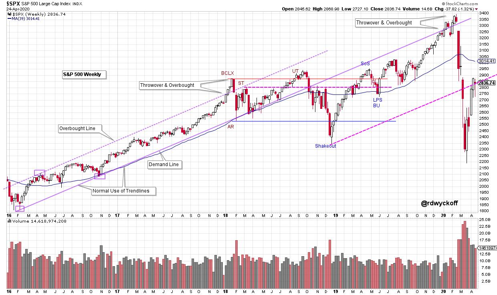

# Stride of the Market in Peril?

URL: https://articles.stockcharts.com/article/articles-wyckoff-2020-04-stride-of-the-market-in-peril-184/
Date: April 26, 2020 at 05:46 PM
Author: Bruce Fraser

Wyckoffian trendline analysis is a very powerful and useful tool. The stride of a trend is often set very early in the uptrend. This analysis is fractal in nature and can be employed in timeframes from very short term to very long term. If the stride is set early a trend can be examined and exploited for most of its duration. Trendlines were used before moving average analysis became popular. And it could be argued that trendlines, properly constructed, are the more powerful analytical technique. Let's study two fascinating trendline analysis case studies.

click on chart for active version

Here is 46 years of uptrend (monthly plot) in the NYSE Composite Index ($NYA). We look for two adjacent lows early in the uptrend and that would be the 1974 low and the 1982 low. Each was associated with a severe recession. Connecting these two lows with a ‘Demand Trendline' illustrates the stride of the advance in this index for years to come. ‘Overbought Lines' are extended parallel to the Demand line. The first parallel line is extended from the intervening 1981 peak. The next is on the climactic surge to the 1987 peak. We draw this second Overbought Line because the channel was exceeded. This trendline is extended as we are expecting the Stride set in '74 and '82 to persist. Note the reaction from the '87 peak returns only to the prior Overbought Line, which becomes Support. Please study the trendline touches by the index. This is all evidence of a stride that is in force.

The 2000 Climax and Distribution is a dramatic exhaustion of the upward trend. The decline into 2003 returns to the Overbought Line which provides Support. An Accumulation forms there and a new bull market launches into 2007. Note the Throwover and Overbought condition at the Trend Channel in '07. The ‘Great Financial Recession' followed. The $NYA returned to the Demand Line that was set 27 years prior. After an Oversold penetration of the Demand Line a ten year bull market was launched. Follow the trajectory of the recent bull trend. Momentum has slowed compared to the prior bull markets. In December 2018 the Demand Line was nearly touched and in 2020 the recent crash put the $NYA well under the Demand Line where it sits today.

The Demand Line overhead could act as Resistance if the $NYA can return to it. Also note the huge surge of Volume on the breakdown from the Demand Line. The 46 year uptrend could be in peril after these recent events. We will watch how soon the economy can bounce back after the COVID-19 lockdown. And we will see whether, and how quickly, the $NYA can get back above the Stride of the Demand Line.

click on chart for active version

A weekly uptrend forms in the $SPX in 2016, setting a stride for the bull run. A Demand Line is extended from the two adjacent lows. The Overbought parallel line (and channel) is determined by the intervening April 2016 high. The throwover and Climax arrives in January of 2018 and sets a Range Bound condition for the next 21 months. The Upthrust (UT) of the BCLX sets up a decline into a December 2018 Shake Out. The rally that followed returned to the Demand Line in Climactic fashion producing a Throwover and Overbought condition in 2020. The rally into the Demand Line from below is a position of weakness and Resistance. The decline that followed is a demonstration. Note how weak the $SPX was below the Demand Line in 2018.

A parallel (to the Demand Line) has been extended from the Shakeout Low. The recent rally has returned the $SPX to this Oversold Trendline from underneath where it has stalled. We will study the price action at this level closely.

Here are two very powerful case studies of Wyckoffian Trendline analysis in action. Many of my prior blog posts have trendline construction and analysis. You are encouraged to study these other examples. Also stockcharts.com has wonderful annotation tools for drawing and experimenting with trendlines and trend channels.

All the Best,

Bruce

@rdwyckoff

To Read More on Wyckoff Trendline Analysis click Here & Here & Here

This last Wednesday Roman Bogomazov (@WyckoffAnalysis) and I conducted a free episode of our weekly Wyckoff Market Discussion (WMD). Below is a link to the recording of that WMD episode. Consider joining our Wyckoff Community and attending these weekly market studies (with a Wyckoffian View). Subscribe at a Very Special Discount, available through Tuesday April 28. To learn more Click Here.

Wyckoff Market Discussion April 22, 2020
