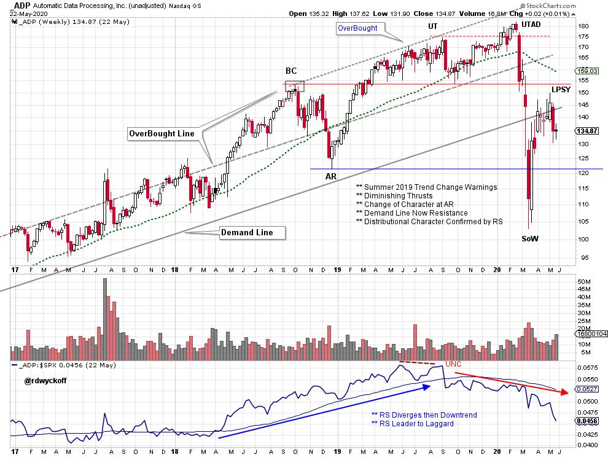
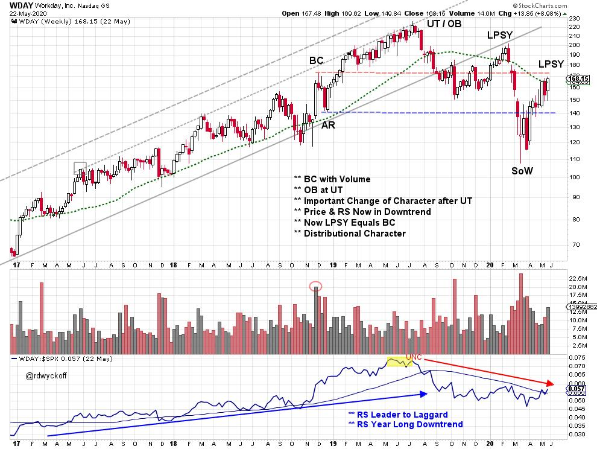
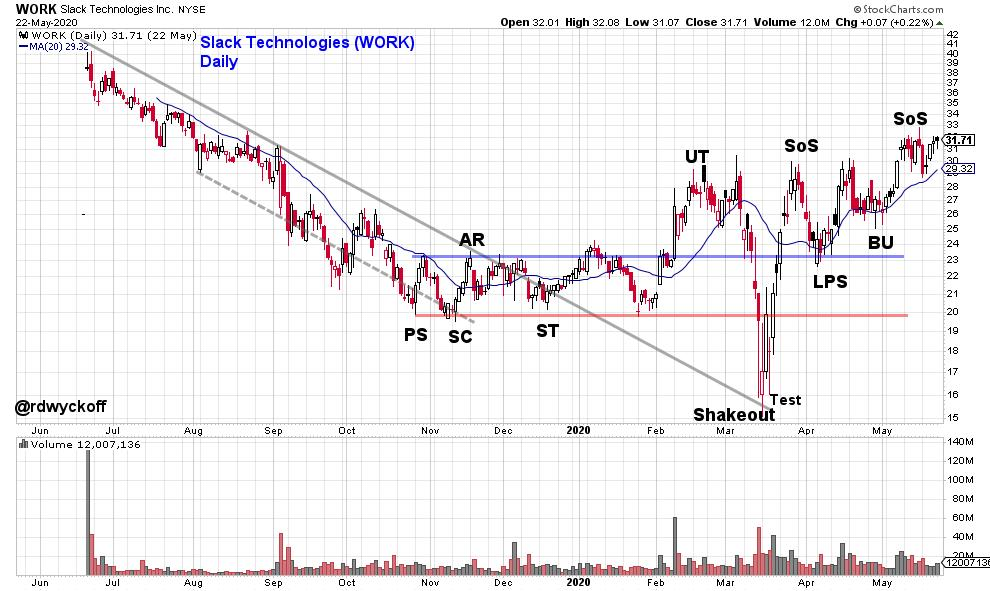
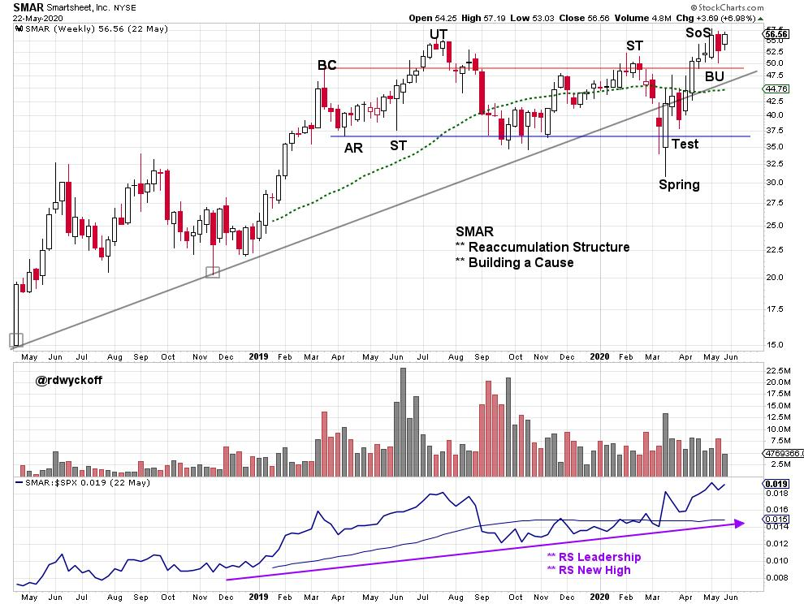
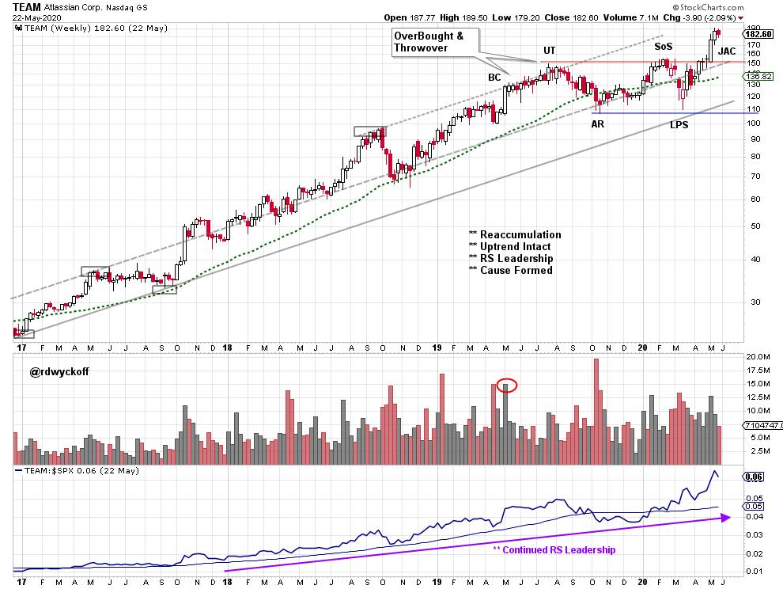

# Work Area Ahead

URL: https://articles.stockcharts.com/article/articles-wyckoff-2020-05-work-area-ahead-901/
Date: May 25, 2020 at 02:30 PM
Author: Bruce Fraser

The worldwide COVID-19 lockdown has produced massive unemployment trends. In the U.S. unemployment is moving rapidly toward the 20% level. Sheltering-in-Place has established many new societal trends. Some of these trends we have explored as the ‘Stay-at-Home Economy' theme. Here we will discern some of the new work related trends with Wyckoff analysis. Just about any economic and societal themes can be unearthed through chart studies. We often can't tell exactly what the trends and themes are, but the related stocks are blazing new trails. Work is going to get done in new and innovative ways in the post COVID-19 era.

click on chart for active version

Among other things ADP is a large payroll processor. During the summer of 2019 the upward trend of ADP slowed and turned downward in Relative Strength and Price. Each upward thrust diminished signaling the loss of momentum. When the February crash arrived, ADP was already a RS laggard and vulnerable to price weakness. Now ADP is in a confirmed downtrend. Employment trends have crashed also and are likely to turn upward very slowly. ADP has rallied to the underside of the prior Demand Line which is Resistance. The bounce off the Sign of Weakness (SoW) has not resulted in a RS bounce. We will watch ADP closely for early signs of latent strength in either price or RS for encouragement that employment trends are reversing.

click on chart for active version

Workday (WDAY) has been a prior favorite of the Wyckoff Power Charting blog. WDAY provides Human Resource applications for business (among other services). Note the family resemblance to ADP. A downtrend is now in force in price and RS. Two forms of Resistance are bearing down on WDAY as it has rallied to the underside of the long term moving average of price and RS. Any strength in WDAY would be a welcome sign that employment conditions are on the mend.

click on chart for active version

An emerging employment trend is to be able to stay at home and work. Companies have developed powerful collaboration software for work teams to be more productive while distancing. COVID-19 sequestering has made these tools essential. Slack Technologies (WORK) develops some of these work collaboration tools. WORK has only recently come public and does not yet earn a profit. The stock is demonstrating leadership and is evidence of new workplace related trends. Let's keep an eye on WORK.

click on chart for active version

Smartsheet (SMAR) is another work collaboration software company. Like WORK it is a recent IPO stock and does not yet make a profit. Note the upward trend and the new high in both price and RS. A Reaccumulation structure appears to be complete. We will watch for SMAR's ability to stay above the Resistance line.

click on chart for active version

Atlassian (TEAM) has enjoyed great leadership until recently pausing into a Reaccumulation structure. Study the RS which was uptrending while the first quarter crash unfolded. All three of these profiled stocks have dynamic sales growth while only TEAM is profitable at this time. RS and price are making new highs and the Reaccumulation appears complete.

Working from vast distances will produce additional trends such as the migration of workers away from corporate hubs and into less urban settings. Can you think of other related trends that could manifest in emerging stock trends and themes? Join me for the next episode of Power Charting (click here for the youtube page) where we will analyze the Point and Figure counts of these and other related stocks.

All the Best,

Bruce

@rdwyckoff
