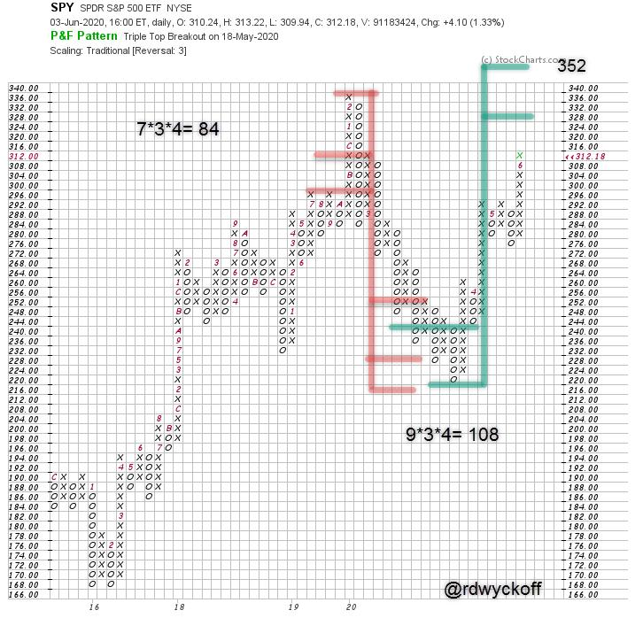

# Power Charting TV: Special Guest Roman Bogomazov. Wyckoff Market Discussion 200th Episode, An Invitation to Attend.

URL: https://articles.stockcharts.com/article/articles-wyckoff-2020-06-power-charting-tv-special-gues-242/
Date: June 08, 2020 at 11:47 AM
Author: Bruce Fraser

Roman Bogomazov is this week's special guest on Power Charting. He discusses the current stock market rally and the upcoming 200th episode of the ‘Wyckoff Market Discussion' series. Professor Roman is a leading Wyckoff Method educator, mentoring under and teaching with famed Wyckoffian Hank Pruden. Roman and I conduct the weekly webinar series: the Wyckoff Market Discussion (on Wednesdays). This next week we will celebrate our 200th episode with the Wyckoff Nation. And you are invited to attend (click here to register and learn more).

This chart profiled in the video, an Accumulation Point & Figure Count of the S&P 500 ETF (SPY), targets a price objective range of 328 /352 which straddles the prior high. This count objective is being approached now (as of Friday the 320 box has been filled). We discuss the possibility of a pullback to the 272 level being a Last Point of Support. Could a very large PnF count be forming for an important new uptrend?

Power Charting Video with Guest Roman Bogomazov

You are invited to the 200th Wyckoff Market Discussion live webinar on June 10th at 3pm PDT, BYOC (Bring Your Own Cake). Click here to learn more and to register.

All the Best,

Bruce

@rdwyckoff
