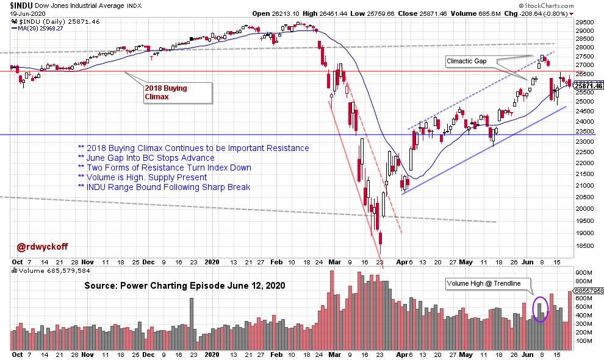

# Power Charting TV: Wyckoff Method Checklist for a Peak.

URL: https://articles.stockcharts.com/article/articles-wyckoff-2020-06-power-charting-tv-wyckoff-meth-184/
Date: June 20, 2020 at 01:44 PM
Author: Bruce Fraser

- Wyckoff Method Checklist for a Peak (Video and Chart Update)
- Crypto Currency & the Wyckoff Method. Alessio Rutigliano Presents on Power Charting
- Wyckoff Market Discussion (WMD) 200th Episode Video and a Special Offer

A series of market conditions have come together this last week to suggest the exhaustion of the second quarter rally. In last week's Power Charting episode, we consider the elements that show a market needing a rest. On Thursday, June 11th (at the time of the recording of this PC episode), the character of the stock market changed by severely reversing downward. This was a classic ‘Change-of-Character' from a climaxing uptrend into a reversal downward. This often results in a Range Bound condition where a new Cause is formed. Only time and tape reading will determine if this is a Reaccumulation or Distribution. Below is an up to date chart of the market action.

click on chart for active version

Click Below to see this Episode of Power Charting:

Power Charting Video (June 12, 2020): Wyckoff Method Checklist for a Peak

Alessio Rutigliano publishes an outstanding blog that analyzes the Crypto Currency market with the Wyckoff Method. Alessio is this weeks guest on Power Charting (click here to read his blog and sign up for his upcoming Crypto Conference). Click below to see his presentation on Power Charting:

Power Charting Video (June 19, 2020): Crypto Currency and the Wyckoff Method

Roman Bogomazov and I host the weekly ‘Wyckoff Market Discussion' (WMD). Each week (Wednesday's at 3pm PT, recording available) we review market conditions from a Wyckoff perspective. A special offer is available through Sunday (Father's Day) to attend these in-depth Wyckoff Market studies. Watch the 200th Episode Special below where we review key market events over that time span. Click here for the Special Offer.

Wyckoff Market Discussion WMD 200th Episode - June 10, 2020

All the Best,

Bruce

@rdwyckoff
