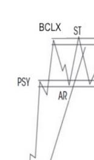
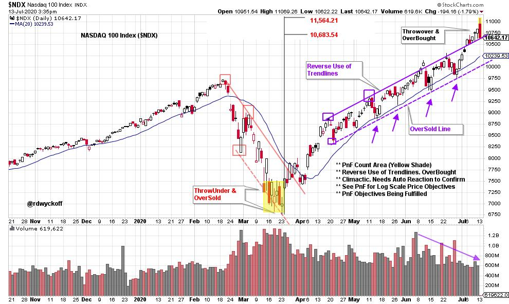
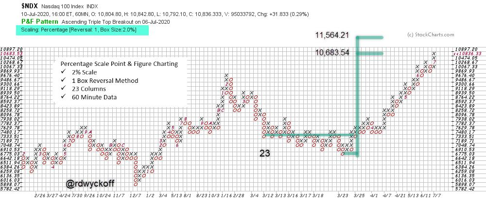

# A NASDAQ 100 Throwover. Is the Uptrend Ending?

URL: https://articles.stockcharts.com/article/articles-wyckoff-2020-07-a-nasdaq-100-throwover-is-the-783/
Date: July 13, 2020 at 04:00 PM
Author: Bruce Fraser

Financial markets are pushing up into the start of earnings season. In June, the S&P 500 and the Dow Jones Industrial Average accelerated into climactic exhaustion as end of quarter window dressing came to a conclusion. This set up a ‘Range-Bound' condition in these averages that continues to this day. The NASDAQ 100 ($NDX) has persisted in its upward trend and is at All-Time-High prices. A remarkable performance from the March lows. Now there are signs of possible exhaustion of the upward trend, at least temporarily.

click on chart for active version

A very sharp decline in February and March resulted in an Oversold condition with a Climax. The March low generated a Point and Figure Cause that is highlighted in yellow (more on this below). With a Reverse Use of Trendlines technique, a Trend Channel formed and was very tradeable. In late June the trend of $NDX accelerated, which often happens as a trend matures into a conclusion. The Trend Channel had a Throwover, which is an OverBought condition. Now $NDX prices are high and extended into the start of an earnings season that is likely to reflect a slowing economy in the Second Quarter. Arguably the $NDX is priced and valued for economic perfection that seems unlikely in reality.

This is a different approach to horizontal Point and Figure analysis. Take a minute to study the construction of this chart. The scale is percentage (log scale) based rather than arithmetic. In this case the scale is 2% with 60 minute intraday data. I have been experimenting with horizontal PnF counting of percentage scale. It is a dynamic concept, which is different from horizontal counting of arithmetic (price) scale PnF charts.

In this case study, a classic Accumulation structure formed in the month of March. We take a conservative count as percentage scale effectively shows accelerating (logarithmic) prices as the trend goes higher. A count of 23 columns can be understood as 23 periods of 2% compounded growth. Now $NDX is entering the percentage count objective price range. We will watch for tape reading evidence of this count working. More on tactics below. From the low to the conservative count, $NDX price has ascended 57.7%, an impressive advance which percentage PnF identified. Could this approach be an important addition to the Wyckoff toolkit? More on percentage scale Point & Figure counting in future blog posts (watch Power Charting this week for further discussion of the NASDAQ 100 and this PnF counting technique).

Tactics. The Trend Channel Throwover could be a sign of Climactic exhaustion unfolding. This would need to be confirmed by an Automatic Reaction (a sharp sudden reaction, on volume, back into the channel). A Range-Bound condition would be expected to follow. Fulfilling the PnF count objective indicates the Cause is nearly used up as the trend channel is being Thrown-over. A new Cause forming would either be Reaccumulation for higher prices or Distribution. That structure would be expected to reveal the next move through classic tape reading. For now the $NDX trend is still upward, and accelerating.

Power Charting TV

Last week's guest on Power Charting was Elliott Wave Theorist educator, Jeffrey Kennedy. Jeffrey presented the ‘Five Core Elliott Wave Patterns' and their application to high probability trading setups. Check out Jeffrey's outstanding presentation here:

Power Charting TV, Special Guest: Jeffrey Kennedy

All the Best,

Bruce

@rdwyckoff

Power Charting TV Landing Page. Click Here.

Disclaimer: This blog is for educational purposes only and should not be construed as financial advice. The ideas and strategies should never be used without first assessing your own personal and financial situation, or without consulting a financial professional.

The author does not have a position in mentioned securities at the time of publication. Any opinions expressed herein are solely those of the author, and do not in any way represent the views or opinions of any other person or entity.
