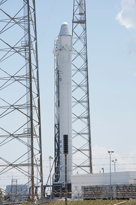
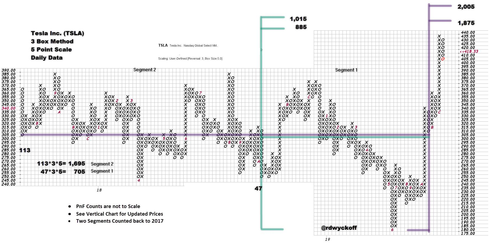
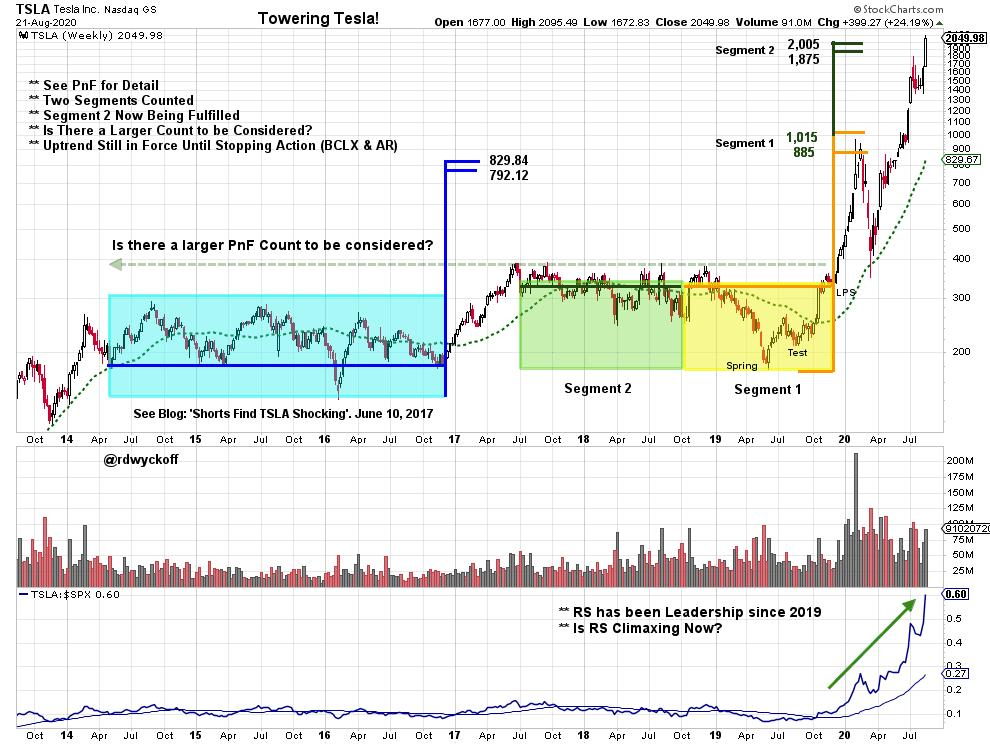

# Towering TSLA!

URL: https://articles.stockcharts.com/article/articles-wyckoff-2020-08-towering-tsla-761/
Date: August 23, 2020 at 05:58 PM
Author: Bruce Fraser

Starting in the second quarter of 2019, Tesla Inc. (TSLA) stock has launched like a SpaceX rocket. In the Wyckoff Method a ‘Cause' will precede an ‘Effect'. A Cause is a preparation phase of Accumulation or Distribution (a trading range). The Horizontal Point and Figure (PnF) counting technique is employed to estimate the possible price objective of that Cause. Therefore, TSLA should have built a PnF horizontal count of a proportion comparable to the price level recently achieved.

Did TSLA build a PnF count equatable to the recent price level achieved? Is the price objective fulfilled? If the PnF counts are completed what should we expect next from TSLA?

Tesla Inc. 3 Box Method Point & Figure Chart with 5 Point Scaling

This PnF chart of TSLA illustrates a range-bound price structure from 2019 back to 2017. Using classic PnF counting technique we have identified two Segments. At the completion of a Spring and Test, a rally phase launched TSLA up and out of the range-bound condition. The uptrend was underway. From the LPS countline of $315, Segment 1 reached upward to a target range of $885 / $1,015. Segment 2 flagged a count range of an eye popping $1,875 / $2,005. Here are some points to consider:

1. Reaching a segmented count (Segment 1) objective will often result in a pause in the uptrend. With the expectation of the larger segment (Segment 2) being fulfilled after a continuation of the trend.
2. It is important to use classic Wyckoff Method tape reading to determine when an uptrend is stopped and enters Reaccumulation or Distribution.
3. An uptrend often has the momentum to throwover or exceed PnF price objectives.
4. A classic stopping action is a Buying Climax followed by an Automatic Reaction. This will typically lead to a range-bound price condition.

The yellow and green shaded boxes identify where the PnF counts were taken on the top chart above. There was a large earlier PnF count (lite blue box). To read the previous blog about this price range click here. Some key points about the chart above:

1. The earlier PnF (lite blue) and the Segment 1 count approximately confirmed each other.
2. A Relative Strength uptrend began with the price surge.
3. At the Segment 1 count completion a sharp reaction followed. This reaction tested the top of the prior breakout area where old Resistance became new Support. The price reaction returned to the rising long term moving average, where it touched and reversed. The reaction was much shallower for the Relative Strength line.
4. Recently TSLA reached (and slightly exceeded) the Segment 2 count objective of 1,875 / 2,005.
5. The trend is considered to still be in force until there are signs of stopping action (Buying Climax & Automatic Reaction).

TSLA and AAPL both announced stock splits to take place by the end of August. TSLA will trade on a 5 for 1 split adjusted basis. Such an event often leads to an acceleration (this is likely taking place now) of the stock price into the split date and could lead to a climax and a pause, at least temporarily. TSLA is now considered to be a mega-cap stock. It currently is just behind the market capitalization of each of the FAANG stocks and is ranked number six in size in the NASDAQ 100 ($NDX). It will likely be added to the S&P500 ($SPX) in the near future, and the resulting indexing will create additional buying demand for Tesla stock. This begs the question; Does TSLA have fuel in the tank for even higher prices? Observe on the vertical chart the gray line across the two areas of Accumulation. Is there a larger PnF count to be considered for TSLA? We will watch for any attempt to pause in the zone of the recently fulfilled price objectives. And then for the potential to generate a new Cause, in the form of Reaccumulation, that confirms additional higher price objectives.

For additional prior blogs on TSLA (click here & here & here)

Acknowledgement: Thank you to long time Wyckoff friend and research collaborator Mark for his ongoing contributions to Wyckoff Power Charting blogs and videos.

All the Best,

Bruce

@rdwyckoff

Disclaimer: This blog is for educational purposes only and should not be construed as financial advice. The ideas and strategies should never be used without first assessing your own personal and financial situation, or without consulting a financial professional.

TSAA-SF 50 Year Anniversary Conference - ‘Old School is New School'

The Technical Securities Analysts Association of San Francisco (TSAASF.org) will host their annual fall conference on September 12th. There will be nine amazing speakers at this day long virtual event. TSAA-SF members attend for free. There is a small charge for non-members to attend. So, become a member and you will also have access to additional online events throughout the year!

Speakers include:

- John Bollinger, CFA, CMT - Creator of Bollinger Bands
- Linda Raschke - Author of "Trading Sardines" with over 35 years of trading experience
- Arthur Hill, CMT - Chief Technical Strategist and main author at TrendInvestorPro.com
- Martin Pring - Founder of Pring Research and Chairman of Pring Turner Capital Group
- Joe Turner - Founding member of Pring Turner Capital Group, Past President of TSAA-SF
- Craig Johnson, CFA, CMT - Managing Director and Senior Technical Research Analyst at Piper Sandler Companies
- Roman Bogomazov - Leading Wyckoff Method educator, President of Wyckoff Associates, LLC (wyckoffanalytics.com), and Past President of the TSAA-SF
- Rich Ross, CMT - Managing Director and Head of Technical Analysis at Evercore ISI
- Akshay Chinchalkar, CMT - Workflow and electronic trading specialist at Bloomberg, Southeast Asia. CMT Association Board Member

Register at TSAASF.org

Upcoming Complimentary Wyckoff Events (First Session is Free) Host: Roman Bogomazov

WYCKOFF TRADING COURSE (WTC) PART I – ANALYSIS (click here to learn more)

WYCKOFF TRADING COURSE (WTC) PART II — EXECUTION (click here to learn more)

WEEKLY WYCKOFF MARKET DISCUSSION (click here to learn more) Hosts: Roman Bogomazov & Bruce Fraser
